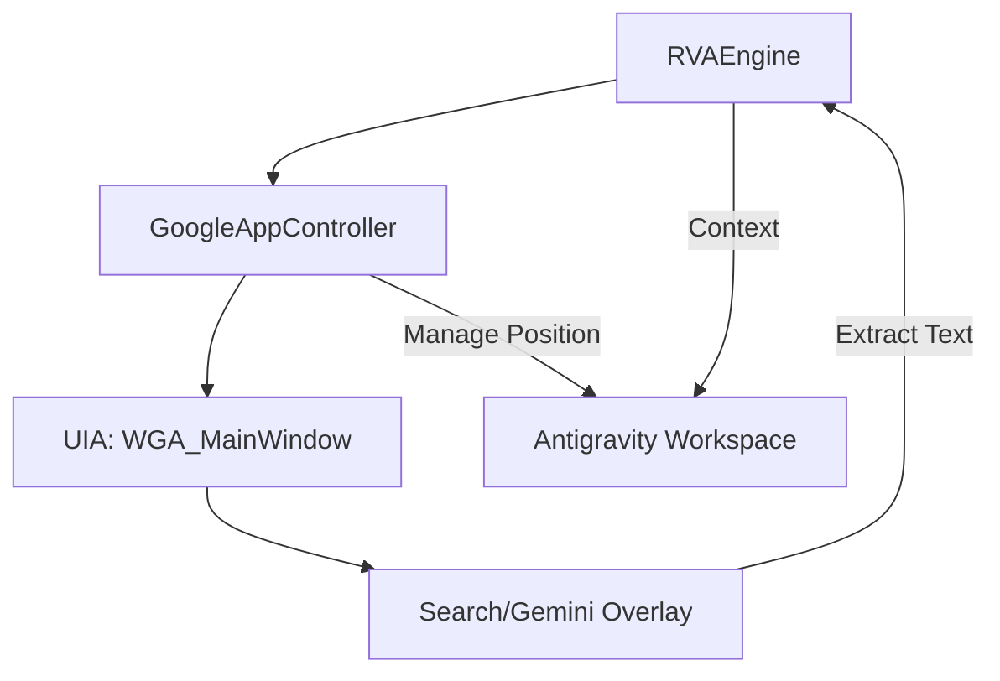

# Phase 158: Google Desktop AI Synergy (Advanced Overlay Control)

## 0. Current State
- **Core RVA**: Industrial `PywinautoController` active.
- **Perception**: Dual-eye (UIA/Vision) integrated.
- **Target**: `('Google app', 'WGA_MainWindow')` identified and running.

## 1. 需求拆解與邊界定義
- **目標**: 實現對 Google Desktop App 的精確控制與數據交換。
- **邊界**:
  - 支援 Google App (WGA_MainWindow) 的啟動、隱藏、與位置調整（避免擋住代碼）。
  - 自動讀取 Google Search/Gemini Overlay 的文本結果。
  - 模擬搜索輸入以獲取即時技術文檔。
- **風險**: Google App 更新頻繁，UI 結構可能變動（需 UIA 動態定位）。

## 2. 技術選型與理由
- **Controller**: `PywinautoController` (UIA Backend) - 現成的工業級控制。
- **Extraction**: `Document` control type pattern extraction - 用於讀取 WebView 內容。
- **Reasoning**: `RVAEngine` 擴展 - 將 Google 搜尋結果作為「外部知識庫」匯入 Reasoning Loop。

## 3. 系統架構圖 (Mermaid)

## 4. 並行與效能設計
- **Background Monitor**: 使用 `ContextMonitor` 監聽 Google App 的出現狀態（Visibility check 每 2秒一次）。
- **Lazy Attachment**: 只有在需要外部搜尋時才連接 Google App 進程，避免長連接佔用控制權。

## 5. 資安設計與威脅建模 (STRIDE)
- **Spoofing**: 驗證視窗 ClassName (WGA_MainWindow) 以防釣魚視窗。
- **Information Disclosure**: 實施 `SensitiveBlacklist`，確保傳送給 Google App 的 Context 不含 API Key。
- **Denial of Service**: 如果 Google App 擋住 IDE 超過 10秒且無法移開，強制最小化以確保生產力。

## 6. AI 產品相關考量
- **UX**: 當 Google 搜尋結果可用時，在 Antigravity 終端輸出輕量級摘要。
- **Cost**: 優先使用 UIA 讀取，減少 OCR/Vision 調用（省 Token）。

## 7. 錯誤處理、監控與恢復策略
- **Recovery**: 若 `WGA_MainWindow` 丟失，自動嘗試重新搜尋進程或提示使用者啟動 Google App。
- **Fallback**: 若 UIA 讀取 WebView 失敗，退回到 Eye-1 (Vision) OCR。

## 8. 測試策略
- **Unit Test**: `tests/rva/test_google_app.py` - 測試視窗定位與基本按鈕交互。
- **E2E Test**: 模擬「查詢 Error -> 啟動 Google App -> 讀取結果」流程。

---

## 執行波次 (Wave Plan)

### Wave 1: Foundation & Discovery
- [ ] 建立 `src/core/rva/google_app.py` 專屬 Controller。
- [ ] 實現 `get_visibility()` 與 `move_to_safe_zone()`。

### Wave 2: Text Extraction & Interaction
- [ ] 實現 `perform_search(query)` 自動化。
- [ ] 實現 `read_overlay_content()` 使用 UIA Document pattern。

### Wave 3: RVA Engine Integration
- [ ] 更新 `RVAEngine` 以整合 Google 外部搜索作為推理步驟。
- [ ] 撰寫 E2E 測試驗證全流程。
