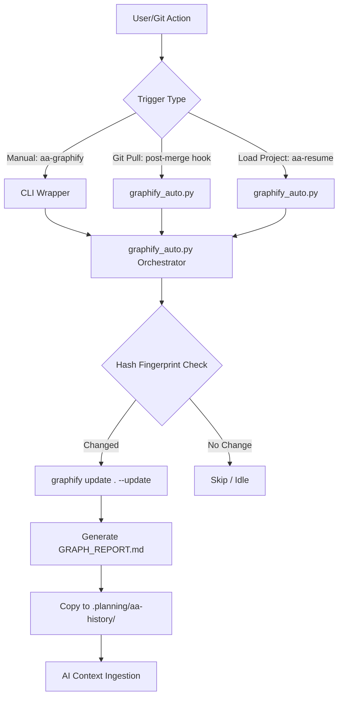

# PHASE-175: Graphify Knowledge Graph Integration (v3.7.1)

## 1. 需求拆解與邊界定義 (Decomposition & Scope)
- **核心目標**: 實作 `aa-graphify` 命令與 `graphify_auto` 自動觸發機制。
- **功能範圍**:
    - `aa-graphify`: 手動管理 CLI (build/update/query/serve)。
    - `graphify_auto`: 基於 `git pull` (post-merge hook) 與 `aa-resume` 的自動更新。
    - 整合 Gemini CLI: 優化 `llm.py` 呼叫，確保與 Gemini 1.5 Flash/Pro 高效對接。
- **邊界**: 不修改 Graphify 的核心解析引擎（Tree-sitter），僅進行封裝、自動化與 Gemini 適配優化。

## 2. 技術選型與理由 (Tech Stack & Rationale)
- **語言**: Python 3.10+ (與 AutoAgent-TW 核心保持一致)。
- **核心依賴**: `graphify` (知識圖譜引擎), `git` (觸發機制), `hashlib` (增量檢查)。
- **LLM 選型**: Gemini 1.5 Flash (用於語義提取，兼顧成本與效能)。
- **理由**: Graphify 原生支援 Gemini 且在處理長上下文代碼方面表現優異。

## 3. 系統架構圖 (Mermaid Architecture)

## 4. 並行與效能設計 (Parallelism & Performance)
- **並行執行**: `graphify_auto` 使用 `subprocess.Popen` 以 detached 模式執行，完全不阻塞用戶輸入。
- **Debounce**: 實作 10 分鐘 Debounce 機制，防止頻繁 git commit 或切換分支造成的 API 浪費。
- **增量更新**: 透過 `graphify update` (AST-only) 進行快速同步，僅在重大變更或手動觸發時進行語義提取。

## 5. 資安設計與威脅建模 (STRIDE)
- **Spoofing**: 腳本路覽硬編碼校驗，防止執行惡意替換腳本。
- **Tampering**: 圖譜輸出目錄設為 `.gitignore` 子集，防止敏感結構資訊洩露。
- **Repudiation**: 記錄所有自動化觸發日誌到 `.planning/logs/graphify_auto.log`。
- **Information Disclosure**: API Key 強制讀取環境變數，禁止硬編碼。

## 6. AI 產品相關考量 (UX, Cost, Model Drift)
- **UX**: 顯著減少 AI "Lost in the files" 的機率，提供 71.5x 的 Token 壓縮比。
- **成本**: 優先使用 `update` 模式，避免不必要的語義提取費用。
- **穩定性**: 透過 `needs_update` 標籤管理，確保 AI 讀取的圖譜與代碼保持同步。

## 7. 錯誤處理、監控與恢復策略 (Resilience)
- **Fallback**: 若 Graphify 執行失敗或環境不支援，自動降級為傳統 `grep` 導航，並在 `STATE.md` 標註。
- **Recovery**: 提供 `aa-graphify --repair` 進行損壞索引重建。

## 8. 測試策略 (Testing Strategy)
- **Unit**: 測試 `Fingerprint` 計算函數的準確性。
- **Integration**: 模擬 `git pull` 觸發 `post-merge` hook 流程。
- **UAT**: 在 `AutoAgent-TW` 自身倉庫進行 3 次完整掃描驗證。

---

## Plan 8 維度檢查表 (GSD v2.1)

| 維度 | 狀態 | 關鍵摘要 |
| :--- | :--- | :--- |
| 1. 需求拆解與邊界 | ✅ | 定義 `aa-graphify`, `graphify_auto`, `hooks` |
| 2. 技術選型 | ✅ | Python + graphify + Gemini Flash |
| 3. 系統架構圖 | ✅ | Mermaid 圖示已產出 |
| 4. 並行與效能 | ✅ | Detached Process + 10m Debounce |
| 5. 資安設計 | ✅ | STRIDE + API Key Security |
| 6. AI 產品考量 | ✅ | 71.5x Token 壓縮, 提高架構導航率 |
| 7. 錯誤處理 | ✅ | Fallback to Grep + Repair CLI |
| 8. 測試策略 | ✅ | 三層測試：Unit, Integration, UAT |
