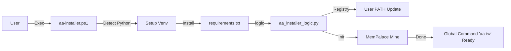

# PLAN: AutoAgent-TW Unified Industrial Installer

## 1. 任務細節 (Plan Details)

| 步驟 | 說明 | 負責組件 |
| :--- | :--- | :--- |
| **1. 需求拆解** | 建立全自動與互動模式並存的安裝程式。 | RESEARCH.md |
| **2. 技術選型** | PowerShell (Windows 原生引導) + Python (核心業務邏輯)。 | `aa-installer.ps1`, `aa_installer_logic.py` |
| **3. 系統架構** | 混合式 Bootstrapper 引導模式，支援動態 PATH 載入。 | Mermaid Workflow |
| **4. 並行與效能** | 使用 `uv` (若可用) 或並行 `pip` 優化套件下載速度。 | Logic script |
| **5. 資安設計** | **STRIDE 分析**: 防止 PATH Injection，確保 env 遮罩，User PATH 隔離。 | `SECURITY.md` |
| **6. AI 產品考量** | 提供極致的終端機回饋 (Fancy Spinners/Colors)，簡化 User Onboarding。 | UI Feedback |
| **7. 錯誤處理** | 支援斷點續傳 (Resumable) 與 虛擬環境自動修復。 | Recovery logic |
| **8. 測試策略** | `smoke-test` 驗證 `autoagent` 與 `aa-tw` 指令是否全域可達。 | Verification script |

## 2. 具體待辦事項 (Checklist)

### Wave 1: 引導層 (The Bootstrapper)
- [ ] 撰寫 `aa-installer.ps1`。
- [ ] 實作「管理員權限檢查」與「ExecutionPolicy 自動繞過」。
- [ ] 檢測 Python/Git 系統安裝狀況。

### Wave 2: 核心邏輯層 (The Core)
- [ ] 修改 `scripts/aa_installer_logic.py` 增加 `@click` 或 `argparse` 原生支援 `--auto`。
- [ ] 新增 `aa-tw.cmd` 作為指令別名。
- [ ] 優化 MemPalace 初始化流程，支援非互動模式。

### Wave 3: 驗證與交付 (Verification & Ship)
- [ ] 執行單一指令驗證全流程。
- [ ] 更新 `README.md` 安裝指南。
- [ ] Git Commit & Version Bump (v2.4.1).

## 3. 系統架構圖

