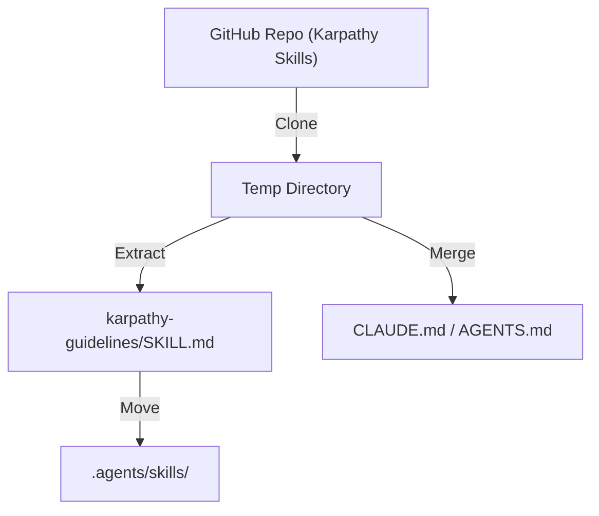

# Plan: Install Karpathy Skills into AutoAgent-TW

## 1. 需求拆解與邊界定義
| 項目 | 描述 |
| :--- | :--- |
| **目標** | 將 `https://github.com/forrestchang/andrej-karpathy-skills` 中的技能整合至 `AutoAgent-TW`。 |
| **範疇** | 複製 `skills/karpathy-guidelines` 資料夾；整合 `CLAUDE.md` 行為準則；更新技能註冊。 |
| **非範疇** | 修改核心 Agent 引擎邏輯。 |

## 2. 技術選型與理由
| 技術 | 理由 |
| :--- | :--- |
| **Git Clone** | 標準且高效的遠端倉庫獲取方式。 |
| **Skill Engine** | 沿用現有 `src/core/skill/engine.py` 以確保相容性。 |
| **Path** | 安裝至 `.agents/skills/`，符合系統進階技能目錄規範。 |

## 3. 系統架構圖 (Mermaid)

## 4. 並行與效能設計
- **Wave 1**: 建立臨時目錄並執行 `git clone`。
- **Wave 2**: 檔案搬移與路徑驗證。
- **Wave 3**: 註冊表更新與最終清理。

## 5. 資安設計與威脅建模 (STRIDE)
| 威脅 | 對策 |
| :--- | :--- |
| **Spoofing** | 驗證來源 URL 為 `forrestchang/andrej-karpathy-skills`。 |
| **Tampering** | 檢查下載的檔案是否包含惡意腳本或隱藏指令。 |
| **Info Disclosure** | 確保 `.env` 等敏感檔案不被 accidental indexing。 |

## 6. AI 產品相關考量
- **UX**: 技能安裝後應能立即透過 `aa_useguide.md` 調用。
- **Consistency**: 保持 Karpathy 準則與現有 `AGENTS.md` 邏輯的一致性。

## 7. 錯誤處理、監控與恢復策略
- 若 Clone 失敗，自動重試。
- 若路徑衝突，備份原有技能。

## 8. 測試策略
- **Unit Test**: 執行 `python scripts/doctor.py --status`。
- **Integration Test**: 驗證 `karpathy-guidelines` 的觸發邏輯。

---

## 任務清單 (Task List)
- [X] Wave 1: 建立臨時目錄並 Clone 倉庫
- [X] Wave 2: 提取 `karpathy-guidelines` 並搬移至 `.agents/skills/`
- [X] Wave 3: 整合 `CLAUDE.md` 內容至 `AutoAgent-TW` 核心配置 (於 `docs/karpathy/` 歸檔並同步準則)
- [X] Wave 4: 執行系統診斷與驗證

---

## Phase 3.6: OpenClaw Integration & Repair

### 8 維度檢查 (8-Dimension Check)

| 維度 | 內容 |
|---|---|
| **1. 需求拆解與邊界定義** | 分解為：(1) Installer 參數化 (2) OpenClaw 構建邏輯修復 (3) 缺失檔案修復 (4) 移除硬編碼路徑。 |
| **2. 技術選型與理由** | 使用 Python `argparse` 與 PowerShell `Read-Host`。使用 `npm` 自動化構建與元數據生成。 |
| **3. 系統架構圖** | `Installer -> logic.py --(optional)--> deploy_openclaw -> npm install -> gen metadata -> build` |
| **4. 並行與效能設計** | 安裝過程為線性執行，`npm` 構建利用多核心平行處理。 |
| **5. 資安設計與威脅建模** | **STRIDE**: T (Tampering) - 確保來源路徑合法且不含惡意腳本。 |
| **6. AI 產品相關考量** | UX：提供互動式安裝選項，避免無意義的依賴下載。 |
| **7. 錯誤處理、監控與恢復策略** | 使用 `try-except` 包裹構建流程，失敗時提供手動修復指引。 |
| **8. 測試策略** | 驗證 `openclaw.mjs` 入口與 `dist/` 生成。 |

- [x] Phase 3.6.1: Installer Architecture Upgrade
    - [x] Modify `aa_installer_logic.py` to add `--with-openclaw` and fix `deploy_openclaw`.
    - [x] Update `aa-installer.ps1` with interactive prompt for OpenClaw.
- [x] Phase 3.6.2: OpenClaw Restoration & Build
    - [x] Identify missing dependencies (e.g., `src/secrets/ref-contract.ts`).
    - [x] Restore missing directories and 14,000+ files from canonical source.
    - [x] Resolve `npm install` dependency conflicts with `--legacy-peer-deps`.
    - [x] Execute `npm run config:channels:gen` for chat channel metadata.
    - [x] Execute `npm run build` for `dist/` artifacts.
- [x] Phase 3.6.3: Final Verification
    - [x] Verify CLI entry point `node openclaw.mjs --version`.
    - [x] Confirm `openclaw` starts without "Missing bundled chat channel metadata" error.
    - [x] Test installation workflow.
