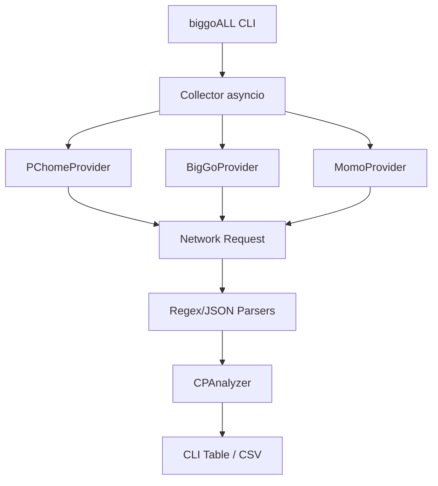

# GSD PLAN: biggoALL Multi-Source Engine Enhancement (v2.5.0)

## 1. 任務細節 (Plan Details)

| 步驟 | 說明 | 負責組件 |
| :--- | :--- | :--- |
| **1. 需求拆解** | 整合 PChome, BigGo, MOMO 三大平台，支援精確 CP 值計算。 | RESEARCH.md |
| **2. 技術選型** | Python `asyncio` + `urllib` (輕量化) + `re` (高效能解析)。 | `biggoALL.py` |
| **3. 系統架構** | Provider-based architecture with Centralized CP Analyzer. | `StoreProvider` classes |
| **4. 並行與效能** | 非同步抓取多個站點，減少總等待時間。 | `asyncio.gather` |
| **5. 資安設計** | **STRIDE**: 防止 Query Injection，對 User Input 進行 URL Encoding。 | `urllib.parse.quote` |
| **6. AI 產品考量** | 輸出格式化美觀的終端機表格與 CSV 報表。 | Table Printer |
| **7. 錯誤處理** | 針對不同的 API 解析失敗建立容錯機制。 | try-except blocks |
| **8. 測試策略** | 執行 `python scripts/biggoALL.py "iPhone 15" --cp` 並驗證 BigGo 來源是否存在。 | CLI Test |

## 2. 具體待辦事項 (Checklist)

### Wave 1: 核心修復 (Parsing Fixes)
- [ ] 修正 `BigGoProvider`: 調研 BigGo 目前的 HTML 結構，改善 Regex 提取邏輯。
- [ ] 升級 `PChomeProvider`: 導入 `pchome_iphone_cp.py` 中的分類與多頁抓取邏輯。
- [ ] 擴展 `CPAnalyzer`: 支援 吋 (inches) 與 系列 (generation) 提取。

### Wave 2: 功能擴展 (Expansion)
- [ ] 實作 `MomoProvider` (或至少建立 Mock 測試可行性)。
- [ ] 增加對 「福利品」 關鍵字的權重處理或特殊過濾。

### Wave 3: 拋光與交付 (Ship)
- [ ] 優化終端機輸出顏色 (使用 ANSI 轉義碼)。
- [ ] 更新 `ARCHITECTURE.md` 加入 biggoALL 引擎說明。
- [ ] Git Commit: `feat: 升級 biggoALL 引擎 - 修正 BigGo 解析與增強 CP 邏輯 v2.5.0`。

## 3. 系統架構圖

