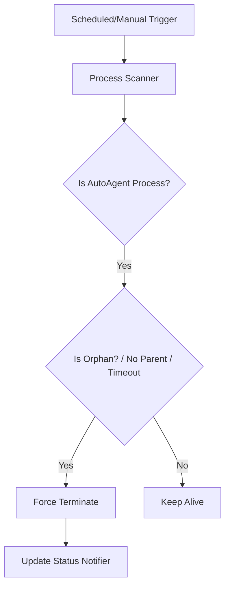

# GSD PLAN: Phase 149 - Resource Extreme Optimization & Process Reaping (v3.2.0)

## 1. 任務細節 (Plan Details)

| 步驟 | 說明 | 負責組件 |
| :--- | :--- | :--- |
| **1. 偵測與分析** | 使用 psutil 獲取所有 node/python 行程及其 command line。 | `scripts/diag_memory.py` |
| **2. 實作 Agent Reaper** | 開發能識別孤立進程（Orphan）並執行收割的引擎。 | `src/core/reaper.py` |
| **3. 優化 mcp-router** | 修改 `mcp_router_gateway.py` 增加 LRU cache 或限制 list 長度。 | `mcp_router_gateway.py` |
| **4. 影像緩衝回收** | 優化 VisionProxy，確保影像處理後的 bytes 確實被 GC 回收。 | `src/core/rva/vision_client.py` |
| **5. 併發安全** | Reaper 執行時須防止競爭條件，避免殺死正在啟動中的新進程。 | `reaper.py` |
| **6. UAT 驗證** | 手動測試：開啟大量 MCP tool 呼叫後執行 Reaper，驗證 RAM 降幅。 | `VERIFICATION.md` |

## 2. 具體待辦事項 (Checklist)

### Wave 1: 進程收割者 (The Reaper)
- [ ] 實作 `src/core/reaper.py`: 基於 `psutil` 的收割邏輯。
- [ ] 實作 `scripts/kill_zombies.py`: CLI 入口。

### Wave 2: MCP 優化 (Gateway Fix)
- [ ] 修正 `mcp_router_gateway.py`: 限制 `thought_chain` 長度為 50。
- [ ] 優化 `hot_cache.json` 讀寫邏輯，避免同步 I/O 導致的延遲。

### Wave 3: 視覺引擎拋光
- [ ] 修正 `vision_client.py` 中的 `shared_memory` 洩漏點。

## 3. 系統架構圖 (Reaper Logic)

