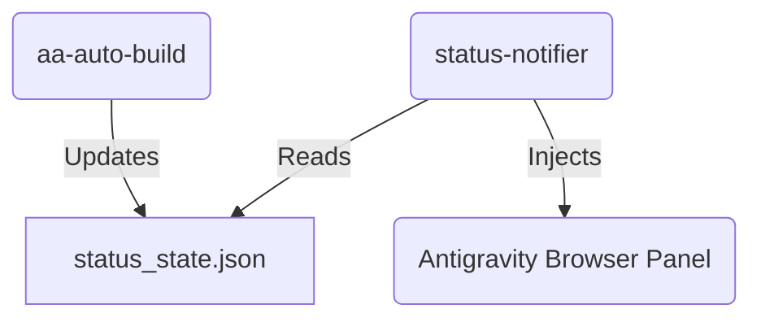

# Phase 1 Context: Foundation & Status Notifier Skill

## Goals
建立 `status-notifier` 技能的基礎結構，並實現最核心的「目前任務」與「下一步目標」動態顯示功能。

## Design Decisions

### 1. Skill Location
- **Decision**: 在專案目錄 `.agents/skills/status-notifier/` 建立。
- **Rationale**: 作為 AutoAgent-TW 的專屬功能，應隨專案移動，直到穩定後再考慮安裝到全域目錄。

### 2. Status Core logic
- **Decision**: 使用 `status_state.json` 作為 Python 腳本與前端 HTML 的中介。
- **Rationale**: 異步處理最穩定，Python 負責讀取並寫入 JSON，前端 HTML 每 2 秒 reload 數據。

### 3. UI Component (Banner)
- **Decision**: 頂部固定 banner (`position: fixed; top: 0;`).
- **Rationale**: 使用者在瀏覽器面板捲動時，通知依然可見。

### 4. Integration Protocol
- **Decision**: 在 Phase 1 先實作一個 `scripts/status-updater.py` 腳本，透過 `subprocess` 被 `aa-auto-build` 週期性呼叫（或在每個 Phase 啟動時更新一次）。

## Architecture Summary

## Next steps
- /aa-plan 1
