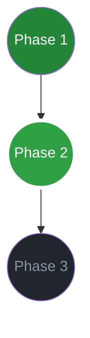

# Phase 2 Research: Dynamic Mermaid Roadmap

## Mermaid Flowchart Syntax
To represent Phase progress:

## Parsing ROADMAP.md
- Use regex or simple string splitting to find `## Phase X: Title`.
- Compare with `.planning/STATE.md` to get current status of each phase.
- Generate the Mermaid string.

## Frontend CSS Logic
- Pulse animation for the `running` node can be done via Mermaid's `classDef` combined with standard CSS in `status.html`.

## Potential Pitfalls
- **Mermaid Initialization**: When re-rendering, `mermaid.init()` or `mermaid.render()` needs to be called correctly to avoid blank charts or memory leaks. Using `mermaid.render` is better for dynamic updates.
- **Node Collision**: Mermaid nodes with spaces in titles need quoting (e.g., `P1["Phase 1: Title"]`).
