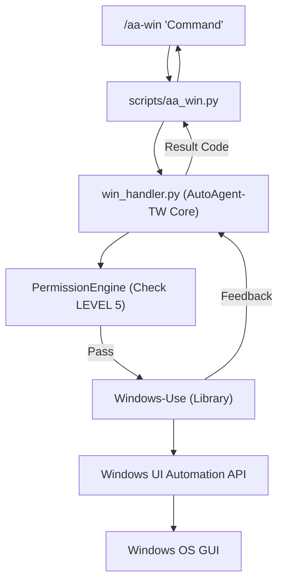

# CONTEXT: Phase 125 — Windows GUI Automation (Windows-Use)

## 🎯 核心目標 (Phase Goals)
Implement direct Windows GUI control for AutoAgent-TW by integrating `Windows-Use` (UI Automation API), enabling AI to interact with desktop applications and system elements without computer vision overhead.

## ⚙️ 技術決策 (Core Decisions)
### 1. 底層驅動 (Automation Engine)
- **Engine**: [Windows-Use](https://github.com/CursorTouch/Windows-Use)
- **Method**: UI Automation (UIA) API for element tree traversal.
- **Support**: Native Windows apps (Win32, WPF, UWP) and Browsers (Accessibility Tree).

### 2. 核心組件 (Core Components)
- **`src/core/automation/win_handler.py`**:
  - Wrapper for `Agent` class from `windows-use`.
  - Bridge between AutoAgent-TW's Permission Engine (Level 5) and GUI actions.
- **`scripts/aa_win.py`**:
  - New CLI tool: `/aa-win "Open Excel, create a table with A-Z and save to desktop"`
  - Support for direct PowerShell execution via UI-integrated terminal calls.
- **`src/core/orchestration/spawn_manager.py` Update**:
  - Add `GUI_MODE` flag to sub-agents.
  - Sub-agents with `GUI_MODE=True` can auto-import `win_handler`.

### 3. 多模型支援 (Multi-LLM Support)
- While AutoAgent-TW primarily uses Claude, the `Windows-Use` integration will be model-agnostic.
- **Fallback Logic**: If `windows-use`'s internal model selection (Ollama/Gemini/etc.) is triggered, it will use our environment defined API keys.

### 4. 資安防護 (Security & Guardrails)
- **LEVEL 5 Requirement**: Any GUI-modifying action requires `LEVEL 5: SYSTEM` permissions.
- **Screen Awareness**: Each action logs the "before/after" element tree for audit.
- **Human-in-the-Loop**: High-risk actions (e.g., clicking "Delete", "Confirm Payment", "Format Disk") trigger an interactive CLI confirmation.

## 🏗️ 系統架構 (Mermaid)

## 📋 待辦事項 (Checklist for PLANNED)
- [ ] 1. `pip install windows-use` dependency check.
- [ ] 2. `win_handler.py` core implementation.
- [ ] 3. `aa_win.py` CLI interface.
- [ ] 4. Permission engine integration (LEVEL 5 requirement).
- [ ] 5. UAT: Success automation of simple tasks (Notepad, Folder creation).

## 📊 驗證指標 (KPT)
- **Accuracy**: GUI element recognition rate > 95%.
- **Speed**: Element tree retrieval < 1s.
- **Safety**: 0 unintended system modifications without confirmation.
