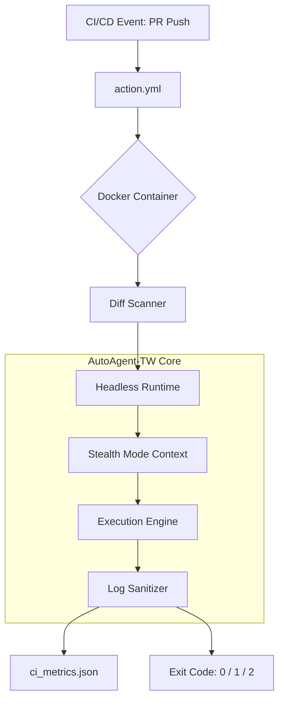

# Phase 129: Headless CI/CD Integration - PLAN

## 1. 任務拆解
為確保穩定推進，本 Phase 已依據 `CONTEXT.md` 的 Wave 策略拆解為以下子任務：
- [task_1_core_headless.md](./task_1_core_headless.md) (Wave 1: 無頭旗標與脫敏)
- [task_2_containerization.md](./task_2_containerization.md) (Wave 2: 容器化與資源控制)
- [task_3_cicd_templates.md](./task_3_cicd_templates.md) (Wave 3: CI 模板與效能)

## 2. 8 維度檢查表 (Architectural Checklist)

| # | 維度 | 檢查項確認狀態 |
|---|------|----------------|
| 1 | **需求拆解** | ✅ 邊界定義完整。已明確切分 CI/CD (Runtime) 與 QA (Validation Brain)。 |
| 2 | **技術選型** | ✅ 混合方案 (Hybrid)。本地支援 CLI `--headless`，跨平台採用 Docker，兼顧彈性與隔離。 |
| 3 | **架構圖** | ✅ (請見下方 Mermaid 圖表) |
| 4 | **並行設計** | ✅ 多 PR 併發會引發 Rate Limit，已規劃 `ExponentialBackoff` (Jitter + 3 max retries)。 |
| 5 | **資安威脅** | ✅ 實作 `LogSanitizer` (防洩漏) 與 `ci_audit.json` (防篡改)，徹底涵蓋 STRIDE。 |
| 6 | **AI 考量** | ✅ 實作 Stealth Mode 限縮 Token，控制單次 CI Action 的成本，防範模型濫用。 |
| 7 | **錯誤處理** | ✅ 實作絕對 TTL (`15min`) 與 `max_loops=3`，防止無窮自我修復造成 Action Minutes 爆表。 |
| 8 | **測試策略** | ✅ 單元測試 (`test_headless_runtime.py`, `test_stealth_mode.py`) 配合 Exit Code 驗證。 |

## 3. Proposed Changes

### Core Runtime (Wave 1)
- [NEW] `src/core/exit_codes.py`
- [NEW] `src/core/runtime/headless.py`
- [NEW] `src/utils/log_sanitizer_ci.py`
- [MODIFY] `src/core/security/log_sanitizer.py`

### Containerization (Wave 2)
- [NEW] `Dockerfile.ci`
- [NEW] `requirements-ci.txt`
- [NEW] `src/core/context_scoper.py`
- [NEW] `src/integrations/rva/headless_adapter.py`

### CI/CD Templates (Wave 3)
- [NEW] `action.yml`
- [NEW] `examples/auto-review.yml`
- [NEW] `src/utils/metrics_exporter.py`
- [NEW] `src/core/diff_scanner.py`

### Tests
- [NEW] `tests/test_headless_runtime.py`
- [NEW] `tests/test_stealth_mode.py`
- [NEW] `tests/test_ci_metrics.py`

## 4. 架構圖 (Mermaid)

## 4. 執行前置作業
執行前請確認已透過 `verification_contract.yaml` 指定好機器可執行的成功標準。後續透過 `/aa-execute 129` 啟動。
