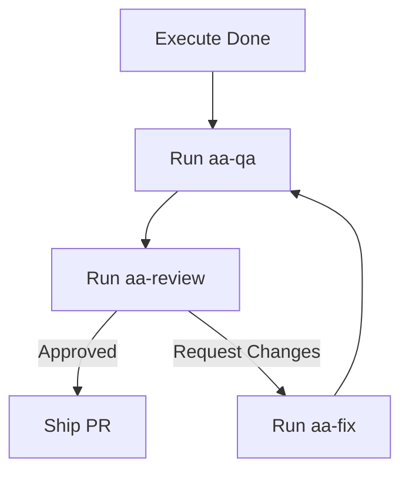

# PLAN: Phase 129 — Headless Mode + CI/CD Integration

## 1. 需求拆解與邊界定義
- [x] Wave 1: 實作狀態鎖定機制 (State Locking) 避免併發衝突。
- [x] Wave 2: 實作閒置偵測 (Idle Watcher) 決定執行時機。
- [ ] Wave 3: 開發 `/aa-review` 自動化評審員。
- [ ] Wave 4: 整合 GitHub Actions 實現完全自動化。

## 2. 技術選型
- **Reviewer Persona**: 採用獨立的 "Security + Architect" Prompt。
- **Diff Engine**: 使用 `git diff` 提取變更範圍。
- **Report Format**: 採用 Markdown 表格與 Severity Tags。

## 3. 系統架構圖 (Review Flow)

## 4. 具體執行步驟 (Wave 3)
### Task 3.1: 建立 aa-review Skill & Workflow
- [x] 建立 `C:\Users\TOM\.gemini\antigravity\skills\aa-review\SKILL.md`
- [x] 建立 `z:\autoagent-TW\_agents\workflows\aa-review.md`

### Task 4.1: 整合 GitHub Actions
- [x] 建立 `.github/workflows/autoagent_ci.yml`
- [ ] 測試 Workflow 語法正則

### Task 4.2: 最終驗證與交付 (Ship)
- [ ] 執行 `/aa-qa 129`
- [ ] 執行 `/aa-ship 129`

## 5. 測試策略 (UAT)
- **UAT 4.1**: 模擬 Git Push 觸發 CI，驗證鎖定與審查流程循環。
- **UAT 4.2**: 驗證非負載期間的 Idle-Watcher 喚醒邏輯。
