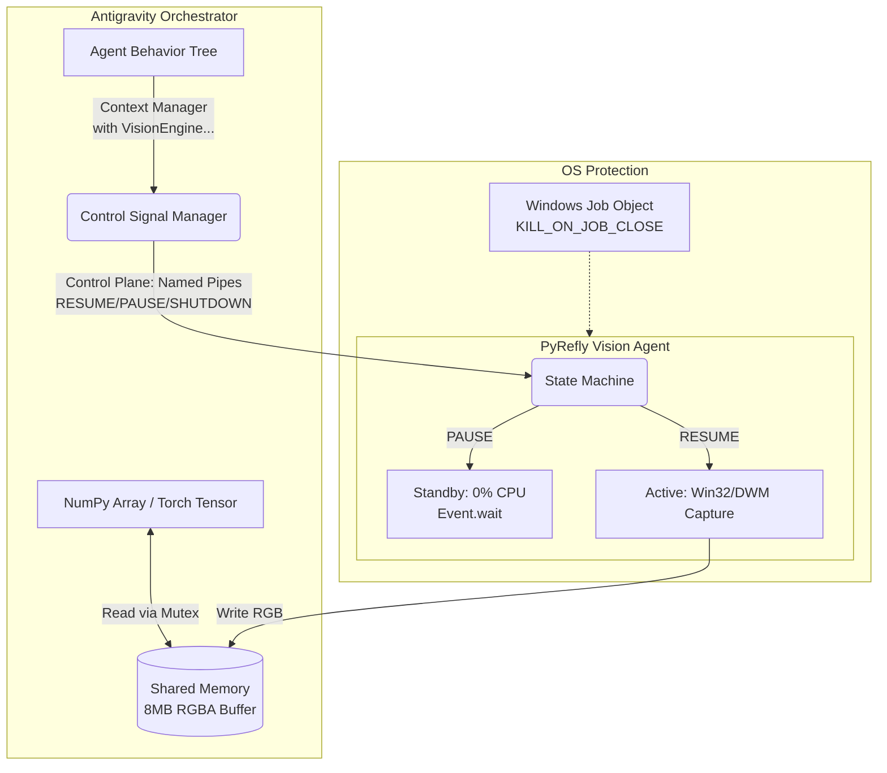

# Phase 148: Vision Engine Zero-Copy & Standby Architecture
**(視覺引擎：零拷貝與休眠架構重構計畫)**

## 1. 需求拆解與邊界定義 (DoD)
- **核心痛點**：舊有 IPC 架構大量依賴 JSON/Base64 傳遞影像，導致記憶體在連續截圖與資料複製的過程中暴漲 (4.3GB+)；且在 Agent 不需要影像判斷時，視覺引擎仍持續消耗 CPU 資源。
- **目標 (DoD)**：
  1. 導入 `multiprocessing.shared_memory` 淘汰 Base64 傳輸。
  2. 加入 Named Pipe/Socket 輕量控制訊號 (PAUSE/RESUME)。
  3. 實作 0% CPU 佔用的 Standby 休眠機制。
  4. 加入 TTL 自毀與 Windows Job Object 的強制清場防線。
- **邊界限制**：限定在 Windows 平台運行（考量到 DWM 與 Job Object 的平台特異性）；以 Python 3.8+ 為最小版本相容基準。

## 2. 技術選型與理由
- **資料層 (Data Plane) - Python `shared_memory`**：避免 Socket 傳輸帶來的序列化/反序列化開銷與記憶體複製。共享記憶體是單機 IPC 的效能天花板。
- **控制層 (Control Plane) - Windows Named Pipes / Local UDP**：具備極低延遲的特性。我們選擇 Name Pipes 來做為 Windows 下最原生的 RPC 方案，並確保跨進程通訊的安全隔離。
- **生命週期管理 - Context Manager (`__enter__`, `__exit__`)**：結合 Python 語言特性優雅封裝，避免 Agent 發生未預期的崩潰導致資源未釋放。

## 3. 系統架構圖

## 4. 並行與效能設計
- **鎖策略 (Locking Strategy)**：由於共享記憶體寫入（PyRefly）和讀取（Antigravity）是異步的，必須使用 `multiprocessing.Lock` 防範讀寫競爭 (Race Condition)，避免破圖。
- **死鎖預防**：所有 Mutex 的 Wait 皆需設定 Timeout 閥值 (例如 `timeout=0.05s`)，逾時未取得鎖直接丟棄該幀，確保引擎永不卡死。

## 5. 資安設計與威脅建模 (STRIDE 分析)
- **Spoofing (假冒)**：本地 Named Pipe 必須綁定嚴格的 ACL (Access Control List)，防止其他低權限惡意進程灌入偽造的「PAUSE」或「SHUTDOWN」訊號癱瘓 Agent 運作。
- **Information Disclosure (資訊洩漏)**：共享記憶體區段名稱將採用隨機 UUID (`Antigravity_Vision_Buffer_<UUID>`) 生成，避免被其它進程讀取螢幕截圖導致敏感資訊外洩。
- **Denial of Service (DoS)**：透過 Windows Job Object 防止 `pyrefly` Fork 炸彈或殭屍進程耗盡系統資源。

## 6. AI 產品相關考量
- **Token 與成本控制**：休眠機制的導入，使多模態 Agent 能在執行純邏輯思考階段，強制中斷視覺取樣，避免過多不必要的多模態 Inference 消耗。
- **延遲體驗優化**：零拷貝使得從截圖到丟給 VLM 的延遲可從 ~150ms 下降至 <20ms，極大幅提升 Agent 互動與感知流暢度。

## 7. 錯誤處理、監控與恢復策略
- **連線中斷重試**：若 Named Pipe 崩潰，Agent 需要能立即偵測到，並且透過 `subprocess.Popen` 以新 UUID 重啟 `pyrefly.exe` 建立新連線。
- **TTL Watchdog**：Pyrefly 內部實作心跳包 (Heartbeat) 定時器，若超過指定時間（例如 15 分鐘）未收到任何 Antigravity 訊號，預設被視為「主控端崩潰」，主動清理記憶體並關閉自我進程。

## 8. 測試策略
- **單元測試**：撰寫 Mock Server 驗證 pyrefly 在接收 PAUSE 時是否確實讓 CPU 佔用率降到 0%。
- **壓力測試 (Stress Testing)**：密集以 60 FPS 進行讀寫，持續 10 分鐘，監測是否有 Memory Leak。
- **資安測試**：嘗試用第三方 Script 以相同的 Shared Memory Name 開啟映射，確認是否因沒有權限而遭阻擋。 
