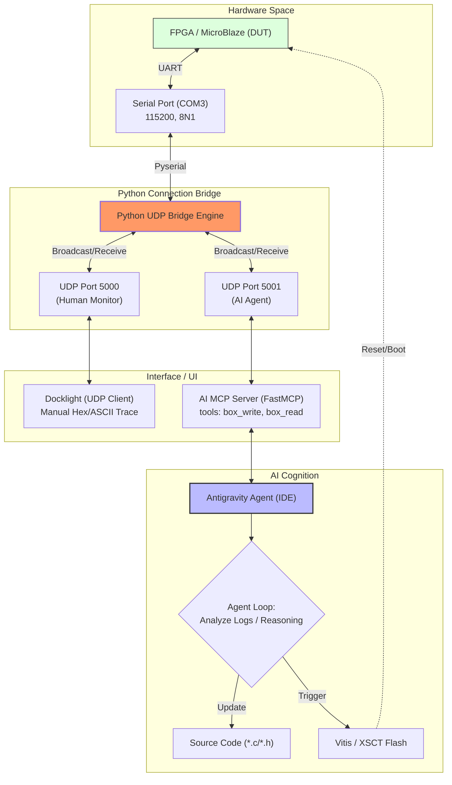

# phase 150: UART-MCP Closed-Loop Debugging Architecture

## 1. 核心意圖 (Intent)
建立一個具備「人類監控、AI 執行」能力的閉環嵌入式韌體測試系統。透過 Python UDP 橋接器解決硬體串列埠 (UART) 獨佔存取問題。

## 2. 系統架構圖 (Flowchart Diagram)

## 3. 技術決策 (Decision Log)

| 決策點 | 選項 | 最終選擇 | 理由 |
| :--- | :--- | :--- | :--- |
| **通訊層保護** | Direct Serial vs UDP Bridge | **UDP Bridge** | 支援多路分接，人類 (Docklight) 與 AI 可並行操作，互不鎖死串列埠。 |
| **傳輸協議** | TCP vs UDP | **UDP (Local)** | 延遲極低且實現簡單，localhost 本地迴圈無需擔心掉包。 |
| **MCP 工具設計** | Stdio vs Webhook | **FastMCP (Stdio)** | Antigravity IDE 原生支援最佳，無網路配置負擔。 |

## 4. 資安威脅建模 (STRIDE)

- **S (Spoofing)**: 通過 `HOST = '127.0.0.1'` 鎖定本地迴圈，防止外部網路非法操控硬體盒。
- **T (Tampering)**: 命令與回應皆為明文，確保本地開發環境防火牆隔離正常。
- **E (Elevation)**: AI 對原始碼有編輯權；Flash 動作建議暫採半自動模式 (Agent 提議內容，User 觸發 Flash)。

## 5. DoD (Definition of Done)
- [x] 提供完整的 Mermaid 流程架構。
- [x] 明確硬體、橋接、代理與 AI 決策層級關係。
- [x] 完成架構文件存檔。
