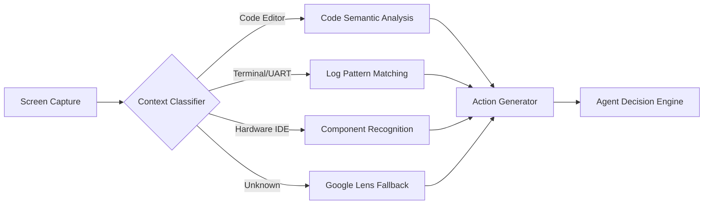

# Phase 157: Google Search Desktop App — Visual-Cognitive Synergy Deep Analysis (v2)

> **Phase**: 157 | **Status**: Discuss Complete | **Date**: 2026-04-19

---

## 0. 意圖挖掘 (Intent Mining)

Tom 明確提出 4 個核心問題維度：

1. **視覺判斷 (Visual Judgment)** — 該 App 能否強化 Agent 的「看」的能力？
2. **GUI 控制 (GUI Control)** — 如何程式化操控該 App？有無 API？
3. **Context Awareness 優化** — 如何利用該 App 提升 Agent 的情境感知？
4. **其它** — 額外的整合機會（Chrome Skills, Auto Browse, Generative UI）。

---

## 1. 視覺判斷強化 (Visual Judgment Enhancement)

### 1.1 Google Desktop App 的視覺能力矩陣

| 能力 | 目前 RVA (Phase 138) | Google Desktop App | 增幅評估 |
|:---|:---|:---|:---|
| **OCR 文字辨識** | Tesseract / Local LLM | Google Lens (雲端) | ★★★★★ 顯著提升 |
| **UI 元件辨識** | pywinauto UIA + Fallback Vision | Google Lens 視覺搜尋 | ★★★☆☆ 輔助補充 |
| **硬體/電路圖辨識** | 無 (靠 LLM 猜測) | Lens + Knowledge Graph | ★★★★★ 從零到有 |
| **錯誤碼語意** | LLM 推理 (有幻覺風險) | Gemini + Web Knowledge | ★★★★☆ 降低幻覺 |
| **即時翻譯** | 無 | Lens 即時翻譯 | ★★★★★ 新能力 |

### 1.2 實作方式：「雙眼架構 (Dual-Eye Architecture)」

```
┌─────────────────────────────────────────────────────┐
│  AutoAgent-TW Agent                                  │
│                                                      │
│  ┌──────────────┐     ┌──────────────────────────┐  │
│  │ Eye-1 (Fast) │     │ Eye-2 (Deep/Authoritative)│  │
│  │ Local Vision  │     │ Google Desktop Lens       │  │
│  │ pywinauto+LLM │     │ Alt+Space → Screen Share  │  │
│  │ ~100ms latency│     │ ~2-5s latency             │  │
│  └──────┬───────┘     └──────────┬───────────────┘  │
│         │                        │                    │
│         └────────┬───────────────┘                    │
│                  ▼                                    │
│         ┌────────────────┐                            │
│         │ Confidence Gate │                            │
│         │ Eye-1 conf > 0.85 → use Eye-1              │
│         │ Eye-1 conf ≤ 0.85 → escalate to Eye-2      │
│         └────────────────┘                            │
└─────────────────────────────────────────────────────┘
```

**核心邏輯**：Eye-1 (本地) 先行判斷。當信心度不足時，自動升級至 Eye-2 (Google Lens)，取得「權威答案」。

### 1.3 適用場景

- **FPGA IDE (Vivado/Vitis)**：辨識 TreeView 節點、Bitstream 編譯狀態、Report 錯誤碼
- **SDK 開發 (T024_main.c)**：辨識暫存器名稱、Register Address 的 Hex 值
- **Docklight / UART Monitor**：辨識串列通訊封包 hex dump 的語意

---

## 2. GUI 控制 (How to Control)

### 2.1 三層控制策略

| 層級 | 方法 | 工具 | 穩定性 | 延遲 |
|:---|:---|:---|:---|:---|
| **L1: 鍵盤快捷鍵** | `Alt+Space` 呼出 → 輸入查詢 → 回車 | pywinauto / pyautogui | ★★★★☆ | ~500ms |
| **L2: Screen Share** | `Alt+Space` → 點擊螢幕分享按鈕 → 選擇視窗 | Playwright + CDP 或 pywinauto | ★★★☆☆ | ~2s |
| **L3: Gemini API (Computer Use)** | 直接調用 `gemini-2.5-computer-use` API | Google Gen AI Python SDK | ★★★★★ | ~1-3s |

### 2.2 推薦方案：L1 + L3 混合

```python
# === L1: 鍵盤模擬呼叫 Google Desktop App ===
import pyautogui
import time

def invoke_google_desktop_search(query: str):
    """透過 Alt+Space 呼出 Google Desktop App 並輸入查詢"""
    pyautogui.hotkey('alt', 'space')
    time.sleep(0.8)  # 等待 overlay 出現
    pyautogui.typewrite(query, interval=0.02)
    pyautogui.press('enter')
    time.sleep(2.0)  # 等待 Gemini 回應
    # 截圖讀取結果
    screenshot = pyautogui.screenshot()
    return screenshot

# === L3: Gemini Computer Use API (推薦用於自動化) ===
from google import genai

def analyze_screen_with_gemini(screenshot_bytes: bytes, task: str):
    """使用 Gemini Computer Use API 分析螢幕截圖"""
    client = genai.Client()
    response = client.models.generate_content(
        model="gemini-2.5-flash-preview-04-17",
        contents=[
            {"role": "user", "parts": [
                {"text": task},
                {"inline_data": {
                    "mime_type": "image/png",
                    "data": screenshot_bytes
                }}
            ]}
        ],
        config={"tools": [{"computer_use": {}}]}
    )
    return response
```

### 2.3 GUI 控制的關鍵約束

> [!WARNING]
> Google Desktop App **沒有公開的開發者 API**。
> 鍵盤模擬 (L1) 是唯一的非官方入口。
> **正式自動化建議走 Gemini API (L3)**，繞過 GUI 直接調用雲端能力。

---

## 3. Context Awareness 優化

### 3.1 情境感知三階段模型



### 3.2 多源情境融合 (Multi-Source Context Fusion)

| 情境來源 | 提供者 | 資訊類型 | 整合策略 |
|:---|:---|:---|:---|
| **IDE 狀態** | pywinauto UIA | 打開的檔案、游標位置、錯誤列表 | 直接讀取 (最快) |
| **螢幕像素** | Local Vision (Eye-1) | UI 佈局、按鈕位置、顏色狀態 | 截圖 → LLM 解析 |
| **語意理解** | Google Lens (Eye-2) | 品牌辨識、型號查找、文字翻譯 | 升級觸發 |
| **外部知識** | Gemini + Web Search | 錯誤碼含義、最佳實踐、API 文檔 | Screen Share → 問答 |
| **歷史記憶** | MemPalace | 過往決策、已知問題、用戶偏好 | 自動檢索注入 |

### 3.3 優化方向：Proactive Context Injection

**現狀**：Agent 被動等待用戶指令 → 才去「看」螢幕。

**目標**：Agent 主動監控螢幕變化 → 預判下一步操作。

```
[每 5 秒] Screen Diff → 變化 > 閾值？
    ├── YES → 觸發 Eye-1 分析
    │         ├── 識別到編譯成功 → 自動觸發燒錄流程
    │         ├── 識別到錯誤對話框 → 自動截圖 + 查詢修復方案
    │         └── 識別到新 UART 輸出 → 自動解析並對照預期值
    └── NO  → 繼續監控
```

---

## 4. 其他整合機會 (Additional Opportunities)

### 4.1 Chrome Auto Browse — AI 瀏覽器代理

- **能力**：自動開啟多個分頁、爬取內容、生成摘要報告
- **AutoAgent 應用**：
  - 自動查找 FPGA Datasheet
  - 批量下載 IP Core 文檔
  - 自動填寫硬體採購表單

### 4.2 Chrome Skills — 可重複的自動化工作流

- **能力**：將重複的 Gemini 提示存為一鍵 Skill
- **AutoAgent 應用**：
  - `/compare-datasheets` — 跨分頁比較兩個 FPGA 規格書
  - `/extract-register-map` — 從 PDF 提取暫存器映射表
  - 可在 `chrome://skills/browse` 管理

### 4.3 Generative UI — 動態生成互動工具

- **能力**：Google Search 能即時「生成」互動式小工具
- **AutoAgent 應用**：
  - 輸入「compare DDR4 vs DDR5 timing parameters」→ 自動生成可互動的比較表
  - 為 Debug 產出動態的 Register Map 瀏覽器

### 4.4 WebMCP 協定 (2026 新標準)

- **能力**：網站可暴露結構化「工具」給 AI Agent，取代脆弱的 Screen Scraping
- **AutoAgent 應用**：未來若 Vivado/Vitis 的 Web 介面支援 WebMCP，Agent 可直接與之對話

---

## 5. 資安威脅建模 (STRIDE Analysis)

| 威脅 | 描述 | 風險等級 | 緩解策略 |
|:---|:---|:---|:---|
| **S (Spoofing)** | 假 Google Desktop overlay 竊取憑證 | 🔴 HIGH | 驗證進程簽章 + HITL 確認 |
| **T (Tampering)** | 惡意 UI 截圖注入誤導 Agent 決策 | 🟡 MEDIUM | Eye-1/Eye-2 交叉驗證 |
| **R (Repudiation)** | Agent 操作無法追溯 | 🟡 MEDIUM | 全操作截圖 + MemPalace 日誌 |
| **I (Info Disclosure)** | 螢幕截圖含敏感資料上傳至 Google Cloud | 🔴 HIGH | Zone 分類 + 敏感區域遮罩 |
| **D (DoS)** | Google API Rate Limit 導致 Agent 卡死 | 🟡 MEDIUM | Eye-1 本地優先 + 429 降級策略 |
| **E (Elevation)** | Agent 透過 Computer Use API 取得額外系統權限 | 🔴 HIGH | Sandbox 執行 + 最小權限原則 |

### 資安鐵律

> [!CAUTION]
> **禁止在 Screen Share 模式下暴露以下視窗**：
> - `.env` 檔案 / API Key 管理工具
> - 密碼管理器 / SSH 私鑰
> - 客戶端原始碼（未公開專案）

---

## 6. 架構選型 — 兩方案對比

### 方案 A：「Google Desktop App 原生路線」

```
優點: 零 API 成本、最新 Google 能力、Screen Share 體驗佳
缺點: 無公開 API、GUI 自動化脆弱、依賴 Google 帳號登入狀態
適用: 手動輔助 + HITL 場景
```

### 方案 B：「Gemini API Computer Use 路線」(推薦)

```
優點: 完全可程式化、穩定 SDK、支援 Sandbox、有 HITL Safety
缺點: API 成本 (但 Flash 模型極便宜)、需自行截圖
適用: 全自動化 Agent 流程
```

### 方案 C：「混合路線 — A + B 聯動」(最佳)

```
日常操作 → Gemini API (方案 B) 自動執行
遇到低信心度 → 升級觸發 Google Desktop Lens (方案 A) 做「權威確認」
敏感操作 → HITL 確認 (Phase 153 合約引擎)
```

---

## 7. DoD (Definition of Done) — 更新版

- [ ] **DOD-1**: 完成 Google Desktop App 安裝並驗證 `Alt+Space` 功能可用
- [ ] **DOD-2**: 完成 L1 鍵盤模擬 PoC (pyautogui → Google Desktop 查詢 → 截圖回收)
- [ ] **DOD-3**: 完成 Gemini Computer Use API PoC (截圖 → API → 動作指令)
- [ ] **DOD-4**: 完成 Eye-1/Eye-2 信心度閘門原型
- [ ] **DOD-5**: 完成 STRIDE 緩解措施的 Minimum Viable 實作
- [ ] **DOD-6**: 驗證「FPGA 電路圖辨識」場景端到端可行性
- [ ] **DOD-7**: 驗證 Chrome Skills 在 AutoAgent 工作流中的可用性
