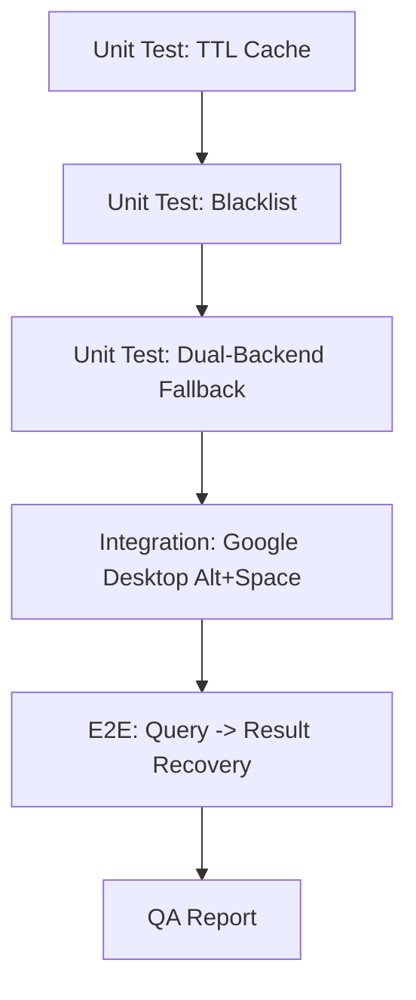

# Phase 157: Google Desktop AI + pywinauto v4 — Execution Plan

> **Phase**: 157 | **Status**: Planning | **Date**: 2026-04-20
> **Target**: Industrial-grade GUI Control & Context Awareness

---

## 1. 任務拆解與波次佈署 (Wave Deployment)

我決定合併部分波次以提升效率，但嚴格遵守「測試先行」與「資安核查」。

### Wave 1: 基礎環境與核心控制器 (DOD-0, 1, 2, 6)
- **Task 1.1**: 環境初始化 (pywinauto, PyQt5) 與驗證。
- **Task 1.2**: 實作 `PywinautoController` v4 (TTL Cache + Blacklist + Retry)。
- **Task 1.3**: 實作 `gui_control_test.py` 單元測試（包含敏感資料讀取嘗試）。

### Wave 2: RVA 引擎整合與 Vivado 實作 (DOD-3, 4, 5)
- **Task 2.1**: 修改 `rva_engine.py` 整合 `gui_control`。
- **Task 2.2**: 實作 `context_monitor.py` (Smart Polling)。
- **Task 2.3**: 擴展 Vivado UIA 讀取器 (Tree/DataGrid)。

### Wave 3: 整體驗證與 QA (DOD-7, 8)
- **Task 3.1**: E2E 測試：Google Desktop Overlay 入侵查詢。
- **Task 3.2**: QA 確認與 `QA-REPORT.md` 生成。

---

## 2. 8 維度檢查表 (Architectural Check)

| 維度 | 狀態 | 描述 |
|:---|:---|:---|
| **1. 需求拆解** | ✅ | 拆解為 3 個波次，覆蓋所有 v4 DoD。 |
| **2. 技術選型** | ✅ | pywinauto (UIA) + mss/imagehash (Vision) + TTL Cache。 |
| **3. 系統架構** | ✅ | 三層視覺 (Eye-0/1/2) + Confidence Gate。 |
| **4. 並行/效能** | ✅ | TTL Cache (30s) 避免 stale handle 並節省 UIA 掃描開銷。 |
| **5. 資安設計** | ✅ | SENSITIVE_CONTROL_TYPES 黑名單攔截 + Audit Logs。 |
| **6. AI/UX** | ✅ | Google Desktop Overlay 文字直接回收，大幅降低幻覺風險。 |
| **7. 錯誤處理** | ✅ | Dual-backend fallback (uia -> win32) + 2x Retry。 |
| **8. 測試策略** | ✅ | 單元測試 (Controller) + E2E 測試 (Google Overlay)。 |

---

## 3. 具體執行清單 (Task List)

### Wave 1 [UI 核心]
1. `run_command`: `pip install pywinauto[inspect] PyQt5 mss imagehash`
2. `write_to_file`: `src/core/rva/gui_control.py` (實作 v4 核心)
3. `write_to_file`: `tests/rva/test_gui_control.py` (單元測試)
4. `run_command`: `pytest tests/rva/test_gui_control.py`

### Wave 2 [控制流整合]
1. `multi_replace_file_content`: `src/core/rva/rva_engine.py` (整合控制器)
2. `write_to_file`: `src/core/rva/context_monitor.py` (Smart Polling)
3. `write_to_file`: `tests/rva/test_rva_integration.py`

---

## 4. 測試路徑 (Test Path)

