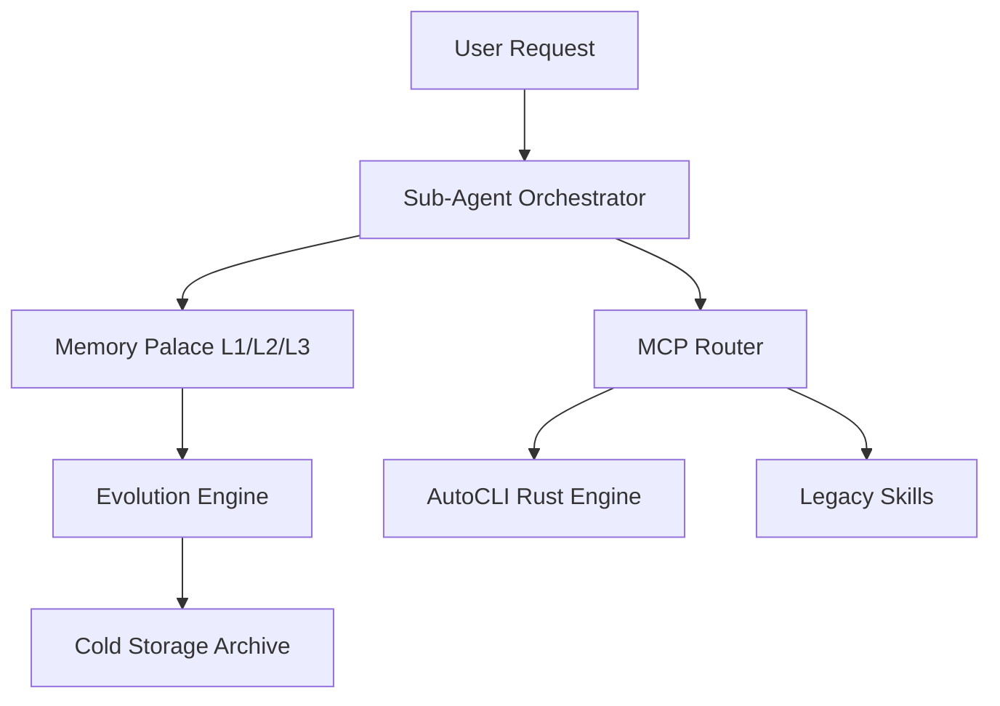

# Phase 161: Knowledge Graph Evolution & AutoSkills 2.0 (v3.4.0)

## 1. 背景與意圖 (Context & Intent)
在 Phase 160 成功整合 Rust-based AutoCLI 後，AutoAgent-TW 已具備極速的 Web 數據獲取能力。然而，目前的知識獲取仍屬於「拉取式 (Pull)」且缺乏「演化 (Evolution)」機制。
本階段旨在實作 **Deep Brain Evolution**，讓系統能根據對話歷史自動更新知識權重，並解決 Phase 160 遺留的 MCP 工具列舉問題 (B7) 與測試覆蓋缺口 (B8)。

## 2. 核心決策 (Core Decisions)
- **Tool Orchestration**: 修正 `src/harness/cli/main.py` 與 `src/core/mcp_router.py`，完整列舉所有掛載工具。
- **Memory Evolution**: 導入 **Active Forgetting** 邏輯的初版，將低頻訪問的 L3 記憶移動至 `archive/`。
- **AutoCLI Deep Integration**: 建立 `src/skills/web_search_adapter.py`，作為 AutoCLI 與 AI 之間的標準接口。

## 3. 架構設計 (Architecture)

## 4. 資安防禦 (Security)
- **B7 Fix Security**: 確保工具列舉過程不會洩漏敏感路徑或 API Key 名稱。
- **AutoCLI Guard v2**: 強化域名的正則表達式匹配，防止繞過 `autocli_guard.py` 的黑名單。

## 5. DoD (Definition of Done)
- [ ] `aa-tw status` 能顯示所有掛載的工具清單。
- [ ] `tests/harness/` 具備 80% 以上的單元測試覆蓋率。
- [ ] 實作一次成功的知識「升級」路徑 (L3 -> L2 -> L1)。
- [ ] 記憶體佔用維持在 < 250MB (符合 M35 要求)。
