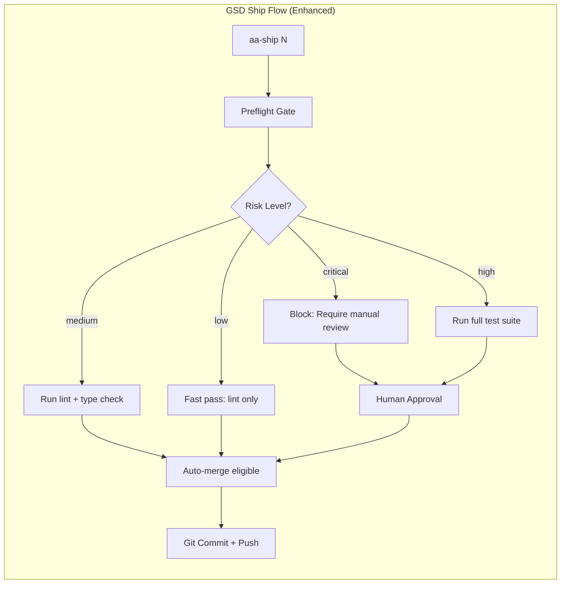

# Phase 162: Harness Engineering Production Guardrails (v3.5.0)

## 1. 背景與意圖 (Context & Intent)

### 來源
- 文章：[Wisely Chen — Harness Engineering 架構全景](https://ai-coding.wiselychen.com/harness-engineering-architecture-overview-ai-code-production-guardrails/)
- 核心論述：AI 可以寫 Code，但不能自己上 Production。中間的「不能」需要用系統架構來實現。
- 參考架構：OpenAI Harness Engineering (3人 5個月 100萬行 0行人寫)

### 核心問題
AutoAgent-TW 擁有強大的 AI Agent 系統 (160+ Phases)，但缺乏 **Production Guardrails**：
1. 無 `risk-tiers.json` — 所有變更一律同等審查，浪費注意力
2. 無 `AGENTS.md` — Agent 行為邊界未系統化
3. 無 Architecture Linter — 依賴方向無強制，反模式可被 10x 速度複製
4. 無 Preflight Gate — aa-ship 前無自動風險評估

### DoD (Definition of Done)
- [ ] 建立 `risk-tiers.json` 定義 critical/high/medium/low 四級路徑
- [ ] 建立 `AGENTS.md` 含禁止事項 + 架構原則 + 風險分級引用
- [ ] 實作 `scripts/preflight_gate.py` 自動判定變更風險等級
- [ ] 建立 `importlinter.ini` 強制 Python 模組依賴方向
- [ ] 整合至 `aa-ship` workflow 作為前置檢查

## 2. 核心決策 (Core Decisions)

### 採用方案 A (MVP Guardrails) 理由
- 文章核心結論：「分級審查是 ROI 最高的第一步。一份 JSON 就能省掉無數次爭論。零成本，純紀律。」
- 方案 B/C 可在後續 Phase 逐步導入
- 與 AutoAgent-TW 的「Stealth Mode」設計哲學一致：最小資源消耗，最大防禦效果

### 技術選型
| 選型 | 工具 | 理由 |
|------|------|------|
| Risk Contract | JSON | 機器可讀、版本可控、零依賴 |
| Architecture Linter | import-linter (Python) | 原生 Python 支援、CI 友好 |
| Preflight Gate | Python script | 與現有 GSD workflow 無縫整合 |
| Agent Protocol | AGENTS.md | 業界標準 (Linux Foundation AAIF 認可) |

## 3. 架構設計 (Architecture)



### AutoAgent-TW 的分層映射
```
Types     → src/core/types/        (最底層，零依賴)
Config    → config/, _configs/     (只依賴 types)
Core      → src/core/              (依賴 types + config)
Harness   → src/harness/           (依賴 core)
Scripts   → scripts/               (依賴任意層，但不被依賴)
Skills    → _agents/skills/        (獨立模組，不被 core 依賴)
```

## 4. 資安防禦 (STRIDE Analysis)

| Threat | Vector | Mitigation |
|--------|--------|------------|
| **Spoofing** | 偽造 risk-tiers.json 降低風險等級 | Git hook 保護 + SHA 驗證 |
| **Tampering** | 修改 preflight_gate.py 跳過檢查 | 腳本路徑列為 critical |
| **Repudiation** | 繞過審查直接 push | Branch protection rules |
| **Information Disclosure** | preflight 輸出洩漏敏感路徑 | 只顯示風險等級，不顯示內容 |
| **Denial of Service** | preflight 無限循環 | 30 秒 timeout |
| **Elevation of Privilege** | Agent 修改自己的 AGENTS.md | AGENTS.md 列為 critical |

## 5. 編排策略 (Orchestration)

### Wave 並行化
- **Wave 1** (並行): risk-tiers.json + AGENTS.md (純文件)
- **Wave 2** (並行): preflight_gate.py + importlinter.ini (工具)
- **Wave 3** (序列): aa-ship 整合 + 測試驗證
