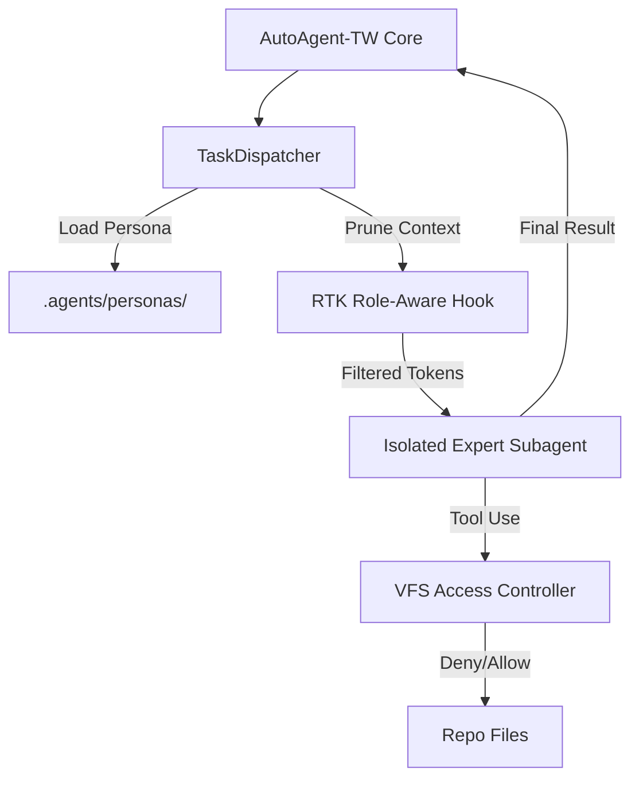

# Phase 164: Subagent Context Isolation (Axis 2)

## 1. 核心目標 (Core Goal)
導入 **VoltAgent** (awesome-claude-code-subagents) 的專家角色模板，並結合 **RTK (Rust Token Killer)** 實作「物理級」與「邏輯級」的語境隔離，確保子代理在執行專門任務時擁有最精簡、最準確的 Context。

## 2. 關鍵決策 (Key Decisions)
- **專家角色化 (Expert Personas)**: 將 100+ 專家 Prompt 導入 `.agents/personas/`，啟動時根據任務自動選用。
- **角色感知裁剪 (Role-aware Pruning)**: 升級 RTK Hook，根據子代理角色（如 C++ 專家）動態過濾無關代碼（如 Python/UI/Docs）。
- **邏輯沙盒隔離 (VFS Isolation)**: 透過 `subagents.json` 定義路徑權限，子代理嘗試 `read_file` 越權路徑時，勾子回傳 `403 Forbidden`。
- **冷啟動原則 (Zero-History Policy)**: 每個子代理任務均為無狀態執行，完成後立即銷毀 Session，防止 Context 交叉污染。

## 3. 架構設計 (Architecture)

## 4. 資安建模 (STRIDE)
- **Information Disclosure**: 防範敏感信息 (API Keys/Secrets) 進入子代理語境。-> 勾子強制遮蔽 `.env`。
- **Tampering**: 子代理越權修改核心模組。-> 由 `diff_scope_check.py` 進行後驗證。

## 5. DoD (Definition of Done)
- [ ] 實作 `subagents.json` 權限配置文件。
- [ ] 升級 `spawn_manager.py` 支援 Persona 加載。
- [ ] 實作 `scripts/rtk_prune.py` 支援角色感知裁剪。
- [ ] 驗證 C++ 專家在執行任務時，Context 消耗量下降 >40%。
