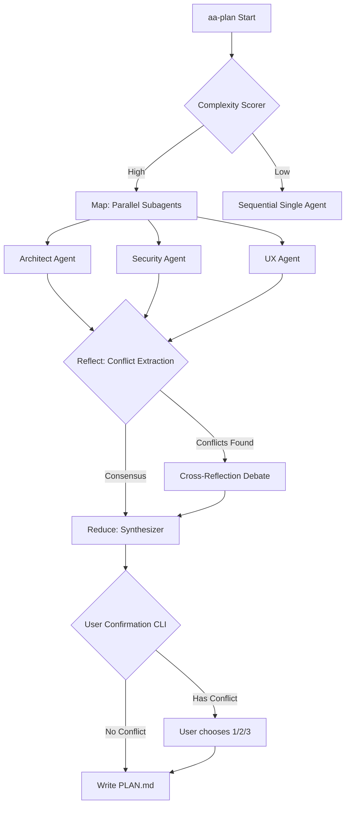

# Phase 167: Multi-Agent Parallel Planning - Implementation Plan

## 1. 8 維度檢查 (8-Dimension Check)

| # | 維度 (Dimension) | 設計與實作細節 (Design & Implementation Details) |
|---|------------------|--------------------------------------------------|
| 1 | **需求拆解與邊界** | 實作 Map-Reduce 風格的平行規劃引擎。預設依 Complexity Scorer 決定是否啟動 Parallel Mode。保留 `--force-single` 向後相容。 |
| 2 | **技術選型與理由** | Python `asyncio` (`asyncio.gather`) + `pydantic` (Schema 驗證) + `rich` (CLI 進度可視化)。利用現有 OpenClaw Gateway 作為底層。 |
| 3 | **系統架構圖** | 見下方 Mermaid 流程圖。包含 Map (動態 Subagents) -> Reflect (交叉辯論) -> Reduce (決策矩陣) -> User Confirmation。 |
| 4 | **並行與效能設計** | 預算感知併發控制：若 Token 餘額 < 30%，自動縮減併發節點 (例如 4 降至 2) 或減少 `max_tokens`。具備斷點快取。 |
| 5 | **資安威脅建模** | 唯讀模式：動態 ToolRegistry 過濾 `write_*` 與 `exec_*`。包裹 User Prompt 於 `<user_input_delimiter>` 並附加嚴格指令防止注入。 |
| 6 | **AI 產品考量** | CLI 即時進度顯示 (`rich` ProgressTree)。當架構衝突發生時，產出標準化決策矩陣供使用者選擇 (1/2/3)，避免 AI 盲目硬裁決。 |
| 7 | **錯誤處理與恢復** | 實作 Circuit Breaker 與 HTTP 429 降級機制 (Fallback)。產出寫入 `.agent-state/parallel_planning_cache/`，中斷可接續。 |
| 8 | **測試策略** | E2E Rate Limit 模擬測試 (模擬 4 個並行請求)。Schema 驗證重試機制測試。唯讀權限越權攔截測試。 |

### 系統架構圖 (System Architecture)

## 2. 任務拆解 (Atomic Tasks)

### Task 1: 核心資料結構與 Prompt 基礎設施 (Foundation)
- 定義 `AgentPlan` 的 Pydantic Schema (`role`, `confidence`, `plan_section`, `dependencies`, `risks`, `conflicts_with`)。
- 撰寫各領域 Expert 的 System Prompt 模板 (Architect, Security, UX 等)。
- 建立 `Cross-Reflection` 與 `Synthesizer` 專用 Prompt。

### Task 2: 唯讀安全防護與工具過濾 (Security & Isolation)
- 實作防護層：動態覆寫 `ToolRegistry`，在呼叫子代理時，強迫過濾掉 `write_to_file`, `multi_replace_file_content`, `run_command` 等危險工具。
- 實作 User Prompt 防注入包裹器 (`<user_input_delimiter>`)。

### Task 3: 平行執行引擎與快取機制 (Parallel Execution Engine)
- 實作 `ParallelPlanner._call_subagent` (基於 `asyncio`)。
- 整合 Exponential Backoff、Circuit Breaker 與 HTTP 429 Fallback。
- 實作 `.agent-state/parallel_planning_cache/` 中斷接續功能。

### Task 4: Map-Reflect-Reduce 流程實作 (Orchestration)
- 實作 `Complexity Scorer` (根據 Context 大小或檔案變更數判斷)。
- 實作 Reflect 階段：衝突向量提取與單輪交叉辯論 (Cross-Reflection)。
- 實作 Reduce 階段：融合計畫並產出決策矩陣 (Decision Matrix)。

### Task 5: 資源監控與 CLI 體驗 (UX & Governance)
- 串接 Phase 143/165 `resource_monitor` 進行 Token 預算感知與動態節點縮減。
- 使用 `rich` 實作 `ProgressTree`，顯示每個 Agent 的耗時與即時狀態。
- 實作互動式 CLI：衝突發生時讓使用者輸入 `1/2/3` 做最後裁決。

## 3. 驗收標準 (UAT Criteria)
- [ ] 能在背景成功發起 3 個併發的 LLM 請求且正常返回。
- [ ] 模擬意見相左時，Synthesizer 能正確擷取出衝突點並生成 Decision Matrix 提示。
- [ ] 子代理嘗試呼叫 `write_to_file` 會被 ToolRegistry 拒絕並噴出許可權錯誤。
