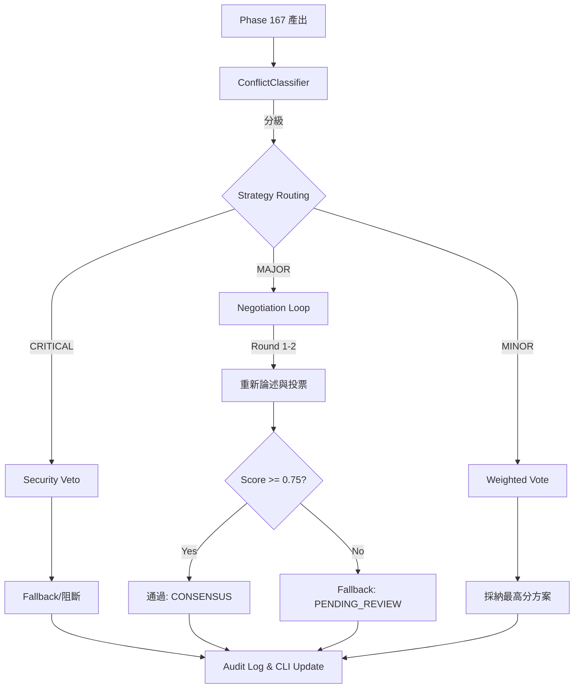

# Phase 168: Multi-Agent Consensus & Voting (Axis 2) - 執行計畫 (PLAN.md)

基於 `phase168_qwen.md` 的深度優化建議，本計畫整合了衝突分級、量化閾值與預算感知回退等 5 項關鍵優化，確保共識機制的工業級穩定性。

## GSD 8 維度檢查表 (8-Dimension Check)

| 維度 | 規劃內容與執行策略 |
| :--- | :--- |
| **1. 需求拆解與邊界定義** | 1. 實作 `ConflictClassifier` (CRITICAL/MAJOR/MINOR 路由)。 2. 實作 `ConsensusEngine` 核心 (計算 Consensus Score, 閾值 0.75)。 3. 實作 `NegotiationLoop` (Max Rounds = 2)。 4. 整合 `ResourceMonitor` (預算低於 20% 強制 Fallback)。 5. 產出 `consensus_audit.json` 不可變日誌。 |
| **2. 技術選型與理由** | - **Python 3.12+ / Pydantic V2**: 用於強型別驗證 `AgentVote` 與 `ConsensusResult`。 - **Asyncio**: 處理非同步協商與投票收集。 - **Rich**: 終端機即時呈現投票進度與分數儀表板。 |
| **3. 系統架構圖 (Mermaid)** | 詳見下方架構圖，涵蓋 Classifier -> Routing -> Negotiation -> Fallback 流程。 |
| **4. 並行與效能設計** | 協商輪次內的各 Agent 重新思考過程使用 `asyncio.gather` 平行化。Token 預算即時檢查 (`can_spend_tokens`) 避免耗盡資源。 |
| **5. 資安設計與威脅建模** | **STRIDE 防禦**： - **EoP**: 透過 `role_weights.yaml` 與 `DomainRelevance` 動態調整權重，賦予 Security 絕對否決權 (CRITICAL 路由)。 - **Repudiation**: `consensus_audit.json` Append-Only 紀錄所有決策與原始論點。 - **DoS**: `MAX_NEGOTIATION_ROUNDS = 2` 防止無窮協商。 |
| **6. AI 產品相關考量** | UX 體驗：終端機會以 `rich.Live` 顯示即時決策矩陣與目前共識分數 (Consensus Score)，若進入 Fallback (`PENDING_REVIEW`)，不中斷主流程但會明顯提示。 |
| **7. 錯誤處理與恢復策略** | 異常中斷或超時將自動 fallback 採納最高分方案並附加 `[BUDGET_FALLBACK]` 或 `[TIMEOUT_FALLBACK]` 標記，寫入 `pending_review.md`。 |
| **8. 測試策略** | 1. **Unit Test**: 針對 `_calculate_score` 與權重邏輯的邊界測試 (分數是否正確收斂)。 2. **Integration**: `MapReflectReduceOrchestrator` 串接 `ConsensusEngine` 的 E2E 測試。 3. **Security Test**: 模擬惡意 Agent 嘗試覆寫 Security Veto 的阻斷測試。 |

## 系統架構圖 (Pipeline)

## 實作步驟清單

1. **核心模型定義**: 在 `scripts/planning/schemas.py` 擴增 `AgentVote`, `ConsensusResult` 等 Pydantic Models。
2. **共識引擎實作**: 新增 `scripts/planning/consensus.py`，實作 `ConsensusEngine`、`ConflictClassifier` 與數學評分邏輯。
3. **編排器整合**: 修改 `scripts/planning/orchestrator.py`，將原先的單純 Reduce 替換為調用 `ConsensusEngine.resolve()`。
4. **UI 擴展**: 修改 `scripts/planning/cli.py`，新增投票進度條與分數儀表板。
5. **日誌與稽核**: 確保 `consensus_audit.json` 在每次決策後正確產出。
