# Phase 170 Enhanced: CC-Inspired Architecture Upgrade (v3.7.0)
## "From Tool to Framework" — 融合 cc.md + cc_v2.md 深度優化

---

## 1. 核心需求與目標 (Requirements & Goals)

### 背景分析

根據 `cc.md` (六大底層設計) + `cc_v2.md` (Enhanced 強化版) 雙重分析，AutoAgent-TW 的 Gap 矩陣如下：

| CC 設計 | aa-TW 現狀 | Gap | Phase 170 目標 |
| :--- | :--- | :---: | :--- |
| **深度防禦 (18 層安全)** | `PermissionEngine` 5-Level | 🟡 | 7 層 Defense Pipeline |
| **狀態持久化 (Session)** | `SessionManager` (JSON) | 🔴 | Checkpoint V2 + Shadow Mode |
| **透明日誌 (Streaming)** | `MetricsExporter` (CI only) | 🔴 | EventBus + Interruptible CLI |
| **系統瘦身 (Compression)** | `ContextScoper` (pruning) | 🔴 | **Safe Async Pipeline** (品質閘門) |
| **模組化技能 (Skills)** | `SkillManifest` + skills/ | 🟡 | + Dynamic Tool Injection |

### 目標 (DoD — Definition of Done)

1. **Workflow Checkpoint V2**：Chat/Execution 分離 + Feature Flag Shadow Mode + `active_tools` 欄位。
2. **Interruptible Streaming**：即時事件 + 用戶可 Ctrl+C 優雅中斷並保存 partial_state。
3. **Safe Auto-Compression**：非同步預壓縮 + **Compression Quality Gate** (壓縮後比原始更差時自動回滾)。
4. **Evidence-Based Memory**：摘要帶有 provenance + evidence 的結構化 JSON。
5. **Defense Pipeline Hardening**：補齊 Input Sanitizer + Sandbox Evaluator + Audit Logger。
6. **成功指標**：Resume 成功率 ≥ 95%；壓縮後品質不低於基線。

---

## 2. 技術方案論證 (Technical Options)

### 2.1 Workflow State 分離 + Feature Flags

#### 方案 A: 雙層 JSON + Shadow Mode（推薦 ✅）
- **Chat State**：`session_manager.py` 繼續管理對話歷史。
- **Execution State**：新增 `workflow_checkpoint.py`，Schema V2：
  ```json
  {
    "step_id": "step_003",
    "action": "run_tests",
    "status": "completed",
    "artifacts": ["test_report.json"],
    "requires_hitl": false,
    "active_tools": ["pytest", "coverage", "git_diff"],
    "capability_mode": "test",
    "partial_state": null,
    "timestamp": "ISO",
    "hmac": "sha256:..."
  }
  ```
- **Shadow Mode**：新舊雙軌並行，Feature Flag `AA_CC_STATE_V2=false` 控制。初期雙寫，驗證通過後再切讀取端。
- **Resume**：讀取最新 checkpoint，跳過已完成步驟。
- **優點**：零爆炸半徑 — 新版出問題時可即時回退。

#### 方案 B: LangGraph Checkpoint 全整合
- 強耦合 LangGraph 版本，無法覆蓋純 Script/CLI 任務。

**決策**：**方案 A**。Shadow Mode 保證安全灰度上線。

### 2.2 即時串流事件 + 可中斷性 (Interruptible Streaming)

#### 方案 A: Abstract EventPublisher + CLI Renderer（推薦 ✅）
- 定義抽象介面 `EventPublisher`，現在實作 `CLIEventPublisher`。
- 事件類型：`TOOL_START, TOOL_END, MODEL_THINKING, CHECKPOINT_SAVED, CONTEXT_COMPRESSED, WORKFLOW_PAUSED`。
- **可中斷性**：Ctrl+C → `tool_cancel` 事件 → 保存 `partial_state` 到 Checkpoint → 優雅退出。
- 未來需 WebSocket 時只需實作 `WebSocketEventPublisher`，符合 YAGNI。

#### 方案 B: WebSocket Server
- 過於複雜，增加攻擊面。

**決策**：**方案 A**。YAGNI + Abstract Interface 保留彈性。

### 2.3 Safe Auto-Compression（重點防護區）

> [!CAUTION]
> **用戶鐵律：壓縮後不得比壓縮前更差。** 必須有品質閘門 (Quality Gate)。

#### 方案 A: 非同步預壓縮 + Quality Gate（推薦 ✅）
- **三階段流水線（全非同步）**：
  - **75% → L1 (Background Trim)**：背景 Worker 啟動，移除冗餘 tool output / system log。
  - **82% → L2 (Background Summarize)**：背景呼叫 LLM 對舊對話前 40% 產生 Evidence-Based 摘要（不阻塞用戶操作）。
  - **90% → L3 (Zero-latency Swap)**：用已準備好的摘要替換原始內容。
- **Compression Quality Gate（核心創新）**：
  - L2 摘要完成後，**不立即替換**。先執行品質驗證：
    1. **Token 比率檢查**：壓縮後 Token 數 ≤ 原始的 40%，否則拒絕。
    2. **關鍵事實回召測試**：從原始對話提取 5 個關鍵決策點（如架構選型、Bug 原因），驗證摘要中是否都涵蓋。
    3. **Semantic Similarity**：用 embedding 計算壓縮前後的語義相似度，閾值 ≥ 0.85。
  - 若**任一項未通過**，拒絕壓縮並降級為 L1 (Trim)，通知用戶：`[⚠️ 壓縮品質不足，已降級為 Trim 模式]`。
  - 若通過，執行 swap 並保留原始對話快照 (`_pre_compress_snapshot.json`) 供 30 分鐘內回滾。
- **每 Session 限制**：最多 3 次 L2 呼叫。超過降級為 L1。
- **Incremental Compression**：後續只壓縮新增區塊，而非每次重壓整段歷史。

#### 方案 B: 固定窗口截斷
- 丟失架構決策脈絡。CC 明確反對。

#### 方案 C: 無品質閘門的直接壓縮（cc_v2 原始建議）
- 風險：壞摘要直接替換原始上下文 → **不可逆的品質損失**。

**決策**：**方案 A**。非同步 + Quality Gate 是本次的核心差異化設計。

### 2.4 Evidence-Based Memory

- Auto-Compressor 輸出必須符合以下結構：
  ```json
  {
    "fact": "用戶偏好使用 Pytest 而非 unittest",
    "evidence": ["msg_id:45@turn:12"],
    "provenance": {"source": "user", "confidence": 0.95},
    "timestamp": "2026-05-03T12:00:00Z",
    "version": 1,
    "supersedes": []
  }
  ```
- 衝突解決策略：**Latest Timestamp + Highest Confidence + User Override** 三層優先序。
- 存入 MemPalace L3，可透過 `aa memory search` 語義檢索。

### 2.5 Dynamic Tool Injection

- Checkpoint V2 增加 `active_tools` + `capability_mode` 欄位。
- 系統根據 `capability_mode` (`explore | code | test | review`) 動態注入 Top-K 工具 (K=8~12)。
- 降低 prompt token 消耗，與 Auto-Compression 形成雙重瘦身。

### 2.6 Defense Pipeline Hardening

| 層級 | 名稱 | 功能 | aa-TW 現狀 |
| :---: | :--- | :--- | :--- |
| L1 | **Input Sanitizer** | 過濾 Prompt Injection | ❌ 缺失 |
| L2 | **Risk Registry** | 5-Level 工具風險分級 | ✅ `PermissionEngine` |
| L3 | **Destructive Cmd Detector** | 偵測危險指令 | ✅ AGENTS.md Hook |
| L4 | **Path Guard** | 路徑白名單 (VFS) | ✅ `vfs_guard.py` |
| L5 | **Sandbox Evaluator** | 沙箱決策 | ❌ 缺失 |
| L6 | **HITL Contract** | 高風險人工確認 | ✅ Phase 153 |
| L7 | **Audit Logger** | 不可變審計日誌 | 🟡 部分 |

**決策**：補齊 L1、L5、L7。

---

## 3. 系統架構圖 (Architecture)

```mermaid
graph TB
    subgraph "Phase 170 Enhanced"
        direction TB
        
        subgraph "Layer 1: Defense Pipeline"
            L1["L1: Input Sanitizer"]
            L2["L2: Risk Registry"]
            L5["L5: Sandbox Evaluator"]
            L6["L6: HITL Contract"]
            L7["L7: Audit Logger"]
        end
        
        subgraph "Layer 2: State Management"
            CS["Chat State (SessionManager)"]
            WS["Workflow Checkpoint V2"]
            SM["Shadow Mode (Feature Flag)"]
            CP["Checkpoint Store"]
        end
        
        subgraph "Layer 3: Streaming & Observability"
            EB["Abstract EventPublisher"]
            CR["CLIEventPublisher (Rich)"]
            IC["Interruptible Controller"]
        end
        
        subgraph "Layer 4: Safe Compression"
            BW["Background Worker (Async)"]
            QG["Quality Gate (Recall + Embedding)"]
            AC["Auto-Compressor (L1→L2→L3)"]
            EM["Evidence Memory (MemPalace L3)"]
        end
        
        subgraph "Layer 5: Tool Optimization"
            TI["Dynamic Tool Injector"]
            CM["Capability Mode Detector"]
        end
    end
    
    L1 --> L2 --> L5 --> L6 --> L7
    CS --> WS --> SM --> CP
    EB --> CR
    EB --> IC
    BW --> QG --> AC --> EM
    CM --> TI
```



---

## 4. 並行與效能設計 (Concurrency & Performance)

| 元件 | 並行策略 | 鎖策略 | 死鎖預防 |
| :--- | :--- | :--- | :--- |
| **Background Compressor** | Daemon Thread + `threading.Event` | 獨立 Lock (不與主線程共享) | TTL 30s 超時自動放棄 |
| **Quality Gate** | 同步 (在 swap 前執行) | 無鎖 (read-only 驗證) | N/A |
| **StreamingEventBus** | `queue.Queue` (thread-safe) | 無鎖 (FIFO) | N/A |
| **CheckpointManager** | 單寫者模式 | `threading.Lock` per workflow | 無巢狀鎖 |
| **Shadow Writer** | Daemon Thread | 獨立 Lock | 失敗不影響主流程 |
| **Audit Logger** | 異步 buffered | `queue.Queue` + flush thread | 5s flush 或 100 條 flush |

---

## 5. 資安威脅建模 (STRIDE Analysis)

| 威脅類別 | 攻擊向量 | 防禦措施 |
| :--- | :--- | :--- |
| **Spoofing** | 偽造 Checkpoint 恢復高風險操作 | HMAC 簽名 (Key 存 `~/.autoagent/config/`) |
| **Tampering** | 修改 checkpoint JSON 注入惡意步驟 | 完整性校驗 (SHA-256) + Resume 時重驗 HITL |
| **Repudiation** | 刪除 Audit Log | Append-only + 日期切分 |
| **Info Disclosure** | Streaming Events 洩漏敏感資訊 | Event 內容經 `log_sanitizer` 過濾 |
| **DoS** | 惡意 Prompt 觸發無限壓縮循環 | 每 session 最多 3 次 L2 + Quality Gate 攔截 |
| **EoP** | Resume 跳過 HITL 確認 | Checkpoint 記錄 `requires_hitl`，Resume 時強制重驗 |

---

## 6. AI 產品考量 (Product & UX)

| 面向 | 設計 |
| :--- | :--- |
| **使用者體驗** | 壓縮全程無感 (Background + Zero-latency swap) |
| **壓縮安全** | Quality Gate 不通過時顯示 `[⚠️ 壓縮品質不足，已降級為 Trim]` |
| **透明度** | CLI 顯示 `[💾 Checkpoint #7]`、`[🔄 Compressed: 48K→12K (Quality: 0.91)]` |
| **可中斷** | Ctrl+C → `[⏸ Workflow paused, partial state saved]` |
| **迭代策略** | Phase 170.1 → 170.2 → 170.3 → 170.4 → 170.5 |

---

## 7. 錯誤處理、監控與恢復策略

| 場景 | 處理方式 |
| :--- | :--- |
| Checkpoint 寫入失敗 | 重試 3 次 → fallback 寫入 memory → 告警 |
| **壓縮品質不合格** | **拒絕 swap，降級為 L1 (Trim)，保留原始對話** |
| 壓縮後用戶發現問題 | 30 分鐘內可從 `_pre_compress_snapshot.json` 回滾 |
| Background Worker 超時 | 30s TTL 後自動放棄，不阻塞主流程 |
| Event Bus 積壓 > 1000 | 丟棄最舊事件，保留最新 500 |
| Checkpoint 完整性校驗失敗 | 拒絕 Resume，從頭開始並通知用戶 |
| Feature Flag 不存在 | 預設為 `false`（走舊版路徑），零風險 |

---

## 8. 測試策略

| 類型 | 標的 | 方法 |
| :--- | :--- | :--- |
| **Unit** | `CheckpointManager V2`, `QualityGate`, `AutoCompressor` | `pytest` + mock LLM |
| **Integration** | workflow → checkpoint → kill → resume | `test_resilience.py` |
| **Compression Quality** | **壓縮前後關鍵事實回召率 ≥ 80%** | `test_compression_quality.py` |
| **E2E** | CLI → 任務 → Ctrl+C → resume → 驗證 partial_state | Manual test |
| **Security** | HMAC 篡改 + HITL bypass 測試 | `test_checkpoint_integrity.py` |
| **Shadow Mode** | 新舊雙寫一致性驗證 | `test_shadow_consistency.py` |

---

## 9. 波次實作計畫 (Implementation Waves)

### Wave 1: Checkpoint V2 + Feature Flags + Dynamic Tools (基礎骨架)
- [ ] 新增 `src/core/workflow_checkpoint.py` (Schema V2 含 active_tools, capability_mode, partial_state)
- [ ] 新增 `src/core/feature_flags.py` (TOML-based, 支援 `AA_CC_STATE_V2` 等 flags)
- [ ] 修改 `session_manager.py`，分離 Chat/Execution + Shadow Mode 雙寫
- [ ] 新增 `tests/test_checkpoint.py`
- **成功指標**: 舊新雙寫 100% 相容，Resume 成功率 ≥ 95%

### Wave 2: Interruptible Streaming (可觀測性 + 可中斷性)
- [ ] 新增 `src/harness/streaming.py` (Abstract EventPublisher + CLIEventPublisher)
- [ ] 新增 `src/harness/cli/event_renderer.py` (Rich Console + 中斷感知)
- [ ] 整合 Ctrl+C → `tool_cancel` → partial_state 保存
- **成功指標**: CLI 即時渲染，中斷後可 Resume

### Wave 3: Safe Auto-Compression (品質優先壓縮)
- [ ] 新增 `src/core/auto_compressor.py` (非同步 Background Worker + L1/L2/L3 Pipeline)
- [ ] 新增 `src/core/compression_quality_gate.py` (**品質閘門**: Token 比率 + 事實回召 + 語義相似度)
- [ ] 新增 `src/core/evidence_memory.py` (Evidence-Based JSON 結構 + Provenance)
- [ ] 修改 `context_scoper.py`，加入 Token 計算觸發器
- [ ] 新增 `tests/test_compression_quality.py` (壓縮品質迴歸測試)
- **成功指標**: 壓縮後品質 ≥ 基線 (事實回召 ≥ 80%)，Context Reduction ≥ 40%

### Wave 4: Defense Pipeline Hardening (安全強化)
- [ ] 新增 `src/core/security/input_sanitizer.py` (L1)
- [ ] 新增 `src/core/security/sandbox_evaluator.py` (L5)
- [ ] 升級 `log_sanitizer.py` → `audit_logger.py` (L7, append-only)
- **成功指標**: 7 層 Defense Pipeline 全覆蓋

### Wave 5: Validation & Metrics (驗證與度量)
- [ ] 執行完整的 Shadow Mode 一致性測試
- [ ] 壓縮品質 A/B 測試 (壓縮 vs 不壓縮的任務完成率對比)
- [ ] 收集 Resume 成功率、壓縮品質分數、Tool Context Token 用量
- [ ] 確認穩定後，將 Feature Flags 切為 `true`
- **成功指標**: 所有量化指標達標後正式啟用

---

## 10. 預計產出檔案清單 (Expected Artifacts)

| 波次 | 檔案 | 狀態 |
| :---: | :--- | :---: |
| W1 | `src/core/workflow_checkpoint.py` | [NEW] |
| W1 | `src/core/feature_flags.py` | [NEW] |
| W1 | `tests/test_checkpoint.py` | [NEW] |
| W2 | `src/harness/streaming.py` | [NEW] |
| W2 | `src/harness/cli/event_renderer.py` | [NEW] |
| W3 | `src/core/auto_compressor.py` | [NEW] |
| W3 | `src/core/compression_quality_gate.py` | [NEW] |
| W3 | `src/core/evidence_memory.py` | [NEW] |
| W3 | `tests/test_compression_quality.py` | [NEW] |
| W4 | `src/core/security/input_sanitizer.py` | [NEW] |
| W4 | `src/core/security/sandbox_evaluator.py` | [NEW] |
| W4 | `src/core/security/audit_logger.py` | [NEW] |
| ALL | `src/core/harness_gateway.py` | [MODIFY] |
| ALL | `src/core/session_manager.py` | [MODIFY] |
| ALL | `src/core/context_scoper.py` | [MODIFY] |

---

## 11. 多 Agent 視角分析 (7-Step CoT)

### 架構師視角 🏗️
- 最大風險：Checkpoint V2 + Shadow Mode 的雙寫可能導致 I/O 翻倍。
- **建議**：Shadow Writer 使用 Daemon Thread，寫入失敗不影響主流程。
- **Simplicity Check**：Feature Flags 用簡單 TOML 而非 `dynaconf`，減少依賴。

### 資安工程師視角 🛡️
- 最大風險：HMAC Key 放在專案 `.env` 中，用戶刪除後所有 Checkpoint 作廢。
- **決策**（已採納 cc_v2 建議）：Key 存 `~/.autoagent/config/checkpoint_key` 系統級目錄，支援 Key Rotation。

### AI 產品專家視角 📦
- **最大風險：壓縮後更差** (用戶明確指出！)
- **決策**：Quality Gate 是 **非可選的硬性閘門**。未通過驗證的摘要**絕不允許替換原始對話**。
- 提供 30 分鐘回滾窗口，進一步兜底。

---

## 12. 假設與開放問題

> [!IMPORTANT]
> **[ASSUMPTION-1]**: Auto-Compression L2 (LLM Summarize) 預設使用 `gemini-2.0-flash`。
> 若環境無 Gemini API，需降級為純字串截取 (L1)。

> [!IMPORTANT]
> **[ASSUMPTION-2]**: Dynamic Tool Injection 假設 aa-TW 的工具數量 > 15 才值得啟用。
> 若工具數 < 15，此機制可延後。

> [!NOTE]
> **[RESOLVED-Q-1]**: EventBus → 先做 In-memory Queue + Abstract EventPublisher (YAGNI)。
> **[RESOLVED-Q-2]**: HMAC Key → 存 `~/.autoagent/config/checkpoint_key` (系統級，支援 Rotation)。

---

## 13. 量化成功指標 (KPIs)

| 指標 | 目標值 | 驗證方式 |
| :--- | :---: | :--- |
| **Resume Success Rate** | ≥ 95% | 模擬 100 次斷線重連 |
| **Compression Quality (事實回召)** | ≥ 80% | `test_compression_quality.py` |
| **Compression Semantic Similarity** | ≥ 0.85 | Embedding cosine similarity |
| **Context Reduction Rate** | ≥ 40% | Token count before/after |
| **User Perceived Latency (壓縮)** | ≤ 100ms | Background swap timing |
| **Shadow Mode 一致性** | 100% | 新舊雙寫 diff 為零 |
