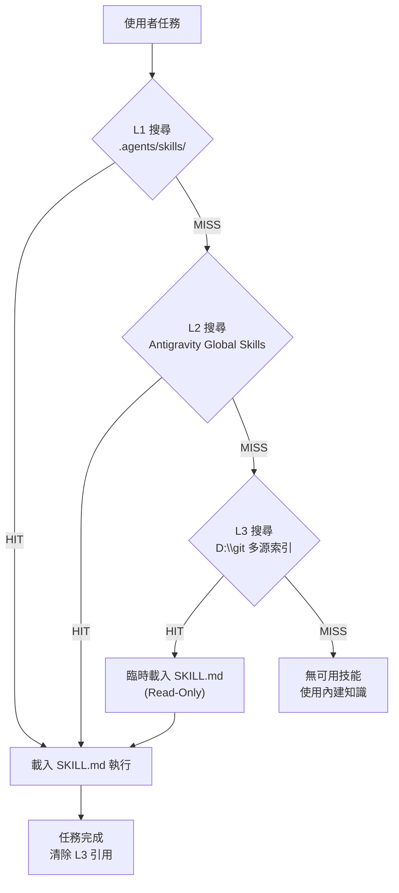

# Phase 173: L3 Skill Cache — D:\git 自動技能發現與生命週期管理

> **Phase**: 173
> **版本**: v3.6.3
> **狀態**: Discuss (Architectural Context)
> **日期**: 2026-05-05

---

## 1. 目標 (Goal)

當 AutoAgent-TW 執行任務時，若在 **L1 (workspace skills)** 與 **L2 (global skills)** 中找不到相關技能，自動向 **L3 (`D:\git`)** 搜尋匹配的 SKILL.md，按需載入使用，**任務結束後自動卸載**（不持久佔用記憶體/Token）。

### CPU Cache 類比模型

```
┌────────────────────────────────────────────────────────────┐
│ L1 Cache (最快 · 5 skills)                                  │
│ z:\AutoAgent-TW\.agents\skills\                             │
│ → git-token-killer, karpathy-guidelines, mcp-router,       │
│   rtk-token-killer, status-notifier                        │
├────────────────────────────────────────────────────────────┤
│ L2 Cache (快 · 172 skills)                                  │
│ C:\Users\TOM\.gemini\antigravity\skills\                    │
│ → 已安裝的全域 Antigravity 技能                              │
├────────────────────────────────────────────────────────────┤
│ L3 Cache (慢 · 7,176 SKILL.md files)                        │
│ D:\git\                                                     │
│ ├── antigravity-awesome-skills/ (4,509 skills + index)      │
│ ├── awesome-HQ-claude-skills/  (864 skills)                 │
│ ├── awesome-HQ-codex-skills/   (880 skills)                 │
│ ├── awesome-codex-skills/      (880 skills)                 │
│ ├── skills/                    (43 skills)                   │
│ └── awesome-agent-skills/      (README only, 0 SKILL.md)    │
│ → 純讀取參考，用完即棄                                       │
└────────────────────────────────────────────────────────────┘
```

---

## 2. 核心設計決策 (Key Decisions)

### 決策 1：搜尋策略 — Index-First vs. Filesystem Scan

| 方案 | 優點 | 缺點 |
|------|------|------|
| **A: Index-First (✅ 選用)** | `skills_index.json` 有 1,445 筆預建索引，搜尋 <50ms | 僅涵蓋 `antigravity-awesome-skills`，需補充其他 repo |
| **B: Filesystem Scan** | 涵蓋所有 7,176 SKILL.md | 每次掃描需 3-5 秒，高 I/O 開銷 |
| **C: Hybrid (✅ 最終)** | Index 優先 + fallback to FS scan for non-indexed repos | 兼顧速度與覆蓋率 |

**最終選用 C (Hybrid)**：先查 `skills_index.json`（4,509 skills），miss 時 fallback 到 `awesome-HQ-*` 等 repo 的 SKILL.md 掃描。

### 決策 2：載入粒度 — Full Copy vs. Read-Only Reference

| 方案 | 描述 |
|------|------|
| **A: Symlink/Copy to .agents/skills/** | 持久安裝，增加 L1 膨脹 |
| **B: Read-Only In-Memory Reference (✅ 選用)** | 僅讀取 SKILL.md 內容到當前會話，任務結束自動消失 |

**選用 B**：符合 "用完即棄" 原則，不污染 workspace。

### 決策 3：自動清除機制 — Eager vs. Lazy Eviction

| 策略 | 說明 |
|------|------|
| **Eager (✅ 選用)** | 每次任務完成後，L3 引用立即從上下文中移除 |
| **Lazy** | 保留到 Token 壓力超過閾值再清除 |

**選用 Eager**：遵循 Karpathy 原則的 Simplicity First，避免複雜的 LRU 邏輯。

---

## 3. 架構設計 (Architecture)



### 搜尋優先級（Search Priority）

1. **L1**: `z:\AutoAgent-TW\.agents\skills\` — 專案級技能 (5 skills)
2. **L2**: `C:\Users\TOM\.gemini\antigravity\skills\` — 全域技能 (172 skills)
3. **L3-Index**: `D:\git\antigravity-awesome-skills\skills_index.json` — 預建索引 (1,445 entries)
4. **L3-FS**: `D:\git\awesome-HQ-claude-skills\`, `D:\git\awesome-HQ-codex-skills\`, `D:\git\skills\` — 補充掃描

### 搜尋演算法

```python
def search_l3(query: str, top_k: int = 3) -> list[SkillMatch]:
    """
    1. Tokenize query -> keywords
    2. Search skills_index.json by:
       - name match (exact > partial)
       - description match (TF-IDF-like scoring)
       - category/tags match
    3. If < top_k results, fallback to FS scan of non-indexed repos
    4. Return ranked list of {skill_id, path, score, description}
    """
```

### 生命週期

```
[DISCOVER] → query 關鍵字比對 skills_index.json + FS scan
[LOAD]     → 讀取 SKILL.md 內容到當前上下文
[EXECUTE]  → 依照 SKILL.md 指令執行任務
[EVICT]    → 任務完成，從上下文中移除 L3 內容
```

---

## 4. 實作方案 (Implementation Plan)

### 4.1 核心腳本：`scripts/l3_skill_cache.py`

- **功能**: 搜尋 `D:\git` 中的技能索引，返回匹配結果
- **輸入**: 查詢關鍵字 (e.g., "kubernetes deployment")
- **輸出**: JSON 格式的匹配結果 [{id, path, score, description}]
- **模式**:
  - `--search <query>` — 搜尋模式
  - `--read <skill_path>` — 讀取特定 SKILL.md
  - `--sources` — 列出所有可用的 L3 源

### 4.2 Workflow 整合：修改 `aa-discuss2.md` 的 Step 2.5

在 Karpathy Think Before Coding 步驟後，新增：

```markdown
### Step 2.7: L3 Skill Discovery (Auto)
1. 如果當前任務的關鍵字在 L1/L2 中無匹配技能：
   - 執行 `python scripts/l3_skill_cache.py --search "<task keywords>"`
2. 如果找到匹配：
   - 自動讀取最佳匹配的 SKILL.md
   - 通知用戶：「[L3 Cache] 偵測到相關技能: xxx-skill，已臨時載入」
3. 任務完成後：
   - L3 內容不保留在後續上下文中
```

### 4.3 Antigravity Bridge 更新

更新 `C:\Users\TOM\.gemini\antigravity\skills\antigravity-awesome-bridge\SKILL.md`：
- 新增 L3 多源搜尋路徑
- 新增 auto-eviction 指令

---

## 5. 資安設計 (STRIDE)

| 威脅 | 風險等級 | 對策 |
|------|----------|------|
| **Spoofing** | LOW | L3 來源均為已知的本機 Git repos，非遠端下載 |
| **Tampering** | MEDIUM | 讀取前檢查 SKILL.md 是否包含可疑 `eval()`/`exec()`/`subprocess` 指令 |
| **Info Disclosure** | LOW | Read-only 模式，不寫入任何資料到 D:\git |
| **Denial of Service** | LOW | 設定搜尋超時 (5s)，避免 FS scan 阻塞主流程 |
| **Elevation of Privilege** | LOW | SKILL.md 僅作為指令文件讀取，不執行其中的腳本 |

---

## 6. 邊界與約束 (Constraints)

### DoD (Definition of Done)
- [ ] `python scripts/l3_skill_cache.py --search "fastapi"` 能在 <1s 內返回匹配結果
- [ ] 搜尋涵蓋所有 7,176 SKILL.md (Index + FS fallback)
- [ ] 載入的 L3 技能不會出現在下次任務的上下文中
- [ ] 所有 Workflow (`aa-discuss2`, `aa-execute`, `aa-plan`) 能自動觸發 L3 搜尋

### 非功能需求
- **效能**: Index 搜尋 <100ms，FS fallback <5s
- **記憶體**: 單次 L3 載入不超過 50KB (一個 SKILL.md 平均 2-5KB)
- **Token**: 單次 L3 注入不超過 2,000 tokens

---

## 7. 多 Agent 思考 (3-Perspective Analysis)

### 架構師視角
> 「Hybrid Index + FS 是正確的折衷。Index 覆蓋主要 repo (4,509)，FS 補充長尾。Read-only 模式避免了 workspace 污染和 Git 衝突。」

### 資安工程師視角
> 「D:\git 是本地磁碟，不涉及遠端 fetch，風險可控。但需防止惡意 SKILL.md 注入危險指令。建議加一層 content sanitizer。」

### AI 產品專家視角
> 「自動發現 + 用完即棄的 UX 完美。但需要透明通知機制，讓用戶知道正在使用哪個 L3 技能。建議加 `[L3 Cache HIT]` 前綴。」

---

## 8. [ASSUMPTION] 標記

1. **[ASSUMPTION]** `D:\git` 路徑固定，不會因系統遷移而改變。
   → 建議後續可配置化 (`l3_cache_paths` in `config.json`)
2. **[ASSUMPTION]** `skills_index.json` 結構穩定，不需要版本適配。
3. **[ASSUMPTION]** 7,176 個 SKILL.md 中沒有惡意內容（來源為已知的開源 repo）。

---

## 9. 替代方案比較

| 方案 | 複雜度 | Token 效率 | 覆蓋率 | 選用 |
|------|--------|-----------|--------|------|
| **A: 預先全部安裝到 L2** | 高 (7,176 skills) | 極差 (Token 爆炸) | 100% | ❌ |
| **B: L3 Cache (本方案)** | 中 | 優 (按需載入) | 100% | ✅ |
| **C: 僅依賴 Web Search** | 低 | 差 (每次上網) | 不確定 | ❌ |
| **D: MCP Server 封裝** | 高 | 好 | 100% | 🔄 未來考慮 |
