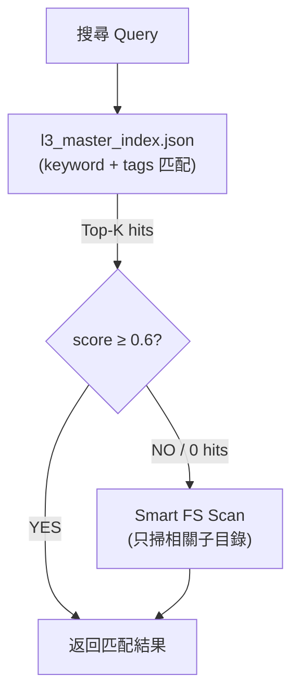
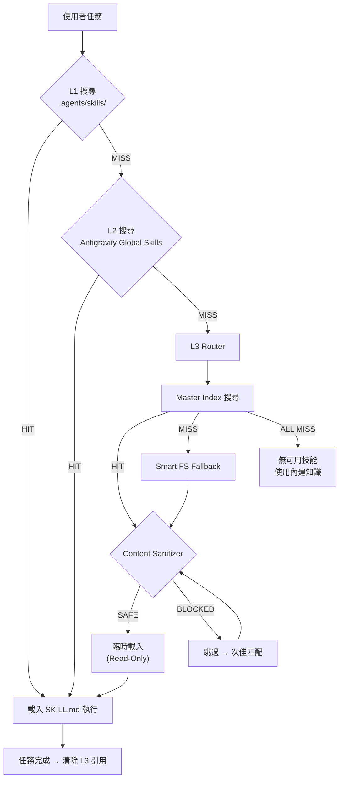

# Phase 173: L3 Skill Cache — 自動技能發現與生命週期管理 (v2.0 Merged)

> **Phase**: 173
> **版本**: v3.6.3
> **狀態**: Discuss Complete → Ready for Plan
> **日期**: 2026-05-05
> **來源**: CONTEXT.md v1.0 + L3skill.md 優化建議 + 使用者 3 項決策回覆

---

## 1. 目標 (Goal)

當 AutoAgent-TW 執行任務時，若在 **L1 (workspace skills)** 與 **L2 (global skills)** 中找不到相關技能，自動向 **L3 (可配置目錄)** 搜尋匹配的 SKILL.md，按需載入使用，**任務結束後自動卸載**。

### CPU Cache 類比模型

```
┌─────────────────────────────────────────────────────────────────┐
│ L1 Cache (最快 · 5 skills)                                       │
│ {workspace}/.agents/skills/                                      │
│ → 專案專用技能 (git-token-killer, karpathy-guidelines 等)         │
├─────────────────────────────────────────────────────────────────┤
│ L2 Cache (快 · 172 skills)                                       │
│ {home}/.gemini/antigravity/skills/                               │
│ → 已安裝的全域 Antigravity 技能                                   │
├─────────────────────────────────────────────────────────────────┤
│ L3 Cache (按需 · 7,176+ SKILL.md)                                │
│ {l3_cache_root}/  ← 可配置 (預設 D:\git)                          │
│ ├── antigravity-awesome-skills/ (4,509 skills + index)           │
│ ├── awesome-HQ-claude-skills/  (864 skills)                      │
│ ├── awesome-HQ-codex-skills/   (880 skills)                      │
│ ├── awesome-codex-skills/      (880 skills)                      │
│ ├── skills/                    (43 skills)                        │
│ └── awesome-agent-skills/      (README curated list)             │
│ → Read-Only 參考，用完即棄                                        │
└─────────────────────────────────────────────────────────────────┘
```

---

## 2. 使用者決策回覆 (User Decisions)

| # | 問題 | 使用者決策 | 影響 |
|---|------|-----------|------|
| 1 | `D:\git` 路徑是否固定？ | **NO** — 安裝時可配置化，並自動 `git clone` 相關 repo 到指定目錄 | 需新增 `l3_config.json` + Installer 整合 |
| 2 | `skills_index.json` 結構穩定？ | **不確定** — 不應依賴單一索引格式 | 需自建 `l3_master_index.json`，具備版本容錯 |
| 3 | SKILL.md 內容是否安全？ | **需資安確認** — 不可直接信任開源 SKILL.md | 需 Content Sanitizer + Hash 驗證 |

---

## 3. 核心設計決策 (Key Decisions)

### 決策 1：L3 路徑可配置化 + 自動 Clone

**安裝時行為：**
```
$ python scripts/aa_installer_logic.py --with-l3-cache --l3-path "E:\my-skills"
```

1. Installer 提示用戶選擇 L3 目錄（預設 `D:\git`）
2. 自動 `git clone --depth 1` 預定義的 repo 清單
3. 路徑寫入 `config/l3_config.json`

**預定義 Git Repo 清單：**

| Repo | URL | SKILL.md 數量 | 優先級 |
|------|-----|--------------|--------|
| antigravity-awesome-skills | `sickn33/antigravity-awesome-skills` | 4,509 | **P0** (有 index) |
| awesome-HQ-claude-skills | `ComposioHQ/awesome-claude-skills` | 864 | P1 |
| awesome-HQ-codex-skills | `ComposioHQ/awesome-codex-skills` | 880 | P1 |
| skills (OpenAI) | `openai/skills` | 43 | P2 |
| awesome-agent-skills | `VoltAgent/awesome-agent-skills` | 0 (README) | P3 |

### 決策 2：自建 Master Index（不依賴上游 index 格式）

由於 `skills_index.json` 格式不穩定，改為 **自建統一索引**：

```python
# l3_master_index.json 結構
{
  "version": "1.0.0",
  "built_at": "2026-05-05T11:00:00Z",
  "total_skills": 7176,
  "entries": [
    {
      "id": "kubernetes-deployment",
      "name": "Kubernetes Deployment",
      "description": "...",
      "repo": "awesome-HQ-claude-skills",
      "path": "kubernetes/deployment/SKILL.md",
      "abs_path": "D:\\git\\awesome-HQ-claude-skills\\kubernetes\\deployment\\SKILL.md",
      "category": "devops",
      "tags": ["k8s", "deployment"],
      "token_count": 1240,
      "content_hash": "sha256:abc123...",
      "risk": "safe",
      "last_modified": "2026-04-12"
    }
  ]
}
```

**建置方式：** `python scripts/build_l3_index.py --root D:\git`
- 遍歷所有 repo，解析每個 SKILL.md 的 frontmatter
- 計算 `content_hash` (SHA-256) 供資安驗證
- 支援 incremental update（只掃描 `git diff` 有變動的檔案）

### 決策 3：搜尋策略 — Hybrid (Index + Smart FS)



### 決策 4：Read-Only + Eager Eviction（不變）

- 僅讀取 SKILL.md 內容到當前會話
- 任務完成後立即清除 L3 引用
- 不安裝、不複製、不持久化

### 決策 5：內容安全閘門 (Content Sanitizer)

**兩層防禦：**

1. **靜態掃描 (Build-time)**：建置 Index 時檢查每個 SKILL.md
2. **載入時驗證 (Runtime)**：讀取前比對 `content_hash`

```python
# 黑名單關鍵字（SKILL.md 中不應出現的危險指令）
DANGEROUS_PATTERNS = [
    r'\beval\s*\(',
    r'\bexec\s*\(',
    r'\bsubprocess\b',
    r'\bos\.system\s*\(',
    r'\bshutil\.rmtree\s*\(',
    r'\brequests\.post\s*\(.+(?:webhook|external)',
    r'\bopen\s*\(.+["\']w["\']\)',
    r'__import__\s*\(',
    r'\bimport\s+ctypes\b',
]

# 風險分級
RISK_LEVELS = {
    "safe": 0,       # 無任何危險 pattern
    "caution": 1,    # 有 1 個 pattern 但可能是教學示例
    "blocked": 2,    # ≥2 個 pattern，拒絕載入
}
```

**使用者通知：**
```
[L3 Cache] ⚠️ kubernetes-hacking (score: 0.88) 被安全閘門攔截
    → 偵測到危險指令: subprocess.call, os.system
    → 已自動跳過，改用次佳匹配: kubernetes-security-best-practices
```

---

## 4. 架構設計 (Architecture)

### 完整流程



### 檔案結構

```
z:\AutoAgent-TW\
├── config/
│   └── l3_config.json          ← L3 路徑 + repo 清單 + 安全設定
├── scripts/
│   ├── l3_skill_cache.py       ← 核心搜尋引擎 (CLI + API)
│   ├── build_l3_index.py       ← Master Index 建置器
│   └── aa_installer_logic.py   ← 新增 --with-l3-cache 參數
├── data/
│   └── l3_master_index.json    ← 自建統一索引
└── .agents/skills/
    └── antigravity-awesome-bridge/
        └── SKILL.md            ← 更新：整合 L3 搜尋邏輯
```

### l3_config.json Schema

```json
{
  "l3_cache_root": "D:\\git",
  "repos": [
    {
      "name": "antigravity-awesome-skills",
      "url": "https://github.com/sickn33/antigravity-awesome-skills",
      "priority": 0,
      "has_index": true,
      "enabled": true
    },
    {
      "name": "awesome-HQ-claude-skills",
      "url": "https://github.com/ComposioHQ/awesome-claude-skills",
      "priority": 1,
      "has_index": false,
      "enabled": true
    },
    {
      "name": "awesome-HQ-codex-skills",
      "url": "https://github.com/ComposioHQ/awesome-codex-skills",
      "priority": 1,
      "has_index": false,
      "enabled": true
    },
    {
      "name": "skills",
      "url": "https://github.com/openai/skills",
      "priority": 2,
      "has_index": false,
      "enabled": true
    }
  ],
  "search": {
    "timeout_seconds": 5,
    "max_results": 5,
    "score_threshold": 0.6,
    "max_token_injection": 2000
  },
  "security": {
    "enable_content_sanitizer": true,
    "hash_verification": true,
    "blocked_risk_level": 2
  }
}
```

---

## 5. 資安設計 — STRIDE 強化版

| 威脅 | 風險等級 | 攻擊向量 | 防禦對策 |
|------|----------|---------|---------|
| **Spoofing** | MEDIUM | 惡意 repo 偽裝合法技能 | 白名單 repo URL + Git origin 驗證 |
| **Tampering** | HIGH | SKILL.md 被注入惡意指令 | Content Sanitizer (黑名單掃描) + SHA-256 Hash 比對 |
| **Repudiation** | LOW | 無法追蹤哪個 L3 技能被使用 | Telemetry log: `{query, hit_repo, score, timestamp}` |
| **Info Disclosure** | LOW | L3 搜尋可能洩漏任務意圖 | 搜尋僅在本機執行，無網路傳輸 |
| **Denial of Service** | MEDIUM | 大量 FS scan 導致磁碟 I/O 飽和 | 每 repo 搜尋超時 2.5s + ThreadPool 並行 |
| **Elevation of Privilege** | MEDIUM | 惡意 SKILL.md 指示 Agent 執行危險操作 | 雙層防禦：靜態掃描 + Runtime Hash 驗證 |

### 額外安全措施

1. **Git Clone 限制**: `--depth 1` 避免拉取完整歷史
2. **唯讀模式**: 所有 L3 操作為 read-only，不寫入 D:\git
3. **Content Hash 驗證**: 若 SKILL.md 被修改（hash 不匹配），發出 `⚠️ TAMPERED` 警告
4. **Quarantine**: 被攔截的 SKILL.md 記錄到 `data/l3_quarantine.log`

---

## 6. 實作分階段 (Phased Implementation)

### Phase 173.1：核心引擎 + Installer（本週）

| 任務 | 產出 |
|------|------|
| 建立 `config/l3_config.json` | 路徑 + repo 清單 + 安全設定 |
| 實作 `scripts/build_l3_index.py` | 遍歷所有 repo → 產出 `l3_master_index.json` |
| 實作 `scripts/l3_skill_cache.py` | `--search` / `--read` / `--sources` / `--rebuild-index` |
| 更新 `scripts/aa_installer_logic.py` | 新增 `--with-l3-cache` + `--l3-path` 參數 |
| Content Sanitizer | 黑名單掃描 + Hash 計算 |

### Phase 173.2：Workflow 整合

| 任務 | 產出 |
|------|------|
| 更新 `antigravity-awesome-bridge/SKILL.md` | L3 多源搜尋指令 |
| 在 `aa-discuss2.md` 新增 Step 2.7 | 自動 L3 Discovery |
| 在 `aa-execute.md` 新增 L3 pre-check | 執行前自動搜尋 |
| Telemetry logging | `data/l3_telemetry.jsonl` |

### Phase 173.3：未來優化（Backlog）

| 任務 | 說明 |
|------|------|
| Embedding Hybrid Search | `0.65 * keyword + 0.35 * embedding` |
| Skill Dependency Graph | NetworkX + `prerequisites` 抽取 |
| L3 → L2 自動升級 | 常用技能建議安裝到 Global Skills |
| MCP Server 封裝 | 將 L3 Cache 包裝為 MCP Tool |

---

## 7. 多 Agent 思考 (3-Perspective Analysis)

### 架構師視角
> 「路徑可配置化是正確的。自建 Master Index 消除了對上游格式的依賴。Hybrid 搜尋兼顧速度與覆蓋率。分 3 階段實作避免過度工程化。」

### 資安工程師視角
> 「Content Sanitizer + Hash 驗證形成雙層防禦。白名單 repo 限制了攻擊面。Quarantine log 提供事後稽核能力。建議 Phase 173.1 完成後做一次完整的安全掃描驗證。」

### AI 產品專家視角
> 「自動 Clone + 可配置路徑降低了使用者門檻。`[L3 Cache HIT]` 通知保持了透明度。Eager Eviction 避免了 Token 浪費。搜尋延遲 <1s 符合 UX 預期。」

---

## 8. DoD (Definition of Done)

- [ ] `python scripts/l3_skill_cache.py --search "fastapi"` 在 <1s 內返回結果
- [ ] `python scripts/build_l3_index.py --root D:\git` 成功建置 Master Index
- [ ] Content Sanitizer 能攔截包含 `eval()/exec()` 的 SKILL.md
- [ ] Hash 驗證能偵測被竄改的 SKILL.md
- [ ] Installer `--with-l3-cache --l3-path "X:\path"` 能自動 clone 所有 repo
- [ ] 載入的 L3 技能不會出現在下次任務的上下文中
- [ ] 搜尋平均延遲 < 800ms (P95)
- [ ] 所有 Workflow 能自動觸發 L3 搜尋

---

## 9. 替代方案比較（最終版）

| 方案 | 複雜度 | Token 效率 | 覆蓋率 | 安全性 | 選用 |
|------|--------|-----------|--------|--------|------|
| **A: 預先全部安裝到 L2** | 高 | 極差 (Token 爆炸) | 100% | 高 | ❌ |
| **B: L3 Cache + Sanitizer (本方案)** | 中 | 優 (按需載入) | 100% | 高 | ✅ |
| **C: 僅依賴 Web Search** | 低 | 差 (每次上網) | 不確定 | 低 | ❌ |
| **D: MCP Server 封裝** | 高 | 好 | 100% | 高 | 🔄 Phase 173.3 |
