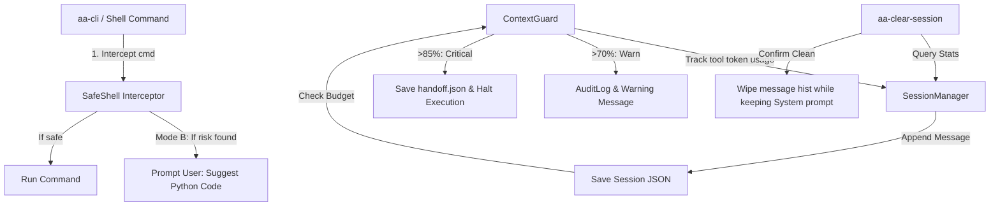

# Phase 179 — Universal Context Guard & Safe Executor
## PLAN.md — Execute Blueprint
> Last Updated: 2026-05-17 | Context Limit: 128K | Shell Mode: B (攔截+確認)

---

## 1. 需求拆解與邊界定義 (Discuss Summary)
此階段旨在建置平台級別的 **Context Guard（上下文防衛）** 與 **Safe Executor（安全執行器）**，並提供 **`aa-clear-session`** 功能，動態清除 AI 上下文而不需重開 IDE。

### 核心限制條件與策略：
1. **128K Token 硬上限**：警告閾值設為 70% (89,600 tokens)，強制停止並存檔閾值設為 85% (108,800 tokens)。
2. **Shell Interception Mode B (攔截並確認)**：針對危險的 shell 鏈結或破壞性指令進行靜態語法樹/規則分析，當識別到潛在風險時，警告並提示用戶確認，同時提供 Python 標準庫替代代碼。
3. **Budget-Triggered Handoff**：不與 Wave 綁定，當上下文耗盡前自動執行 Handoff 快照。
4. **`aa-clear-session` CLI 命令**：在清除前詳細顯示目前 Session 的 token 用量與狀態，並在清除時僅保留 System Instructions 和最後 3-5 條 Message，動態重置上下文。

---

## 2. 規劃階段 8 維度檢查表 (8-Dimensional Check Matrix)

| 維度 | 安全與架構設計方案 | 預防性優化策略 |
| :--- | :--- | :--- |
| **1. 需求拆解與邊界定義** | 精確定義 Warn (70%), Critical (85%), Max (100%) 的處理邏輯，確保系統與 Shell 指令的檢查均有明確的回傳合約與錯誤碼。 | 對所有輸入的 Shell 指令進行前後綴 trim，防止惡意繞過。 |
| **2. 技術選型與理由** | 採用純 Python 實現核心 `ContextGuard` 模組，不引入重型依賴。使用 `argparse` 與 `pathlib` 建立高可攜性的 CLI 清理工具。 | 避免依賴 `tiktoken` 等外部大套件以維持 200MB 以下 Stealth Mode 記憶體限制，使用高精度啟發式估算演算法。 |
| **3. 系統架構圖 (Mermaid)** | 如下方 Mermaid 系統流程所示，將防禦模組注入 `SessionManager` 與 `HarnessGateway`。 | 維持高內聚低耦合的 Class 結構。 |
| **4. 並行與效能設計** | Session 清除與寫入過程均採用 `threading.RLock` 鎖定機制，確保多執行緒環境下讀寫安全，防範死鎖。 | 讀寫操作使用原子寫入（寫入 temp 檔案再 rename），避免損毀 JSON。 |
| **5. 資安設計與威脅建模** | 執行 **STRIDE 分析**： - *Spoofing*: 使用 `Path.resolve()` 防範 Path Traversal。 - *Tampering*: JSON 寫入前進行 Schema 校驗。 - *Elevation*: 禁用 `eval()`/`exec()`。 - *Denial of Service*: 對 `BUSY` 狀態的 Session 禁止無提示清除（除非 --force）。 | 使用規則與 Regex 靜態攔截 `rm -rf` 等破壞性操作，並在 CLI 執行前提示。 |
| **6. AI 產品相關考量** | 提供高 DX（開發者體驗）的 CLI 介面，使用表格與豐富色彩顯示 Token 用量，跳過時支援 `--yes` 自動化。 | 提供引導式的 Python 替代代碼，教育 AI 與開發者轉向安全寫法。 |
| **7. 錯誤處理與恢復** | 針對 JSON 讀取失敗、檔案權限不足提供優雅的 Try-Except 機制。Handoff 寫入失敗時自動備份至 fallback 路徑。 | 任何異常均輸出詳細 Traceback 並記入 `AuditLogger`。 |
| **8. 測試策略** | 撰寫單元測試覆蓋 Token 追蹤、Safe Shell 攔截、Handoff 生成以及 CLI 子命令執行，確保覆蓋率 > 95%。 | 建立對應的 mock 測試，模擬 Session token 超載的極端情況。 |

---

## 3. 系統架構圖 (Mermaid Layout)

---

## 4. 執行計畫 (Wave Plan)

### Wave 1: 核心防禦模組 `src/core/context_guard.py` [NEW]
- 實作 `ContextGuard` 類別，提供 Token 累計追蹤、高精度 Unicode 估算、Safe Shell 靜態分析與 Handoff 存取方法。
- 內建 `DANGEROUS_PATTERNS` 規則庫與 `SAFE_ALTERNATIVES` Python 標準庫對應建議。

### Wave 2: 接線現有系統 (Integration & Wiring)
- **`src/core/harness_gateway.py`**：在 `_init_security()` 中載入並實例化 `ContextGuard`。
- **`src/core/session_manager.py`**：修復 `send()` 方法，累加 `session.token_count` 避開永遠是 0 的 bug；並在 token 超限時觸發 Handoff 警告與熔斷。

### Wave 3: `aa-clear-session` CLI 與指令包裝器 [NEW]
- **`scripts/aa_clear_session.py`**：獨立清除工具。讀取 `.sessions/` 中的 JSON 檔案，以表格呈現各 Session 的 key、kind、messages、估算 tokens 以及 active 狀態；執行清除時保留系統提示詞與最近的歷史，大幅釋放 tokens。
- **`scripts/aa_cli.py`**：註冊 `clear-session` 子命令以支援 `aa clear-session`。
- **`aa-clear-session.cmd`**：於根目錄建立批次檔包裝，讓使用者能一鍵執行 `aa-clear-session`。

### Wave 4: 測試套件 `tests/test_context_guard.py` [NEW]
- 針對 `ContextGuard` 的 Token 累加、圖片成本計算、規則過濾進行全面單元測試。
- 測試 `CommandAnalysis` 是否正確識別危險操作並提供 Python 建議代碼。
- 測試 Handoff 的完整性驗證與 `aa-clear-session` 的清理效果。

---

## 5. 驗證計畫 (Verification Matrix)

1. **靜態語法審計**：執行 `python -m py_compile src/core/context_guard.py` 確保無語法問題。
2. **自動化測試**：執行 `pytest tests/test_context_guard.py -v` 確保所有測試案例通過。
3. **整合性啟動**：執行 `aa-harness` 與 `aa-tw` 指令，驗證注入 `ContextGuard` 不影響系統啟動與正常訊息傳遞。
4. **手動 CLI 測試**：執行 `aa-clear-session` 與 `aa clear-session`，確認能完美列出並重置 Session，釋放 token 的同時保留 System Prompts。
