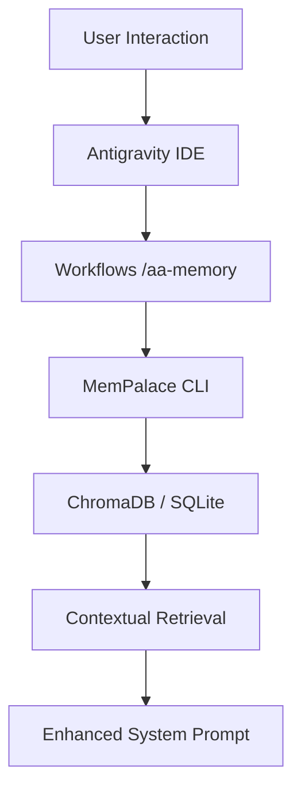

# AutoAgent-TW Architecture: Memory Palace Integration

## Overview
AutoAgent-TW now incorporates **MemPalace**, a long-term memory system that stores verbatim conversation history, project decisions, and temporal facts entirely locally. This allows the AI to "remember" decisions made in past sessions, significantly improving consistency and reducing redundant questions.

## Core Components
1. **MemPalace Engine**: A Python-based semantic search and knowledge graph system using ChromaDB (local) and SQLite.
2. **Project Palace**: Each AutoAgent project now has its own palace stored in the root (`mempalace.yaml`, `chroma.sqlite3`).
3. **Knowledge Gateway (`aa_kb_gateway.py`)**: A multi-modal router supporting:
    - **Security Guard**: White-list based filtering for LineBot ingestion.
    - **Vision OCR**: Gemini-powered extraction of text from images.
    - **Command Routing**: Discriminates between Queries (`@大腦`) and Ingestion (`#知識庫`).
4. **Hybrid Sync Plane (`kb_gdrive_sync.py`)**: Dual-mode synchronization supporting both Google Drive API (Service Account) and Rclone for maximum deployment flexibility.

## Data Flow
### 1. Memory Retrieval Flow

### 2. Knowledge Ingestion Pipeline (Phase 133)

## Design Decisions
- **Local First**: We chose MemPalace because it requires zero API keys and keeps all user data in the workspace.
- **Hybrid Sync**: Implementation of Rclone alongside Drive API allows the system to run in air-gapped or restricted environments where direct API access might be blocked.
- **Whitelist Defense**: Instead of using LLM for intent classification of every message, a prefix-based whitelist approach is used to save costs and prevent prompt injection from unauthorized sources.

