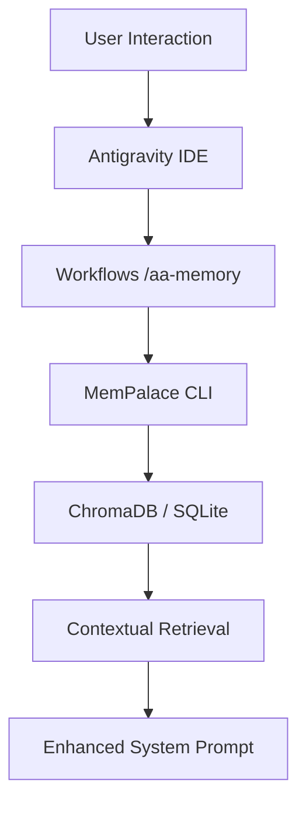

# AutoAgent-TW Architecture: Memory Palace Integration

## Overview
AutoAgent-TW now incorporates **MemPalace**, a long-term memory system that stores verbatim conversation history, project decisions, and temporal facts entirely locally. This allows the AI to "remember" decisions made in past sessions, significantly improving consistency and reducing redundant questions.

## Core Components
1. **MemPalace Engine**: A Python-based semantic search and knowledge graph system using ChromaDB (local) and SQLite.
2. **Project Palace**: Each AutoAgent project now has its own palace stored in the root (`mempalace.yaml`, `chroma.sqlite3`).
3. **Mining Layer**: Automated mining of project files, logs, and artifacts during installation and via workflows.
4. **CLI Shim (`mempalace.cmd`)**: A project-local command to interact with the memory system using the project's virtual environment.

## Data Flow

## Integration Details
- **Installer**: `scripts/aa_installer_logic.py` now automatically clones MemPalace from GitHub, installs dependencies, and initializes the project palace.
- **Environment**: Uses `PYTHONUTF8=1` and `PYTHONIOENCODING=utf-8` to handle Windows-specific character encoding issues.
- **Workflow**: `/aa-memory` provides a high-level interface for users to search or update the memory.

## Design Decisions
- **Local First**: We chose MemPalace because it requires zero API keys and keeps all user data in the workspace, aligning with the AutoAgent-TW "Zero-Trust" and "Privacy" goals.
- **Verbatim Storage**: Unlike summarizers, we store original text to prevent context loss, reaching 96.6% recall accuracy.
- **Project Isolation**: Every project has its own memory, preventing "context contamination" between different tasks.
