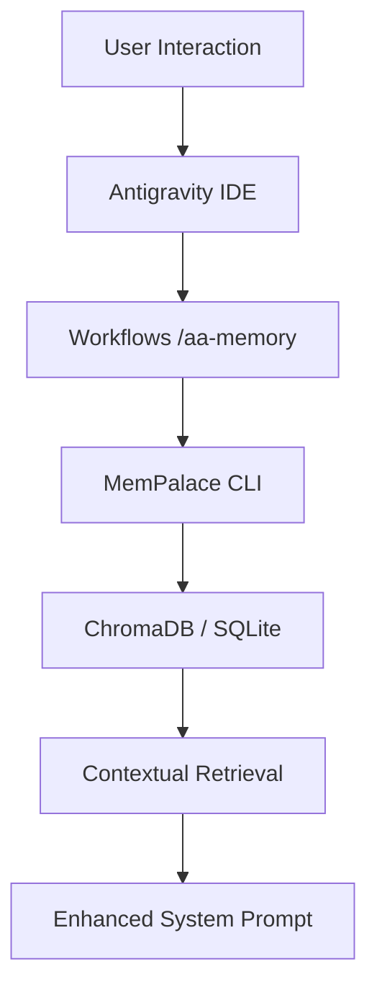
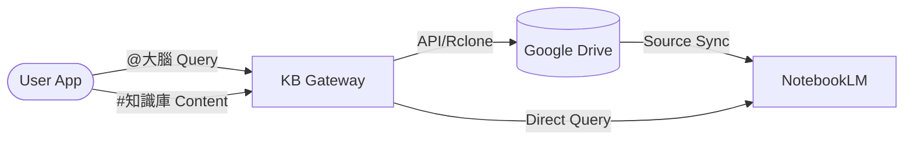

# AutoAgent-TW Architecture: Memory Palace Integration

## Overview
AutoAgent-TW now incorporates **MemPalace**, a long-term memory system that stores verbatim conversation history, project decisions, and temporal facts entirely locally. This allows the AI to "remember" decisions made in past sessions, significantly improving consistency and reducing redundant questions.

## Core Components
1. **MemPalace Engine**: A Python-based semantic search and knowledge graph system using ChromaDB (local) and SQLite.
2. **Project Palace**: Each AutoAgent project now has its own palace stored in the root (`mempalace.yaml`, `chroma.sqlite3`).
3. **Knowledge Gateway (`aa_kb_gateway.py`)**: A multi-modal router supporting:
    - **Security Guard**: White-list based filtering for LineBot ingestion.
    - **Vision OCR**: Gemini-powered extraction of text from images.
    - **Command Routing**: Discriminates between Queries (`@大腦`) and Ingestion (`#知識庫`).
4. **Hybrid Sync Plane (`kb_gdrive_sync.py`)**: Dual-mode synchronization supporting both Google Drive API (Service Account) and Rclone for maximum deployment flexibility.

## Data Flow
### 1. Memory Retrieval Flow

### 2. Knowledge Ingestion Pipeline (Phase 133)

## Deployment & Installation
AutoAgent-TW uses a **Hybrid Industrial Installer** (`aa-installer.ps1` + `aa_installer_logic.py`):
- **Bootstrapper**: PowerShell handles OS-level execution policies and Python detection.
- **Logic Engine**: Python manages venv creation, dependency resolution, and internal registry.
- **Global Shims**: Automatically generates `.cmd` shims in the project root and adds them to the **User-level PATH** to avoid Administrative overhead while ensuring global availability of `aa-tw` and `autoagent` commands.

## Resource & Lifecycle Management (Phase 149)
To ensure system stability during long-running sessions, AutoAgent-TW implements a robust resource management layer:
1. **Agent Reaper**: A background monitor that identifies and terminates orphaned node.exe (MCP servers) and python.exe processes by checking parent process health and command-line signatures.
2. **Vision Zero-Copy Architecture**: Utilizes multiprocessing.shared_memory to transfer high-resolution screen data directly between the capture daemon (PyRefly) and the analysis agent without intermediate buffer copies.
3. **Lazy Memory Allocation**: All vision and file-heavy tools use LRU caching and explicit buffer cleaning to prevent memory bloat over 500MB.
4. **Task Isolation**: Uses Windows **Job Objects** to treat the entire agent tree as a single atomic unit for resource limiting and final cleanup.
