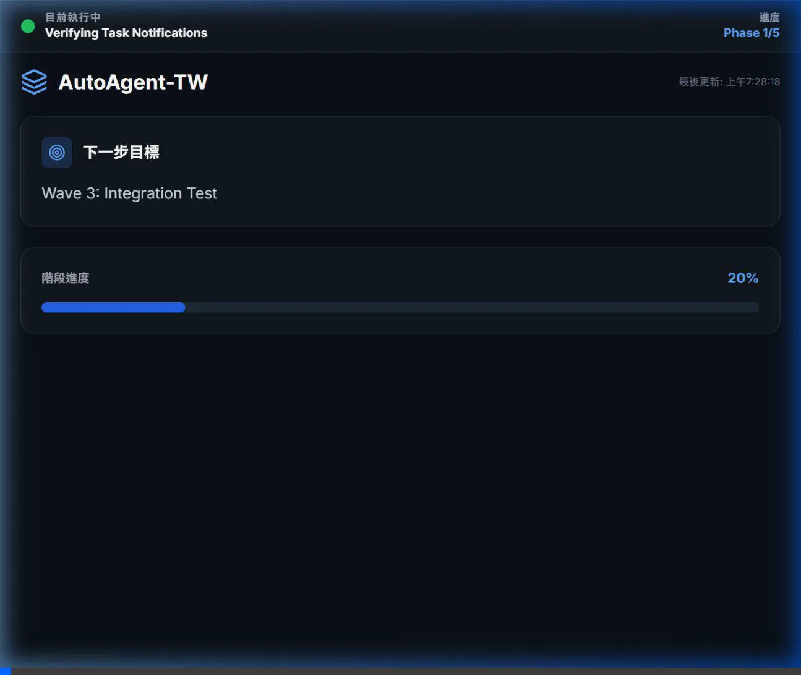
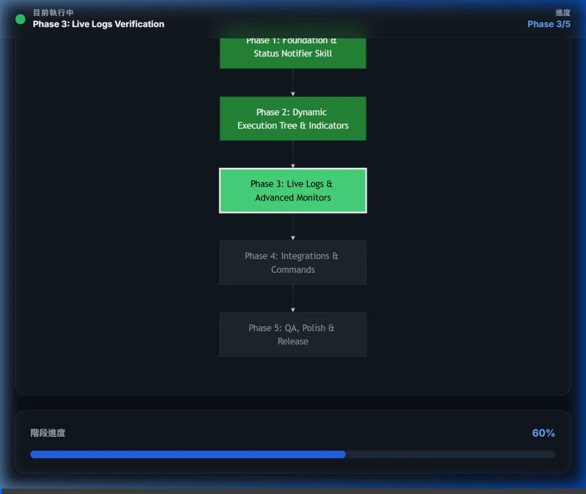
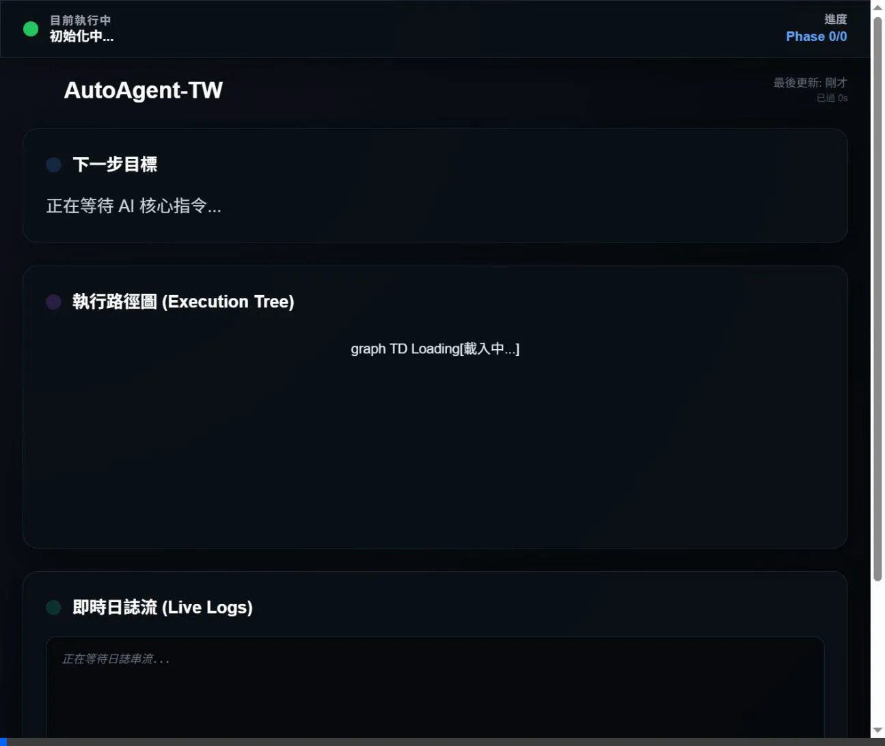
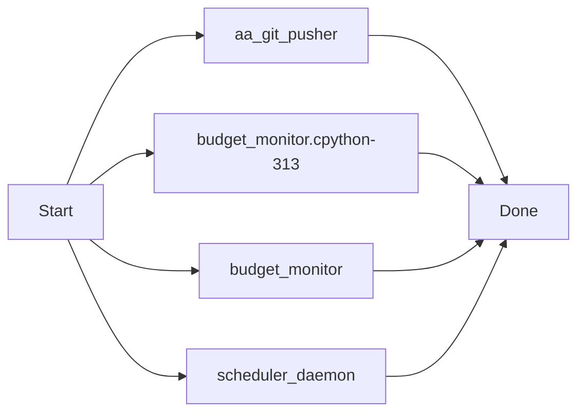
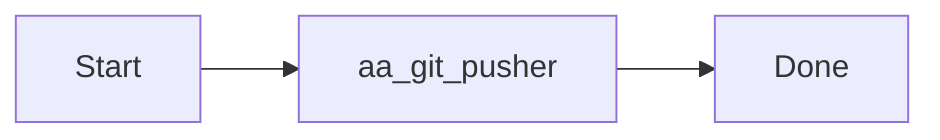
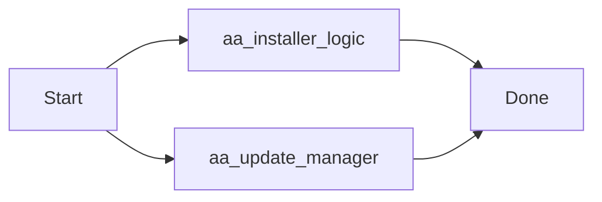
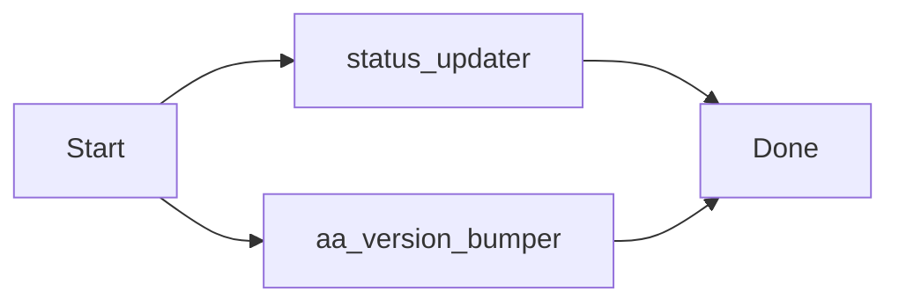

# 📊 AutoAgent-TW 狀態儀表板 (Status Dashboard) 完全指南

儀表板是 AutoAgent-TW 的「大腦視覺化中心」。它能讓您即時監控 Agent 的執行流程、檢視歷史日誌，並管理所有的背景排程任務與事件鉤子。

---

## 🚀 快速啟動
您可以在瀏覽器中直接開啟下列檔案（無需啟動 Web Server，已內建 CORS 繞過方案）：
🔗 **[status.html](.agents/skills/status-notifier/templates/status.html)**

---

## 🎨 核心三大分頁內容

### 1. 執行流程 (Execution Flow)
這是 Agent 執行任務時的即時狀態顯示。
- **動態流程圖**: 使用 Mermaid.js 生成，標記當前執行到的步驟（綠色為完成，藍色為進行中）。
- **進度指示器**: 顯示當前 Phase（如 Phase 5/5）與完成百分比。
- **即時通知**: 包含當前任務描述、下一階段目標、以及自我修復 (Self-Repair) 的輪次。

### 2. 進度日誌 (Terminal Logs)
將背景執行的終端機輸出同步到網頁中，方便除錯。
- **即時滾動**: 自動捕獲 `status_updater.py` 傳送的最新日誌行。
- **錯誤標記**: 當狀態為 `fail` 時，背景會變紅，並觸發 LINE Notify 警報。

### 3. 排程與鉤子 (Scheduler & Hooks)
**v1.6.0 新增功能**，用於監控自主任務。
- **Scheduled Tasks**: 顯示所有由 `aa-schedule` 加入的定時任務（如心跳檢查、自動測試）。
  - 欄位包含：任務名稱、觸發類型（cron/interval）、參數、**上次執行時間**與**執行結果**。
- **Event Hooks**: 顯示目前掛載的所有 Git 事件鉤子（如 `post-commit` 會觸發哪些背景自動化操作）。

---

## 🛠 技術架構與原理

### 數據流 (Data Pipeline)
1. **觸發源**: CLI 指令、背景 Daemon 或 Git Hooks 調用 `status_updater.py`。
2. **數據持久化**: 狀態被寫入 `.agent-state/status_state.json`。
3. **JS 封裝**: 同步產生 `.agent-state/status_state.js` 用於繞過瀏覽器本地檔案讀取的 CORS 限制。
4. **前端渲染**: `status.html` 透過 `setInterval` 每 2 秒輪詢一次數據並重新渲染 UI。

### 核心檔案位置
- **UI 模板**: `.agents/skills/status-notifier/templates/status.html` (CSS/JS 內建於 single file)
- **更新腳本**: `.agents/skills/status-notifier/scripts/status_updater.py`
- **狀態緩存**: `.agent-state/status_state.js`

---

## ❓ 常見問題與排除 (Troubleshooting)

| 問題現象 | 可能原因 | 解決方法 |
| :--- | :--- | :--- |
| **數據沒有更新** | 背景 Daemon 未啟動 | 執行 `python scripts/aa_schedule_cli.py start` |
| **進度卡在 Phase 1/5** | 未自動感應 Phase | 執行 `aa-progress` 觸發一次全局狀態同步 |
| **亂碼 (CP950)** | Windows 終端機編碼衝突 | 已在 v1.6.0 修復，請確保使用 `utf-8` 保存 JSON |
| **任務顯示 FAILED** | 排程指令路徑錯誤 | 檢查 `.agents/logs/scheduler.log` 獲取詳細報錯 |

---

## 📝 建議操作
在使用 AutoAgent-TW 進行開發時，建議**在您的副螢幕或背景持續開啟 status.html**，它能在 Agent 陷入修復循環或遇到嚴重錯誤時，第一時間透過視覺顏色變化通知您。

---
### [v1.7.x Update] 2026-04-01 08:33:57
v1.7.0 Resilience Upgrade & aa-gitpush Engine Deployment: Full system robustness implemented with automated context-aware delivery and visual documentation.

[Manifest]
 .agent-state/budget.json                           |   9 +
 .agent-state/scheduled_tasks.json                  |  51 +-
 .agent-state/scheduler.pid                         |   1 +
 .agent-state/status_state.js                       |  89 ++-
 .agent-state/status_state.json                     |  90 ++-
 .agents/logs/events.log                            |  39 +
 .agents/logs/scheduler.log                         | 834 +++++++++++++++++++++
 .../skills/status-notifier/templates/status.html   | 105 ++-
 _agents/workflows/aa-discuss.md                    |  34 +-
 _agents/workflows/aa-gitpush.md                    |  33 +
 scripts/aa_git_pusher.py                           | 101 +++
 .../__pycache__/budget_monitor.cpython-313.pyc     | Bin 0 -> 7283 bytes
 scripts/resilience/budget_monitor.py               | 114 ++-
 scripts/scheduler_daemon.py                        |  28 +-
 14 files changed, 1455 insertions(+), 73 deletions(-)

[Test Result]: Verified via aa-gitpush-core
[Visual Doc]: Mermaid logic appended to docs

#### Sequence & Logic Flow

---
### [v1.7.x Update] 2026-04-01 08:44:29
docs: initialize gitpush.md and integrate it into the aa-gitpush documentation sync engine.

[Manifest]
 .agent-state/scheduled_tasks.json | 16 +++++++--------
 .agent-state/status_state.js      | 22 ++++++++++-----------
 .agent-state/status_state.json    | 18 ++++++++---------
 .agents/logs/events.log           |  3 +++
 .agents/logs/scheduler.log        | 41 +++++++++++++++++++++++++++++++++++++++
 gitpush.md                        | 27 ++++++++++++++++++++++++++
 scripts/aa_git_pusher.py          |  8 +++++++-
 7 files changed, 106 insertions(+), 29 deletions(-)

[Test Result]: Verified via aa-gitpush-core
[Visual Doc]: Mermaid logic appended to docs

#### Sequence & Logic Flow

---
### [v1.7.x Update] 2026-04-01 08:49:24
feat: Official v1.7.0 Release - Mark all Resilience phases DONE and finalize management docs.

[Manifest]
 .agent-state/scheduled_tasks.json | 16 ++++++++--------
 .agent-state/status_state.js      | 24 ++++++++++++------------
 .agent-state/status_state.json    | 29 ++++++++++++++---------------
 .agents/logs/events.log           |  3 +++
 .agents/logs/scheduler.log        | 19 +++++++++++++++++++
 .planning/ROADMAP.md              | 32 +++++++++++++-------------------
 .planning/config.json             |  4 ++--
 7 files changed, 71 insertions(+), 56 deletions(-)

[Test Result]: Verified via aa-gitpush-core
[Visual Doc]: Mermaid logic appended to docs

---
### [v1.7.x Update] 2026-04-01 10:12:03
feat: Official v1.7.0 Release - Milestone Complete! Add EXE Installer, Selective Update Manager, and Fixed Dashboard Observability.

[Manifest]
 .agent-state/scheduled_tasks.json                  |   20 +-
 .agent-state/status_state.js                       |   26 +-
 .agent-state/status_state.json                     |   26 +-
 .agents/logs/events.log                            |    3 +
 .agents/logs/scheduler.log                         |  362 +
 .../skills/status-notifier/templates/status.html   |   21 +-
 AutoAgent-TW_Setup.spec                            |   38 +
 RELEASE_V1.7.0.md                                  |   21 +
 build/AutoAgent-TW_Setup/Analysis-00.toc           |  633 ++
 build/AutoAgent-TW_Setup/AutoAgent-TW_Setup.pkg    |  Bin 0 -> 7696844 bytes
 build/AutoAgent-TW_Setup/EXE-00.toc                |  237 +
 build/AutoAgent-TW_Setup/PKG-00.toc                |  215 +
 build/AutoAgent-TW_Setup/PYZ-00.pyz                |  Bin 0 -> 1366233 bytes
 build/AutoAgent-TW_Setup/PYZ-00.toc                |  163 +
 build/AutoAgent-TW_Setup/base_library.zip          |  Bin 0 -> 1401781 bytes
 .../localpycs/pyimod01_archive.pyc                 |  Bin 0 -> 4930 bytes
 .../localpycs/pyimod02_importers.pyc               |  Bin 0 -> 31802 bytes
 .../localpycs/pyimod03_ctypes.pyc                  |  Bin 0 -> 6450 bytes
 .../localpycs/pyimod04_pywin32.pyc                 |  Bin 0 -> 1679 bytes
 build/AutoAgent-TW_Setup/localpycs/struct.pyc      |  Bin 0 -> 305 bytes
 .../AutoAgent-TW_Setup/warn-AutoAgent-TW_Setup.txt |   25 +
 .../xref-AutoAgent-TW_Setup.html                   | 7455 ++++++++++++++++++++
 dist/AutoAgent-TW_Setup.exe                        |  Bin 0 -> 8042444 bytes
 scripts/aa_installer_logic.py                      |   40 +
 scripts/aa_update_manager.py                       |   53 +
 25 files changed, 9296 insertions(+), 42 deletions(-)

[Test Result]: Verified via aa-gitpush-core
[Visual Doc]: Mermaid logic appended to docs

#### Sequence & Logic Flow

---
### [v1.7.x Update] 2026-04-01 10:39:53
feat: Phase 113 Completed - Finalize Auto-Bumper, Beginner Guide & Sync IDLE Bug

[Manifest]
 .agent-state/scheduled_tasks.json                  |  16 +--
 .agent-state/status_state.js                       |  20 ++--
 .agent-state/status_state.json                     |  20 ++--
 .agents/logs/events.log                            |   3 +
 .agents/logs/scheduler.log                         | 126 +++++++++++++++++++++
 .../status-notifier/scripts/status_updater.py      |  18 ++-
 README.md                                          |  18 +++
 RELEASE_V1.7.0.md                                  |   1 +
 scripts/aa_version_bumper.py                       |  52 +++++++++
 9 files changed, 242 insertions(+), 32 deletions(-)

[Test Result]: Verified via aa-gitpush-core
[Visual Doc]: Mermaid logic appended to docs

#### Sequence & Logic Flow

