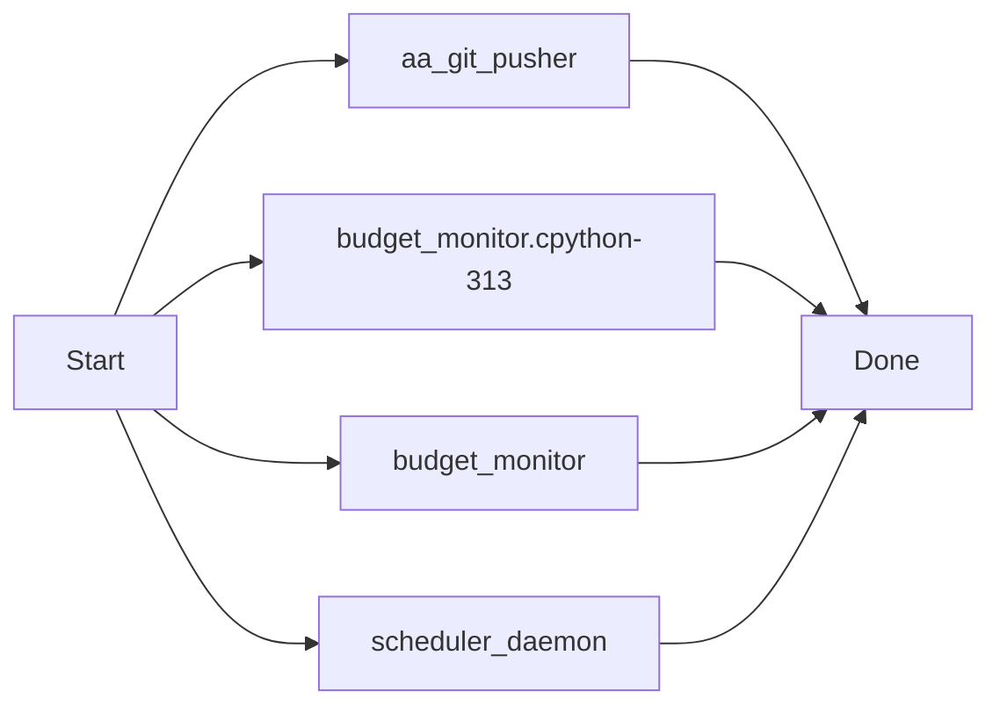
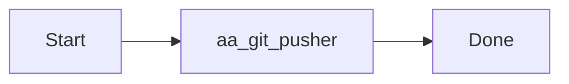
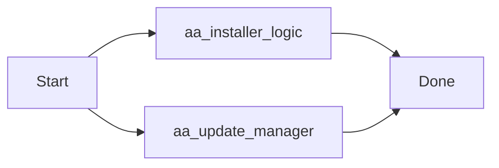
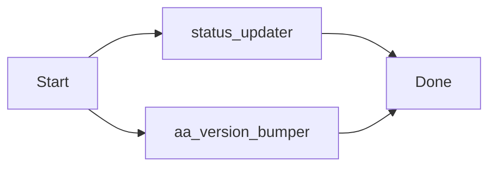
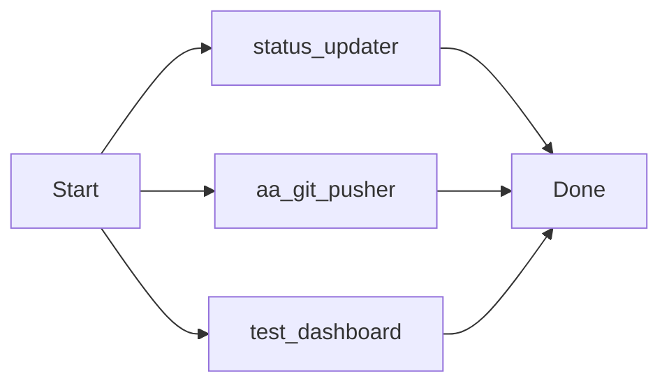
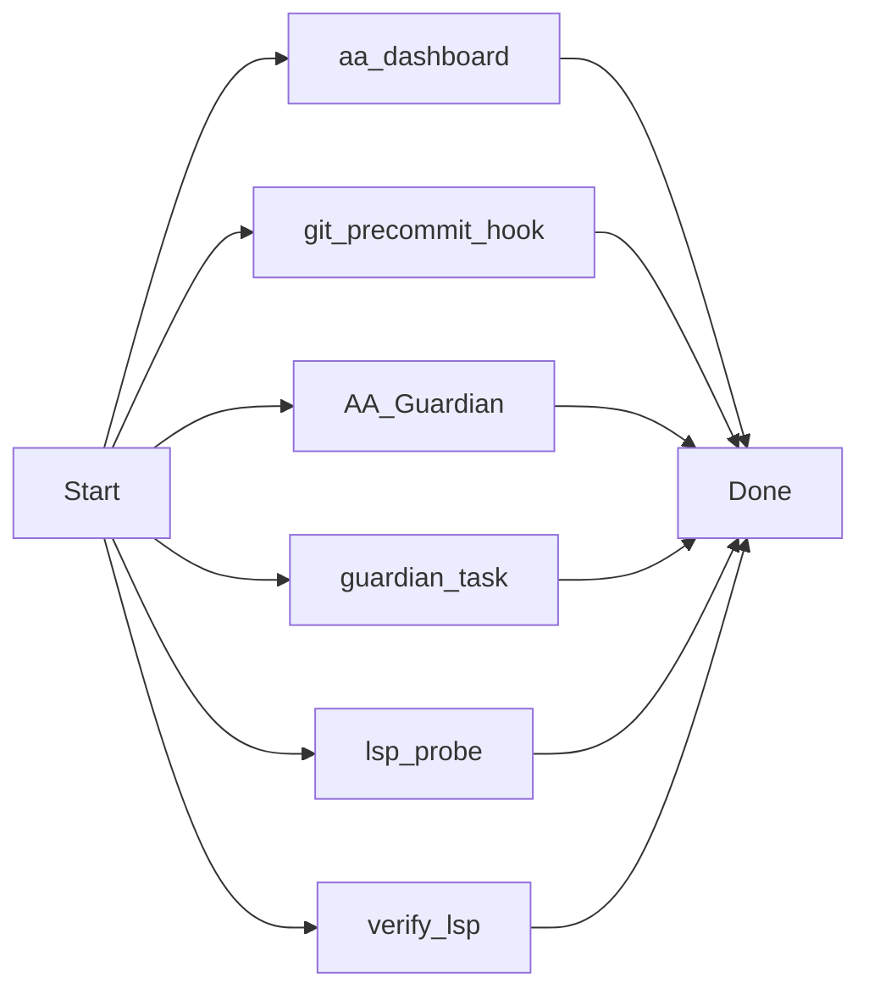
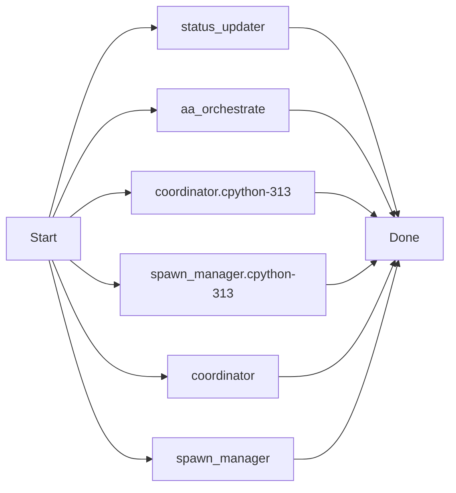

# AutoAgent-TW: Advanced Autonomous Agent System

## 🚀 繁體中文介紹 (Introduction)

**AutoAgent-TW** 是一套專為 Antigravity IDE 打造的高級自主開發代理系統。
它基於 L3/L4 級別的自動化邏輯，能自動完成從「需求規劃」到「程式碼實作」再到「品質 QA」的全生命週期開發流程。

### 核心功能 (Key Features)

1.  **自主排程 (Auto-Schedule)**: v1.6.0 引入 `/aa-schedule` 守護行程，支援 Cron/Interval 定時執行任務。
2.  **事件驅動 (Event-Driven)**: 整合 Git Hooks 與 CI 事件，當 Git 提交或 CI 失敗時自動啟動修復鏈。
3.  **智能修復 (Adaptive-Repair)**: 基於趨勢與多樣性分析的動態修復循環，不再受限於固定三輪。
4.  **任務鏈 (Task Chaining)**: 使用 `/aa-chain` 組合複雜的條件執行管線 (`&&`, `||`, `|`)。
5.  **視覺化儀表板 (Visual Dashboard)**: 即時查看執行樹、日誌流、排程任務與事件鉤子。
    - 開啟路徑：`.agents/skills/status-notifier/templates/status.html`

---

## 🛠 安裝與指令 (Commands)

| 指令 | 功能描述 |
|:---:|:---|
| `/aa-auto-build` | 啟動全自動開發模式 |
| `/aa-schedule` | 管理定時排程任務與背景守護行程 |
| `/aa-chain` | 執行條件式任務鏈組合 |
| `/aa-progress` | 查看當前開發進度與儀表板連結 |
| `/aa-version` | 查詢系統版本與變更日誌 |

---

## 🐣 新手安裝導引大補帖 (Beginner Guide)

歡迎來到 AutoAgent-TW！我們為非開發者或第一次使用的朋友準備了「一鍵安裝包」。

### 1. 取得安裝檔
前往本專案的 **GitHub Releases** 頁面，下載最新的 `AutoAgent-TW_Setup.exe`。

### 2. 驗證安全性 (SHA256)
由於程式是由 Python 打包而成，Windows SmartScreen 可能會跳出「未知的發行者」警告。您可以透過比對發布頁面上的 **SHA256 校驗碼** （如 `RELEASE_V1.7.0.md` 所列）來確認檔案是否被竄改。若校驗碼一致，請點選「其他資訊」 -> 「仍要執行」。

### 3. 一鍵安裝與執行
雙擊執行 `.exe` 後，系統會自動為您：
1. 偵測並建立隔離的 Python 虛擬環境 (`venv`)
2. 自動下載並安裝所需的 `requirements.txt` 依賴
3. 提示輸入 API Key，隨後啟動背景排程與視覺化儀表板

---

## ⚖️ 免責聲明 (Disclaimer)

使用本專案前請務必閱讀以下條款：
1. **自主行為風險**: 本系統具有自主修改程式碼與執行命令之能力，使用者需對其指令產生的最終後果負責。
2. **程式碼正確性**: 雖然具備 QA 與自癒機制，但不保證產出的代碼完全無誤，建議在生產環境使用前進行二次審核。
3. **資料安全**: 請勿在專案目錄下放置未加密的敏感金鑰（API Keys/Passwords），以免被 Agent 誤傳或處理。

---

## 👨‍💻 English Summary

**AutoAgent-TW** is an autonomous agent system for Antigravity IDE. It orchestrates Builder, QA, and Guardian agents to automate full-stack development cycles.

- **Autonomous Scheduling**: Background daemon for cron-based task execution.
- **Event-Driven**: Git hooks and CI failure triggers for automated recovery.
- **Adaptive Repair**: Intelligence-based repair loops with trend analysis.
- **Task Piping**: Flexible command chaining with conditional logic.

---
*Created by [tom0930](https://github.com/tom0930)*

---
### [v1.7.x Update] 2026-04-01 08:33:57
v1.7.0 Resilience Upgrade & aa-gitpush Engine Deployment: Full system robustness implemented with automated context-aware delivery and visual documentation.

[Manifest]
 .agent-state/budget.json                           |   9 +
 .agent-state/scheduled_tasks.json                  |  51 +-
 .agent-state/scheduler.pid                         |   1 +
 .agent-state/status_state.js                       |  89 ++-
 .agent-state/status_state.json                     |  90 ++-
 .agents/logs/events.log                            |  39 +
 .agents/logs/scheduler.log                         | 834 +++++++++++++++++++++
 .../skills/status-notifier/templates/status.html   | 105 ++-
 _agents/workflows/aa-discuss.md                    |  34 +-
 _agents/workflows/aa-gitpush.md                    |  33 +
 scripts/aa_git_pusher.py                           | 101 +++
 .../__pycache__/budget_monitor.cpython-313.pyc     | Bin 0 -> 7283 bytes
 scripts/resilience/budget_monitor.py               | 114 ++-
 scripts/scheduler_daemon.py                        |  28 +-
 14 files changed, 1455 insertions(+), 73 deletions(-)

[Test Result]: Verified via aa-gitpush-core
[Visual Doc]: Mermaid logic appended to docs

#### Sequence & Logic Flow

---
### [v1.7.x Update] 2026-04-01 08:44:29
docs: initialize gitpush.md and integrate it into the aa-gitpush documentation sync engine.

[Manifest]
 .agent-state/scheduled_tasks.json | 16 +++++++--------
 .agent-state/status_state.js      | 22 ++++++++++-----------
 .agent-state/status_state.json    | 18 ++++++++---------
 .agents/logs/events.log           |  3 +++
 .agents/logs/scheduler.log        | 41 +++++++++++++++++++++++++++++++++++++++
 gitpush.md                        | 27 ++++++++++++++++++++++++++
 scripts/aa_git_pusher.py          |  8 +++++++-
 7 files changed, 106 insertions(+), 29 deletions(-)

[Test Result]: Verified via aa-gitpush-core
[Visual Doc]: Mermaid logic appended to docs

#### Sequence & Logic Flow

---
### [v1.7.x Update] 2026-04-01 08:49:24
feat: Official v1.7.0 Release - Mark all Resilience phases DONE and finalize management docs.

[Manifest]
 .agent-state/scheduled_tasks.json | 16 ++++++++--------
 .agent-state/status_state.js      | 24 ++++++++++++------------
 .agent-state/status_state.json    | 29 ++++++++++++++---------------
 .agents/logs/events.log           |  3 +++
 .agents/logs/scheduler.log        | 19 +++++++++++++++++++
 .planning/ROADMAP.md              | 32 +++++++++++++-------------------
 .planning/config.json             |  4 ++--
 7 files changed, 71 insertions(+), 56 deletions(-)

[Test Result]: Verified via aa-gitpush-core
[Visual Doc]: Mermaid logic appended to docs

---
### [v1.7.x Update] 2026-04-01 10:12:03
feat: Official v1.7.0 Release - Milestone Complete! Add EXE Installer, Selective Update Manager, and Fixed Dashboard Observability.

[Manifest]
 .agent-state/scheduled_tasks.json                  |   20 +-
 .agent-state/status_state.js                       |   26 +-
 .agent-state/status_state.json                     |   26 +-
 .agents/logs/events.log                            |    3 +
 .agents/logs/scheduler.log                         |  362 +
 .../skills/status-notifier/templates/status.html   |   21 +-
 AutoAgent-TW_Setup.spec                            |   38 +
 RELEASE_V1.7.0.md                                  |   21 +
 build/AutoAgent-TW_Setup/Analysis-00.toc           |  633 ++
 build/AutoAgent-TW_Setup/AutoAgent-TW_Setup.pkg    |  Bin 0 -> 7696844 bytes
 build/AutoAgent-TW_Setup/EXE-00.toc                |  237 +
 build/AutoAgent-TW_Setup/PKG-00.toc                |  215 +
 build/AutoAgent-TW_Setup/PYZ-00.pyz                |  Bin 0 -> 1366233 bytes
 build/AutoAgent-TW_Setup/PYZ-00.toc                |  163 +
 build/AutoAgent-TW_Setup/base_library.zip          |  Bin 0 -> 1401781 bytes
 .../localpycs/pyimod01_archive.pyc                 |  Bin 0 -> 4930 bytes
 .../localpycs/pyimod02_importers.pyc               |  Bin 0 -> 31802 bytes
 .../localpycs/pyimod03_ctypes.pyc                  |  Bin 0 -> 6450 bytes
 .../localpycs/pyimod04_pywin32.pyc                 |  Bin 0 -> 1679 bytes
 build/AutoAgent-TW_Setup/localpycs/struct.pyc      |  Bin 0 -> 305 bytes
 .../AutoAgent-TW_Setup/warn-AutoAgent-TW_Setup.txt |   25 +
 .../xref-AutoAgent-TW_Setup.html                   | 7455 ++++++++++++++++++++
 dist/AutoAgent-TW_Setup.exe                        |  Bin 0 -> 8042444 bytes
 scripts/aa_installer_logic.py                      |   40 +
 scripts/aa_update_manager.py                       |   53 +
 25 files changed, 9296 insertions(+), 42 deletions(-)

[Test Result]: Verified via aa-gitpush-core
[Visual Doc]: Mermaid logic appended to docs

#### Sequence & Logic Flow

---
### [v1.7.x Update] 2026-04-01 10:39:53
feat: Phase 113 Completed - Finalize Auto-Bumper, Beginner Guide & Sync IDLE Bug

[Manifest]
 .agent-state/scheduled_tasks.json                  |  16 +--
 .agent-state/status_state.js                       |  20 ++--
 .agent-state/status_state.json                     |  20 ++--
 .agents/logs/events.log                            |   3 +
 .agents/logs/scheduler.log                         | 126 +++++++++++++++++++++
 .../status-notifier/scripts/status_updater.py      |  18 ++-
 README.md                                          |  18 +++
 RELEASE_V1.7.0.md                                  |   1 +
 scripts/aa_version_bumper.py                       |  52 +++++++++
 9 files changed, 242 insertions(+), 32 deletions(-)

[Test Result]: Verified via aa-gitpush-core
[Visual Doc]: Mermaid logic appended to docs

#### Sequence & Logic Flow

---
### [v1.7.x Update] 2026-04-01 14:16:41
fix: Dashboard Resilience & v1.7.2 Infrastructure Upgrade

### ✨ Key Improvements
- ✅ Resolved persistence and CORS issues in Dashboard

[Manifest]
  🛠️ Logic:
    - .agents/skills/status-notifier/scripts/status_updater.py
    - scripts/aa_git_pusher.py

  🎨 UI/Dashboard:
    - .agent-state/scheduled_tasks.json
    - .agent-state/status_state.js
    - .agent-state/status_state.json
    - .agents/skills/status-notifier/templates/status.html
    - .planning/config.json

  🧪 Tests/Diag:
    - scripts/debug/test_dashboard.py

  📝 Docs:
    - .planning/ROADMAP.md

  📦 Other:
    - .agents/logs/events.log
    - .agents/logs/scheduler.log

[Visual Doc]: Mermaid logic appended to docs

#### Sequence & Logic Flow

---
### [v1.7.x Update] 2026-04-01 16:12:52
feat: v1.8.0 Coordination Upgrade - LSP Probing, Git Hook Manifest, Guardian Pro & Dashboard Automation

### ✨ Key Improvements

[Manifest]
  🛠️ Logic:
    - scripts/aa_dashboard.py
    - scripts/git_precommit_hook.py
    - scripts/resilience/AA_Guardian.py
    - scripts/resilience/guardian_task.py
    - scripts/tools/lsp_probe.py
    - scripts/tools/verify_lsp.py

  🎨 UI/Dashboard:
    - .agent-state/scheduled_tasks.json
    - .agent-state/status_state.js
    - .agent-state/status_state.json
    - .agents/skills/status-notifier/templates/status.html
    - .planning/config.json

  📝 Docs:
    - .planning/PROJECT.md
    - .planning/ROADMAP.md
    - .planning/STATE.md
    - .planning/phases/116-dashboard-automation/CONTEXT.md
    - .planning/phases/116-dashboard-automation/PLAN.md
    - Schedule_readme.md
    - memo.md
    - version_list.md
    - workers.md

  📦 Other:
    - .agents/logs/events.log
    - .agents/logs/scheduler.log
    - idea_claueloop.mf

[Visual Doc]: Mermaid logic appended to docs

#### Sequence & Logic Flow

---
### [v1.7.x Update] 2026-04-02 09:03:49
feat: v1.9.0-2.3.0 complete Phase 5 Predictor & Phase 1 Orchestrator

### ✨ Key Improvements

[Manifest]
  🛠️ Logic:
    - .agents/skills/status-notifier/scripts/status_updater.py
    - scripts/aa_orchestrate.py
    - scripts/subagent/__pycache__/coordinator.cpython-313.pyc
    - scripts/subagent/__pycache__/spawn_manager.cpython-313.pyc
    - scripts/subagent/coordinator.py
    - scripts/subagent/spawn_manager.py

  🎨 UI/Dashboard:
    - .agents/skills/status-notifier/templates/status.html

  📝 Docs:
    - .planning1/ROADMAP.md
    - .planning1/STATE.md

[Visual Doc]: Mermaid logic appended to docs

#### Sequence & Logic Flow

