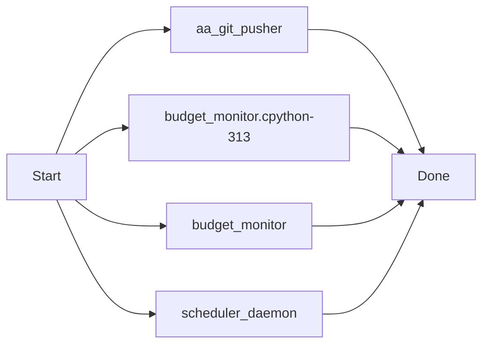

# AutoAgent-TW: Advanced Autonomous Agent System

## 🚀 繁體中文介紹 (Introduction)

**AutoAgent-TW** 是一套專為 Antigravity IDE 打造的高級自主開發代理系統。
它基於 L3/L4 級別的自動化邏輯，能自動完成從「需求規劃」到「程式碼實作」再到「品質 QA」的全生命週期開發流程。

### 核心功能 (Key Features)

1.  **自主排程 (Auto-Schedule)**: v1.6.0 引入 `/aa-schedule` 守護行程，支援 Cron/Interval 定時執行任務。
2.  **事件驅動 (Event-Driven)**: 整合 Git Hooks 與 CI 事件，當 Git 提交或 CI 失敗時自動啟動修復鏈。
3.  **智能修復 (Adaptive-Repair)**: 基於趨勢與多樣性分析的動態修復循環，不再受限於固定三輪。
4.  **任務鏈 (Task Chaining)**: 使用 `/aa-chain` 組合複雜的條件執行管線 (`&&`, `||`, `|`)。
5.  **視覺化儀表板 (Visual Dashboard)**: 即時查看執行樹、日誌流、排程任務與事件鉤子。
    - 開啟路徑：`.agents/skills/status-notifier/templates/status.html`

---

## 🛠 安裝與指令 (Commands)

| 指令 | 功能描述 |
|:---:|:---|
| `/aa-auto-build` | 啟動全自動開發模式 |
| `/aa-schedule` | 管理定時排程任務與背景守護行程 |
| `/aa-chain` | 執行條件式任務鏈組合 |
| `/aa-progress` | 查看當前開發進度與儀表板連結 |
| `/aa-version` | 查詢系統版本與變更日誌 |

---

## ⚖️ 免責聲明 (Disclaimer)

使用本專案前請務必閱讀以下條款：
1. **自主行為風險**: 本系統具有自主修改程式碼與執行命令之能力，使用者需對其指令產生的最終後果負責。
2. **程式碼正確性**: 雖然具備 QA 與自癒機制，但不保證產出的代碼完全無誤，建議在生產環境使用前進行二次審核。
3. **資料安全**: 請勿在專案目錄下放置未加密的敏感金鑰（API Keys/Passwords），以免被 Agent 誤傳或處理。

---

## 👨‍💻 English Summary

**AutoAgent-TW** is an autonomous agent system for Antigravity IDE. It orchestrates Builder, QA, and Guardian agents to automate full-stack development cycles.

- **Autonomous Scheduling**: Background daemon for cron-based task execution.
- **Event-Driven**: Git hooks and CI failure triggers for automated recovery.
- **Adaptive Repair**: Intelligence-based repair loops with trend analysis.
- **Task Piping**: Flexible command chaining with conditional logic.

---
*Created by [tom0930](https://github.com/tom0930)*

---
### [v1.7.x Update] 2026-04-01 08:33:57
v1.7.0 Resilience Upgrade & aa-gitpush Engine Deployment: Full system robustness implemented with automated context-aware delivery and visual documentation.

[Manifest]
 .agent-state/budget.json                           |   9 +
 .agent-state/scheduled_tasks.json                  |  51 +-
 .agent-state/scheduler.pid                         |   1 +
 .agent-state/status_state.js                       |  89 ++-
 .agent-state/status_state.json                     |  90 ++-
 .agents/logs/events.log                            |  39 +
 .agents/logs/scheduler.log                         | 834 +++++++++++++++++++++
 .../skills/status-notifier/templates/status.html   | 105 ++-
 _agents/workflows/aa-discuss.md                    |  34 +-
 _agents/workflows/aa-gitpush.md                    |  33 +
 scripts/aa_git_pusher.py                           | 101 +++
 .../__pycache__/budget_monitor.cpython-313.pyc     | Bin 0 -> 7283 bytes
 scripts/resilience/budget_monitor.py               | 114 ++-
 scripts/scheduler_daemon.py                        |  28 +-
 14 files changed, 1455 insertions(+), 73 deletions(-)

[Test Result]: Verified via aa-gitpush-core
[Visual Doc]: Mermaid logic appended to docs

#### Sequence & Logic Flow

