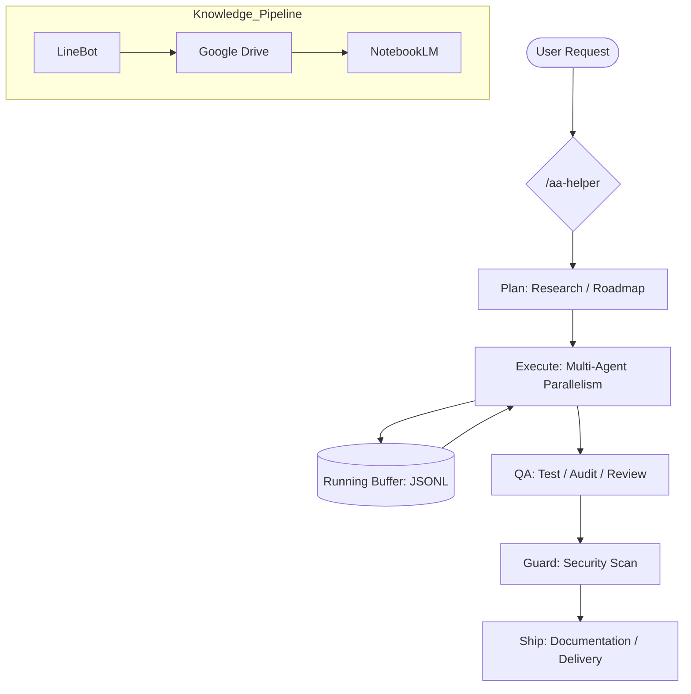

# 🤖 AutoAgent-TW
> **工業級自主開發代理系統 (Autonomous Agent Framework v1.7.5)**

**AutoAgent-TW** 是一套專為 Antigravity IDE 深度整合的自主開發代理框架。它不只是一個 AI 助手，而是一位具備 **高韌性 (Resilience)**、**自我修復 (Self-Healing)** 與 **長期記憶 (Long-term Memory)** 的全端虛擬工程師。

---

## 🏗️ 核心架構支柱 (The Three Pillars)

### 1. 🛡️ 高韌性執行 (Resilience & Fault-Tolerance)
內建 **Phase-based 容錯機制** 與 **Buffer Engine**。面對數百個檔案的重構任務，自動啟動「分片處理」與「斷點續傳」，徹底終結 AI 超時與 Spin 問題。

### 2. 🧠 知識庫引擎 (Knowledge Automation)
全自動知識流向：`LineBot ➔ Google Drive ➔ NotebookLM`。整合向量檢索與主動分享機制，實現即時技術問答與文檔同步。

### 3. 🚀 GSD 流程哲學 (Get Shit Done Methodology)
嚴格執行 `Discuss ➔ Plan ➔ Execute ➔ QA ➔ Ship` 標準化流程。每一波修改都具備原子化提交 (Atomic Commits) 與 UAT 驗證機制。

---

## 💻 指令指南 (CLI Command Guide)

| 重點指令 | 功能描述 | 適用場景 |
| :--- | :--- | :--- |
| `/aa-discuss` | 進行架構研究與設計決策 | 啟動新功能開發的第一步 |
| `/aa-plan` | 生成詳細的研發計畫 (RESEARCH/PLAN) | 明確任務邊界與測試準則 |
| `/aa-execute` | 啟動波浪式並行開發 | 自動編寫、修改代碼與 Commit |
| `/aa-qa` | 執行五維度品質審計 (Test/Lint/CR) | 出貨前的嚴格驗證 |
| `/aa-guard` | 安全哨兵掃描與災難 Checkpoint | 檢查敏感資訊與系統一致性 |
| `/aa-ship` | 正式交付並更新版本里程碑 | 結案、文檔同步與 PR 生成 |

---

## 📊 系統邏輯流 (High-Level Architecture)

---

## 🏁 快速開始 (Getting Started)

1.  **環境需求**：Windows 10/11, Python 3.10+, Antigravity IDE。
2.  **一鍵安裝**：下載並執行專案目錄下的 `dist/AutoAgent-TW_Setup.exe`。
3.  **啟動開發**：在 IDE Terminal 輸入 `/aa-helper` 即可開始接辦任務。

---

## 📜 免責聲明 (Disclaimer)
*   **自主修改風險**：本系統具備原生命令執行權限，請在隔離環境或 Git 受控環境下運行。
*   **成本控管**：請密切關注 Token 花費，系統已內建預算警告提醒。

---
*Created with ❤️ by [tom0930](https://github.com/tom0930). 
Dedicated to the future of Agentic Workflows.*
