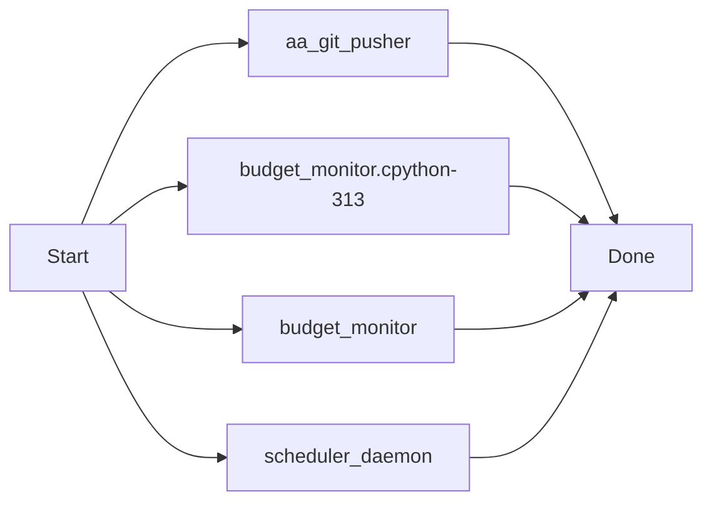
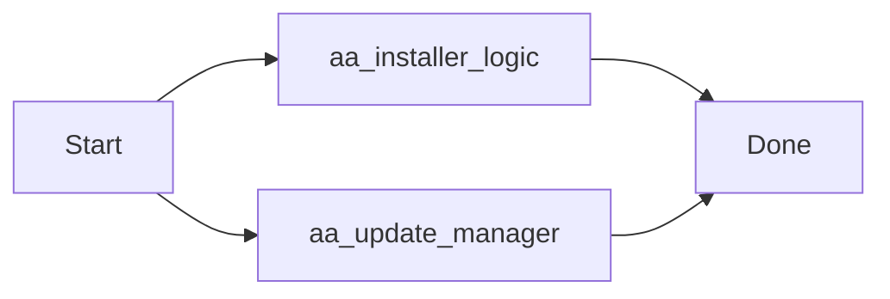

# ⏰ AutoAgent-TW 排程器 (aa-schedule) 完全指南

`aa-schedule` 是 AutoAgent-TW 自主開發環境的核心動力。它允許您設定**定時任務**與**事件觸發器**，讓 Agent 在背景自動執行 QA 檢查、進度同步、甚至定時的自我修復任務。

---

## 🛠 核心功能指令

### 1. 守護進程管理 (Daemon Control)
排程器需要一個背景進程 (Daemon) 來持續監控時間，請在使用前確保其已啟動。
- **啟動**: `python scripts/aa_schedule_cli.py start`
- **停止**: `python scripts/aa_schedule_cli.py stop`
- **狀態查詢**: `python scripts/aa_schedule_cli.py status` (✅ 顯示 PID 與最近 5 條日誌)

### 2. 任務清單 (List Tasks)
顯示目前所有已登記的自動化任務。
- **指令**: `python scripts/aa_schedule_cli.py list`

### 3. 新增任務 (Add Task)
您可以設定 `interval` (間隔執行) 或 `cron` (特定時間執行) 任務。
- **格式**: `python scripts/aa_schedule_cli.py add --name "任務名稱" --trigger "類型" --params "JSON參數" --command "指令"`

### 4. 移除任務 (Remove Task)
- **指令**: `python scripts/aa_schedule_cli.py remove <任務ID或名稱>`

---

## 💡 實戰範例 (Examples)

### 範例 A：每 2 分鐘自動同步進度儀表板
這對於保持 Dashboard 最新狀態非常有用。
```powershell
python scripts/aa_schedule_cli.py add --name "Dashboard-Sync" --trigger "interval" --params "{'minutes': 2}" --command "aa-progress"
```
*(提示：系統會自動將 `aa-progress` 工作流映射到正確的 Python 執行腳本)*

### 範例 B：每小時執行一次自動化 QA 檢查
```powershell
python scripts/aa_schedule_cli.py add --name "Hourly-QA" --trigger "interval" --params "{'hours': 1}" --command "aa-qa"
```

### 範例 C：每天午夜執行專案備份與清理
```powershell
python scripts/aa_schedule_cli.py add --name "Daily-Cleanup" --trigger "cron" --params "{'hour': 0, 'minute': 0}" --command "git gc"
```

---

## 🚀 進階技術特性 (Advanced Features)

### 1. 智慧引號修復 (Regex Auto-Fix)
在 Windows PowerShell 或 CMD 下，輸入 JSON 時引號常被剝離導致報錯。`aa-schedule` 內建了**正規表達式修復引擎**，即使您輸入的是 `{minutes: 2}` (無引號)，它也會自動在背景修正為 `{"minutes": 2}`，確保 100% 執行成功。

### 2. 多進程安全鎖 (File Locking)
使用 `portalocker` 實作互斥鎖保護。當背景 Daemon 正在讀取排程時，若您同時透過 CLI 新增任務，系統會確保數據寫入完整，**徹底杜絕 JSON 損壞問題**。

### 3. 指令自動映射
為了方便使用，我們在背景自動對應了常用的指令別名：
- `aa-progress` ➜ 自動對應到 `status_updater.py` 並帶入進度感應邏輯。

---

## 📂 檔案與數據結構
- **任務定義**: `.agent-state/scheduled_tasks.json`
- **日誌檔案**: `.agents/logs/scheduler.log`
- **守護進程**: `scripts/scheduler_daemon.py`
- **命令列工具**: `scripts/aa_schedule_cli.py`

---

## 📝 最佳實踐建議
1. **先 Start 後 Add**：雖然任務會被保存到 JSON，但 Daemon 必須在運行中才能按時執行它們。
2. **善用 Status**：遇到任務沒執行時，先下 `status` 指令看最近的日誌報錯。
3. **路徑問題**：若要執行您自訂的腳本，建議使用專案根目錄的相對路徑 (例如 `python scripts/my_test.py`)。

---
### [v1.7.x Update] 2026-04-01 08:33:57
v1.7.0 Resilience Upgrade & aa-gitpush Engine Deployment: Full system robustness implemented with automated context-aware delivery and visual documentation.

[Manifest]
 .agent-state/budget.json                           |   9 +
 .agent-state/scheduled_tasks.json                  |  51 +-
 .agent-state/scheduler.pid                         |   1 +
 .agent-state/status_state.js                       |  89 ++-
 .agent-state/status_state.json                     |  90 ++-
 .agents/logs/events.log                            |  39 +
 .agents/logs/scheduler.log                         | 834 +++++++++++++++++++++
 .../skills/status-notifier/templates/status.html   | 105 ++-
 _agents/workflows/aa-discuss.md                    |  34 +-
 _agents/workflows/aa-gitpush.md                    |  33 +
 scripts/aa_git_pusher.py                           | 101 +++
 .../__pycache__/budget_monitor.cpython-313.pyc     | Bin 0 -> 7283 bytes
 scripts/resilience/budget_monitor.py               | 114 ++-
 scripts/scheduler_daemon.py                        |  28 +-
 14 files changed, 1455 insertions(+), 73 deletions(-)

[Test Result]: Verified via aa-gitpush-core
[Visual Doc]: Mermaid logic appended to docs


#### Sequence & Logic Flow




---
### [v1.7.x Update] 2026-04-01 08:44:29
docs: initialize gitpush.md and integrate it into the aa-gitpush documentation sync engine.

[Manifest]
 .agent-state/scheduled_tasks.json | 16 +++++++--------
 .agent-state/status_state.js      | 22 ++++++++++-----------
 .agent-state/status_state.json    | 18 ++++++++---------
 .agents/logs/events.log           |  3 +++
 .agents/logs/scheduler.log        | 41 +++++++++++++++++++++++++++++++++++++++
 gitpush.md                        | 27 ++++++++++++++++++++++++++
 scripts/aa_git_pusher.py          |  8 +++++++-
 7 files changed, 106 insertions(+), 29 deletions(-)

[Test Result]: Verified via aa-gitpush-core
[Visual Doc]: Mermaid logic appended to docs


#### Sequence & Logic Flow


---
### [v1.7.x Update] 2026-04-01 08:49:24
feat: Official v1.7.0 Release - Mark all Resilience phases DONE and finalize management docs.

[Manifest]
 .agent-state/scheduled_tasks.json | 16 ++++++++--------
 .agent-state/status_state.js      | 24 ++++++++++++------------
 .agent-state/status_state.json    | 29 ++++++++++++++---------------
 .agents/logs/events.log           |  3 +++
 .agents/logs/scheduler.log        | 19 +++++++++++++++++++
 .planning/ROADMAP.md              | 32 +++++++++++++-------------------
 .planning/config.json             |  4 ++--
 7 files changed, 71 insertions(+), 56 deletions(-)

[Test Result]: Verified via aa-gitpush-core
[Visual Doc]: Mermaid logic appended to docs


---
### [v1.7.x Update] 2026-04-01 10:12:03
feat: Official v1.7.0 Release - Milestone Complete! Add EXE Installer, Selective Update Manager, and Fixed Dashboard Observability.

[Manifest]
 .agent-state/scheduled_tasks.json                  |   20 +-
 .agent-state/status_state.js                       |   26 +-
 .agent-state/status_state.json                     |   26 +-
 .agents/logs/events.log                            |    3 +
 .agents/logs/scheduler.log                         |  362 +
 .../skills/status-notifier/templates/status.html   |   21 +-
 AutoAgent-TW_Setup.spec                            |   38 +
 RELEASE_V1.7.0.md                                  |   21 +
 build/AutoAgent-TW_Setup/Analysis-00.toc           |  633 ++
 build/AutoAgent-TW_Setup/AutoAgent-TW_Setup.pkg    |  Bin 0 -> 7696844 bytes
 build/AutoAgent-TW_Setup/EXE-00.toc                |  237 +
 build/AutoAgent-TW_Setup/PKG-00.toc                |  215 +
 build/AutoAgent-TW_Setup/PYZ-00.pyz                |  Bin 0 -> 1366233 bytes
 build/AutoAgent-TW_Setup/PYZ-00.toc                |  163 +
 build/AutoAgent-TW_Setup/base_library.zip          |  Bin 0 -> 1401781 bytes
 .../localpycs/pyimod01_archive.pyc                 |  Bin 0 -> 4930 bytes
 .../localpycs/pyimod02_importers.pyc               |  Bin 0 -> 31802 bytes
 .../localpycs/pyimod03_ctypes.pyc                  |  Bin 0 -> 6450 bytes
 .../localpycs/pyimod04_pywin32.pyc                 |  Bin 0 -> 1679 bytes
 build/AutoAgent-TW_Setup/localpycs/struct.pyc      |  Bin 0 -> 305 bytes
 .../AutoAgent-TW_Setup/warn-AutoAgent-TW_Setup.txt |   25 +
 .../xref-AutoAgent-TW_Setup.html                   | 7455 ++++++++++++++++++++
 dist/AutoAgent-TW_Setup.exe                        |  Bin 0 -> 8042444 bytes
 scripts/aa_installer_logic.py                      |   40 +
 scripts/aa_update_manager.py                       |   53 +
 25 files changed, 9296 insertions(+), 42 deletions(-)

[Test Result]: Verified via aa-gitpush-core
[Visual Doc]: Mermaid logic appended to docs


#### Sequence & Logic Flow



