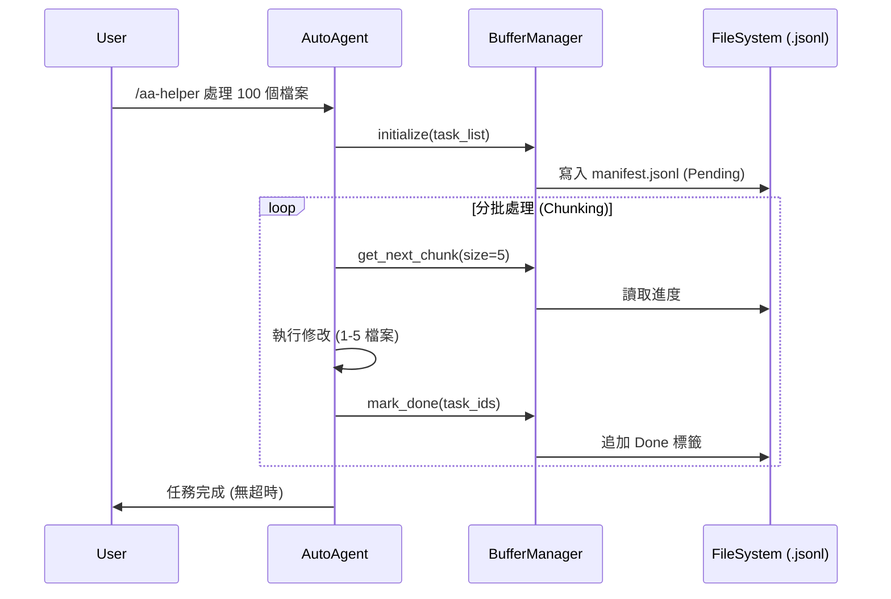
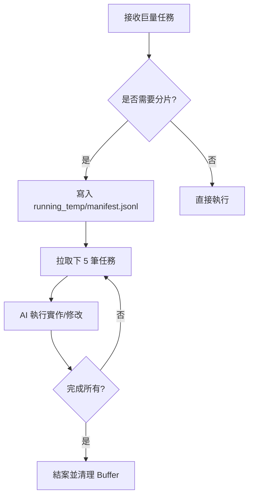

# AutoAgent-TW: 智能工程師指令教材 (2026-04-08)

## 🏗️ 核心指令生命週期 (Command Lifecycle)
AutoAgent-TW 遵循 GSD (Get Shit Done) 哲學，將軟體工程拆解為以下標準動作：

### 1. `/aa-plan` (研究與規劃)
*   **用途**：當收到一個複雜需求（如 Phase 132）時，先進行技術可行性研究。
*   **產出**：
    *   `RESEARCH.md`：紀錄技術選型、優缺點分析（如 JSON vs JSONL）。
    *   `PLAN.md`：拆解具體任務與 Wave。
*   **關鍵思維**：先想清楚再動手，避免 Context Rot。

### 2. `/aa-execute` (執行與實作)
*   **用途**：根據 `PLAN.md` 自動編寫程式碼，執行實體操作。
*   **特點**：
    *   **Wave 並行**：將任務分組執行。
    *   **原子化 Commit**：每個子任務完成後自動提交 Git，確保可回溯。
*   **今日案例**：實作 `scripts/utils/buffer_manager.py`。

### 3. `/aa-qa` & `/aa-test` (驗證與品質)
*   **用途**：執行單元測試、整合測試以及 UAT 檢查。
*   **產出**：`QA-REPORT.md`。
*   **Debug 循環**：如果測試失敗，AI 會自動進入 `debug` 或 `fix` 循環，直到通過。

### 4. `/aa-guard` (安全與哨兵)
*   **用途**：在出貨前進行「安全掃描」。
*   **動作**：
    *   檢查硬編碼的 API Key。
    *   建立 Security Checkpoint (Git 臨時備份)。
    *   確認符合 License 與文檔規範。

### 5. `/aa-ship` (交付與發布)
*   **用途**：正式結案。
*   **動作**：
    *   更新 `PROJECT.md` 版本號 (v1.7.x)。
    *   更新 `ROADMAP.md` 狀態。
    *   產生 Phase Summary，清理 `running_temp`。

---

## 🚀 今日案例分析：Phase 132 - Buffer Engine
為了避免大型任務導致的 **Spinning (轉圈圈/超時)**，我們實作了緩衝執行引擎。

### 序列圖 (Sequence Diagram)

### 流程圖 (Flowchart)

---

## 💡 Tom 的資深工程師心得：
「好的 AI 指令系統不應該是『黑盒子』，而是一個**可觀察、可恢復、可審計**的流水線。透過 `/aa-plan` 確保正確性，透過 `/aa-execute` 確保效率，透過 `running_temp` 確保穩定性。這就是工業級 AI 開發的標配。」

---
**本文件由 AutoAgent-TW @Tom 自動生成於 2026-04-08。**
