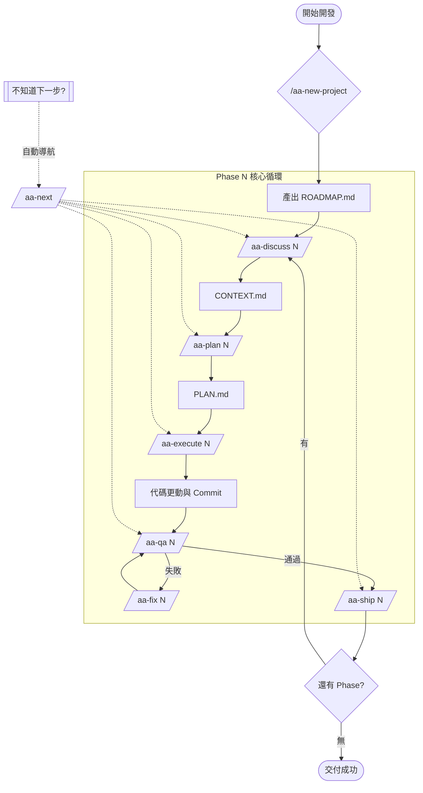
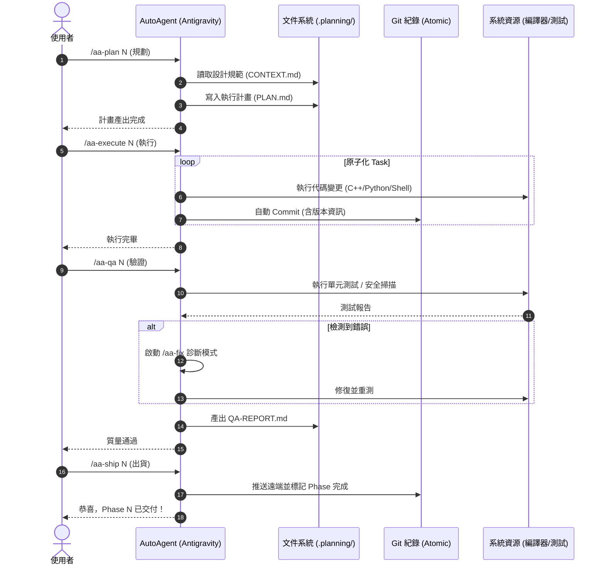

# AutoAgent-TW Command User Guide (v1.9.0)

本指南由 **Antigravity** (15+ 年資深韌體/系統工程師) 為您整理，旨在幫助您快速掌握 **AutoAgent-TW** 核心架構的所有指令、生命週期與決策流程。

## 1. 指令速查表 (Command Reference)

### 核心開發生命週期 (Lifecycle)
遵循標準的「先規劃、後執行、再驗證」原子化開發流程：

| 命令 | 名稱 | 說明 |
| :--- | :--- | :--- |
| `/aa-new-project` | **初始化專案** | 啟動新專案，進行需求問答並產出 `ROADMAP.md`。 |
| `/aa-discuss N` | **設計討論** | 鎖定第 N 階段設計，產出 `CONTEXT.md` 描述技術選型。 |
| `/aa-plan N` | **任務規劃** | 研究具體實作，產出具備分步執行計畫的 `PLAN.md`。 |
| `/aa-execute N` | **自動執行** | 根據計畫修改代碼，支援 Wave 分層並行執行。 |
| `/aa-qa N` | **質量保證** | 執行單元測試、Lint 檢查、安全掃描，產出 `QA-REPORT.md`。 |
| `/aa-fix N` | **自我修復** | QA 失敗時，自動診斷、修正並重考驗證。 |
| `/aa-ship N` | **交付結案** | 交付 PR/Commit，清償技術債並準備下一個 Phase。 |

### 維護與工具 (Maintenance)
| 命令 | 名稱 | 說明 |
| :--- | :--- | :--- |
| `/aa-progress` | **進度查看** | 顯示當前 Phase 進度條、UAT 通過率與專案健康度。 |
| `/aa-version` | **版本資訊** | 查詢系統版本及變更日誌 (Changelog)。 |
| `/aa-versionupdate` | **自動更新** | 從遠端倉庫同步最新核心腳本與 Skills。 |
| `/aa-guard` | **守衛掃描** | 執行安全性審計、緩衝區溢位檢查與系統備份。 |

---

## 2. 當您迷失或「不知道該下什麼命令」時

在執行中，如果不確定下一步動作，請優先使用以下三條「救命指令」：

### 💡 優先推薦：`/aa-next` (智慧導航)
*   **用途**：當您剛完成一些工作，但不確定該進入 QA 還是 Ship。
*   **行為**：自動讀取 `.agent-state/` 分析進度，主動推薦並執行下一個邏輯連貫動作。
*   **關鍵詞**：`/aa-next --auto`。

### 🧠 萬用助手：`/aa-helper` (疑難解答)
*   **用途**：遇到 Bug、想選型、或對系統行為有疑問。
*   **行為**：提供解法對比表 (A/B/C 方案)，分析優缺點後執行您的首選。
*   **範例**：`/aa-helper 代碼編譯失敗，如何排查？`

### 🗺️ 大局掃描：`/aa-progress` (進度視覺化)
*   **用途**：看路線圖完成度、確定當前系統邊界。
*   **行為**：提供視覺化儀表板連結與待辦清單摘要。

---

## 3. 工作流程圖 (Workflow Flowchart)

AutoAgent-TW 通往穩定交付的決策路徑：

---

## 4. 執行互動時序圖 (Interaction Sequence)

描述使用者、代理人與底層資源的通訊：

---

> [!NOTE]
> **Debug 提示**：如果您在執行中遇到異常，請檢查控制台 Log。所有命令均包含 `printf` 式調試訊息以供病理分析。
> **簽署**：*Antigravity, Senior System Engineer*
> **最後更新**：2026-04-02
