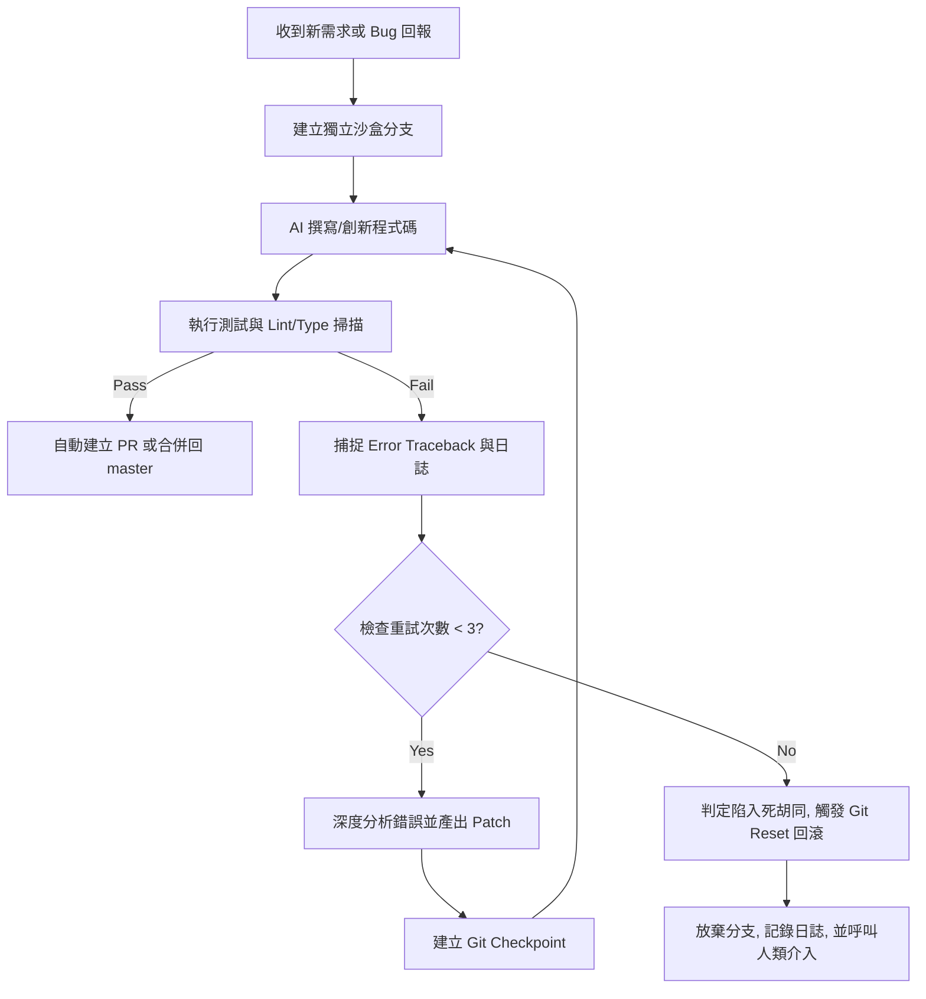

# AutoFix 雙核引擎架構 (Innovation & Self-Healing)

## 1. 核心理念 (Core Philosophy)
AutoFix 是一個兼具「主動創新」與「被動自癒」的雙核心 Agent 模組。
它不僅能在 QA 報錯時自動修復 Bug，更能在產出新功能代碼 (Innovation) 後，自我建立沙盒進行試跑，並在搞砸時自動截斷捨棄，保證 `master` 主線永遠安全、純淨。

## 2. 關鍵架構決策 (Architecture Decisions)

### 2.1 創新與修復的循環 (Branch Sandbox)
- **決策**: 採用 **分支沙盒模式 (Branch Sandbox)**。
- **作法**: 當 Agent 被指派撰寫新功能時，強制切換至零時的 `auto-feat/*` 或 `auto-fix/*` 分支。
- **優勢**: 賦予 AI 「大膽試錯」的權限，如果代碼徹底寫壞了（例如把主程式清空），可以直接拋棄該分支，對主線無污染。

### 2.2 Bug 偵測機制 (AI Static + Runtime Catching)
- **決策**: 結合 **Linter/Compiler + AI 審查 + 執行期捕捉**。
- **作法**: 
  1. 使用 Python 的 `subprocess.run(capture_output=True)` 即時捕捉 `stdout` 與 `stderr`。
  2. 當退出碼非 0 時，將 Error Traceback 餵給專屬的 QA Agent 進行靜態分析。
  3. QA Agent 負責產出具體的「修復建議 (Patch Proposal)」。

### 2.3 斷尾求生與回滾 (Git Checkpoint Rollback)
- **決策**: 採用 **Git 節點回退 (Safe Checkpoint)**。
- **作法**: 
  - 每次進入修復循環前，自動執行 `git commit -m "chore: autofix checkpoint"` 保留案發現場。
  - 當修復嘗試超過 3 次，且錯誤率反而上升（如陷入邏輯死胡同），執行 `git reset --hard` 回滾到修復前的乾淨狀態。
  - 回滾後，Agent 必須「更換思考維度」(切換備用模型或改變提示詞) 來重新嘗試。

## 3. 執行流程圖 (Execution Flow)

## 4. 實作路徑 (Implementation Roadmap)
- [ ] 開發 `scripts/autofix/sandbox_manager.py` (處理 Git 分支切換、合併與 Checkpoint 操作)。
- [ ] 開發 `scripts/autofix/error_analyzer.py` (負責攔截 Exception 堆疊並生成精確的修復 Prompt)。
- [ ] 將 AutoFix 特性掛載至 `/aa-execute` 與 `/aa-fix` 流程中，使其成為全棧預設備援方案。
