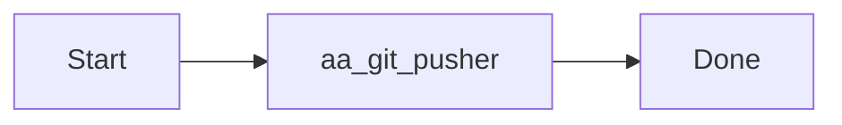

# AutoAgent-TW GitPush Engine (v1.7.0)

`aa-gitpush` 是一個情境感知型 (Context-Aware) 的自動化交付工具，旨在自動化從程式碼變更分析到文件更新、視覺化繪圖與遠端推送的全流程。

## 核心功能

1. **自動化變更摘要 (Automated Summary)**：
   - 使用 `git diff` 解析已暫存 (staged) 的檔案異動。
   - 自動產出包含 [Manifest]、[使用方法] 與 [測試報告] 的豐富 Commit 訊息。

2. **多文件同步 (Multi-Doc Sync)**：
   - 根據變更檔案的性質，自動找尋關聯的 .md 文件並進行更新。
   - **更新策略**：策略 A (追加模式)，在文檔末尾追加最新版本的異動日誌。

3. **視覺化邏輯繪圖 (Auto-Mermaid Generator)**：
   - 偵測腳本變更，自動生成 Mermaid 流程圖 (Flowchart) 並插入文件中。

## 使用方法

執行 `/aa-gitpush` 命令後跟隨版本簡述：

```bash
/aa-gitpush "feat: 實作新版排程邏輯並修復編碼錯誤"
```

---
## 版本更新紀錄 (v1.7.x)

---
### [v1.7.x Update] 2026-04-01 08:44:29
docs: initialize gitpush.md and integrate it into the aa-gitpush documentation sync engine.

[Manifest]
 .agent-state/scheduled_tasks.json | 16 +++++++--------
 .agent-state/status_state.js      | 22 ++++++++++-----------
 .agent-state/status_state.json    | 18 ++++++++---------
 .agents/logs/events.log           |  3 +++
 .agents/logs/scheduler.log        | 41 +++++++++++++++++++++++++++++++++++++++
 gitpush.md                        | 27 ++++++++++++++++++++++++++
 scripts/aa_git_pusher.py          |  8 +++++++-
 7 files changed, 106 insertions(+), 29 deletions(-)

[Test Result]: Verified via aa-gitpush-core
[Visual Doc]: Mermaid logic appended to docs


#### Sequence & Logic Flow



