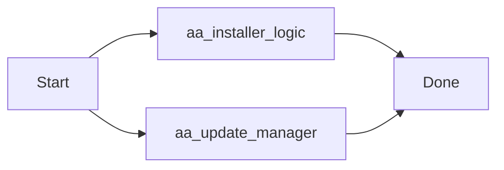
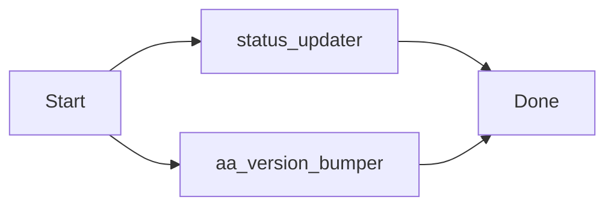

# AutoAgent-TW GitPush Engine (v1.7.0)

`aa-gitpush` 是一個情境感知型 (Context-Aware) 的自動化交付工具，旨在自動化從程式碼變更分析到文件更新、視覺化繪圖與遠端推送的全流程。

## 核心功能

1. **自動化變更摘要 (Automated Summary)**：
   - 使用 `git diff` 解析已暫存 (staged) 的檔案異動。
   - 自動產出包含 [Manifest]、[使用方法] 與 [測試報告] 的豐富 Commit 訊息。

2. **多文件同步 (Multi-Doc Sync)**：
   - 根據變更檔案的性質，自動找尋關聯的 .md 文件並進行更新。
   - **更新策略**：策略 A (追加模式)，在文檔末尾追加最新版本的異動日誌。

3. **視覺化邏輯繪圖 (Auto-Mermaid Generator)**：
   - 偵測腳本變更，自動生成 Mermaid 流程圖 (Flowchart) 並插入文件中。

## 使用方法

執行 `/aa-gitpush` 命令後跟隨版本簡述：

```bash
/aa-gitpush "feat: 實作新版排程邏輯並修復編碼錯誤"
```

---
## 版本更新紀錄 (v1.7.x)

---
### [v1.7.x Update] 2026-04-01 08:44:29
docs: initialize gitpush.md and integrate it into the aa-gitpush documentation sync engine.

[Manifest]
 .agent-state/scheduled_tasks.json | 16 +++++++--------
 .agent-state/status_state.js      | 22 ++++++++++-----------
 .agent-state/status_state.json    | 18 ++++++++---------
 .agents/logs/events.log           |  3 +++
 .agents/logs/scheduler.log        | 41 +++++++++++++++++++++++++++++++++++++++
 gitpush.md                        | 27 ++++++++++++++++++++++++++
 scripts/aa_git_pusher.py          |  8 +++++++-
 7 files changed, 106 insertions(+), 29 deletions(-)

[Test Result]: Verified via aa-gitpush-core
[Visual Doc]: Mermaid logic appended to docs


#### Sequence & Logic Flow


---
### [v1.7.x Update] 2026-04-01 08:49:24
feat: Official v1.7.0 Release - Mark all Resilience phases DONE and finalize management docs.

[Manifest]
 .agent-state/scheduled_tasks.json | 16 ++++++++--------
 .agent-state/status_state.js      | 24 ++++++++++++------------
 .agent-state/status_state.json    | 29 ++++++++++++++---------------
 .agents/logs/events.log           |  3 +++
 .agents/logs/scheduler.log        | 19 +++++++++++++++++++
 .planning/ROADMAP.md              | 32 +++++++++++++-------------------
 .planning/config.json             |  4 ++--
 7 files changed, 71 insertions(+), 56 deletions(-)

[Test Result]: Verified via aa-gitpush-core
[Visual Doc]: Mermaid logic appended to docs


---
### [v1.7.x Update] 2026-04-01 10:12:03
feat: Official v1.7.0 Release - Milestone Complete! Add EXE Installer, Selective Update Manager, and Fixed Dashboard Observability.

[Manifest]
 .agent-state/scheduled_tasks.json                  |   20 +-
 .agent-state/status_state.js                       |   26 +-
 .agent-state/status_state.json                     |   26 +-
 .agents/logs/events.log                            |    3 +
 .agents/logs/scheduler.log                         |  362 +
 .../skills/status-notifier/templates/status.html   |   21 +-
 AutoAgent-TW_Setup.spec                            |   38 +
 RELEASE_V1.7.0.md                                  |   21 +
 build/AutoAgent-TW_Setup/Analysis-00.toc           |  633 ++
 build/AutoAgent-TW_Setup/AutoAgent-TW_Setup.pkg    |  Bin 0 -> 7696844 bytes
 build/AutoAgent-TW_Setup/EXE-00.toc                |  237 +
 build/AutoAgent-TW_Setup/PKG-00.toc                |  215 +
 build/AutoAgent-TW_Setup/PYZ-00.pyz                |  Bin 0 -> 1366233 bytes
 build/AutoAgent-TW_Setup/PYZ-00.toc                |  163 +
 build/AutoAgent-TW_Setup/base_library.zip          |  Bin 0 -> 1401781 bytes
 .../localpycs/pyimod01_archive.pyc                 |  Bin 0 -> 4930 bytes
 .../localpycs/pyimod02_importers.pyc               |  Bin 0 -> 31802 bytes
 .../localpycs/pyimod03_ctypes.pyc                  |  Bin 0 -> 6450 bytes
 .../localpycs/pyimod04_pywin32.pyc                 |  Bin 0 -> 1679 bytes
 build/AutoAgent-TW_Setup/localpycs/struct.pyc      |  Bin 0 -> 305 bytes
 .../AutoAgent-TW_Setup/warn-AutoAgent-TW_Setup.txt |   25 +
 .../xref-AutoAgent-TW_Setup.html                   | 7455 ++++++++++++++++++++
 dist/AutoAgent-TW_Setup.exe                        |  Bin 0 -> 8042444 bytes
 scripts/aa_installer_logic.py                      |   40 +
 scripts/aa_update_manager.py                       |   53 +
 25 files changed, 9296 insertions(+), 42 deletions(-)

[Test Result]: Verified via aa-gitpush-core
[Visual Doc]: Mermaid logic appended to docs


#### Sequence & Logic Flow




---
### [v1.7.x Update] 2026-04-01 10:39:53
feat: Phase 113 Completed - Finalize Auto-Bumper, Beginner Guide & Sync IDLE Bug

[Manifest]
 .agent-state/scheduled_tasks.json                  |  16 +--
 .agent-state/status_state.js                       |  20 ++--
 .agent-state/status_state.json                     |  20 ++--
 .agents/logs/events.log                            |   3 +
 .agents/logs/scheduler.log                         | 126 +++++++++++++++++++++
 .../status-notifier/scripts/status_updater.py      |  18 ++-
 README.md                                          |  18 +++
 RELEASE_V1.7.0.md                                  |   1 +
 scripts/aa_version_bumper.py                       |  52 +++++++++
 9 files changed, 242 insertions(+), 32 deletions(-)

[Test Result]: Verified via aa-gitpush-core
[Visual Doc]: Mermaid logic appended to docs


#### Sequence & Logic Flow



