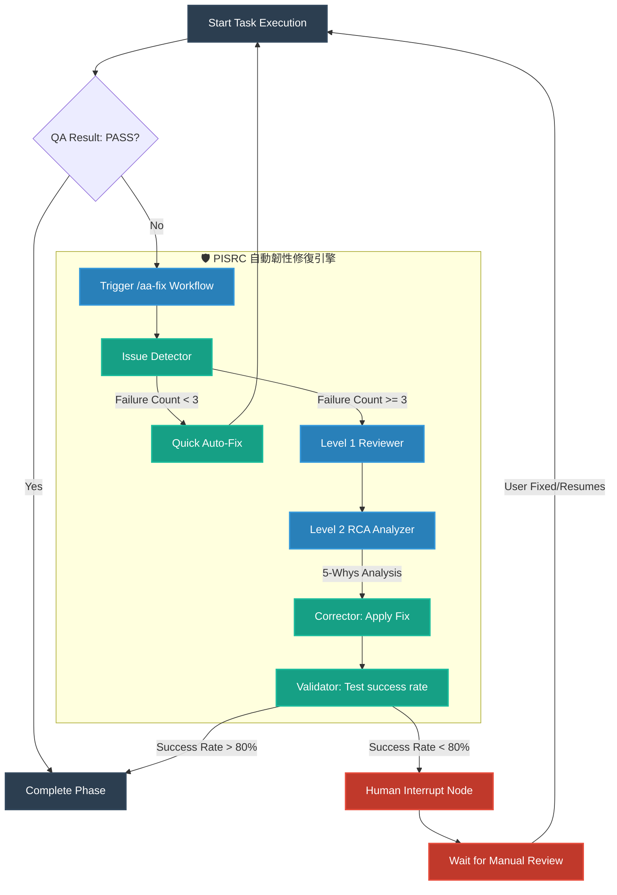
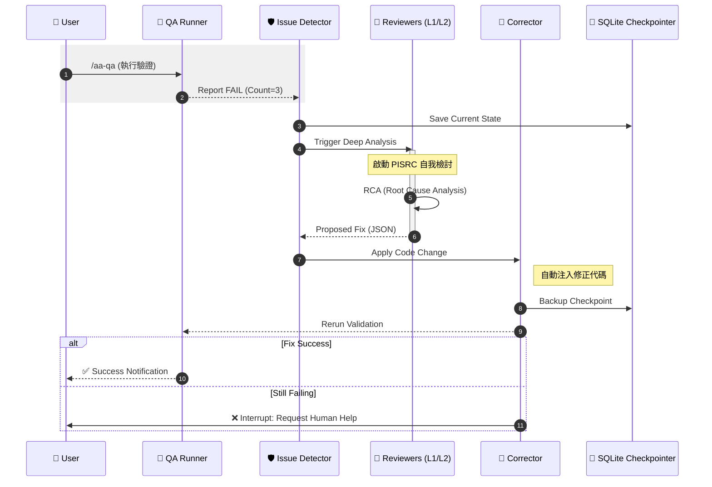

# AutoAgent (AA) 自我檢討與修正機制說明文件 (PISRC 框架)

本文件詳細說明 AutoAgent 如何透過 **PISRC (Persistent Issue Self-Review & Correction)** 框架實現自主分析、重複失敗檢討、代碼修正以及驗證機制。

---

## 1. 核心概念：什麼是 PISRC？

PISRC 是一個基於 **LangGraph** 的「有狀態圖 (StateGraph)」修復引擎。與傳統簡單的 Try-Except 迴圈不同，PISRC 具備執行記憶，能根據「失敗的次數」逐步擴大分析深度。

### 主要功能：
- **重複失敗偵測**：當同一個子任務連續失敗時，會自動調高診斷層級。
- **多層級反思 (Reviewer Nodes)**：
    - **L1 啟發式檢查**：針對常見錯誤（如語法、路徑、Prompt 誤解）快速提出建議。
    - **L2 根因分析 (RCA)**：使用 **5 Whys 策略** 挖掘隱藏在邏輯底層的問題。
- **自動化實施 (Corrector)**：根據分析結果自動更新代碼或調整工具指令。
- **持久化中斷 (Checkpointing)**：所有對話狀態皆存儲於 SQLite，失敗後可隨時從中斷點恢復。

---

## 2. 執行流程圖 (Flowchart)

以下展示任務從執行失敗到進入 PISRC 自動修復循環的邏輯開關：

---

## 3. 序列圖 (Sequence Diagram)

展示 Agent 內部各組件在面對「固執錯誤」時的互動順序：

---

## 4. 如何操作 PISRC？

### 自動觸發
在一般的 `/aa-auto-build` 循環中，如果 `/aa-qa` 失敗，系統會自動調用 `/aa-fix`。當 `/aa-fix` 偵測到問題重複發生時，會靜默並自動啟動 PISRC。

### 手動呼叫與檢視
1. **執行修復**：`/aa-fix [Phase_Num]`
2. **查看診斷日誌**：診斷結果會寫入 `.agent-state/fix-log` 或 `QA-REPORT.md`。
3. **人工介入處理**：如果 PISRC 進入中斷狀態 (Human Interrupt)，請檢查 `.agent-state/current-errors` 並在修正後下達：
   - `/aa-resume`：讓 Agent 從剛才的 PISRC 中斷點繼續嘗試。

### 核心檔案位置
- **圖引擎**: `scripts/resilience/pisrc_graph.py`
- **狀態庫**: `agent_state.db` (自動生成)
- **規則定義**: `_agents/workflows/aa-fix.md`

---

*Generated by AutoAgent-TW Resilience Module*
