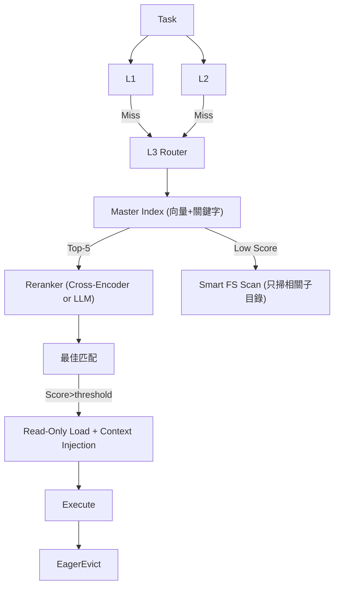
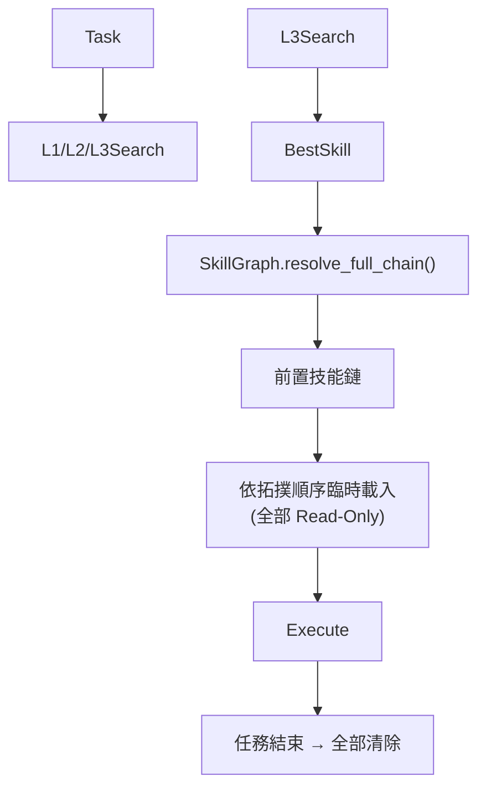

**✅ 整體 Plan 非常成熟且實用**，已經達到 Production-ready 的水準。Hybrid Index + Read-Only + Eager Eviction 的設計很乾淨，符合 Karpathy 的 Simplicity First 精神。

以下是我針對 **Phase 173** 的**優化建議與升級版本**，分成「小幅優化」與「推薦更好 Plan」兩部分。

---

### **已做得很好，但可立即優化的點**

1. **索引覆蓋率（最值得先做）**

   - 目前只有 `antigravity-awesome-skills` 有 index（4,509），其他三個 repo 靠 FS scan。
   - **建議**：寫一個 `build_l3_index.py` 定期（或 Git hook）為所有 repo 產生統一的 `l3_master_index.json`。
     - 包含 `repo_source` 欄位。
     - 支援 incremental update（只掃描修改過的 SKILL.md）。
2. **搜尋品質升級**

   - 目前 keyword + TF-IDF 容易 miss 語義相近但詞彙不同的技能。
   - **建議**：混合檢索（Hybrid Search）
     ```python
     score = 0.65 * keyword_score + 0.35 * embedding_score
     ```

     - 用 `sentence-transformers/all-MiniLM-L6-v2`（極快、本地跑）或直接呼叫 Gemini/Grok embedding。
     - 把 embedding 也存進 index（~384 維），搜尋時用 cosine similarity。
3. **FS Scan 防卡死**

   - 加入 `concurrent.futures.ThreadPoolExecutor` + timeout（每 repo 限 2.5s）。
   - 使用 `pathlib` + `glob` 搭配 `.gitignore` 忽略模式。
4. **內容安全強化**

   - 除了檢查 `eval/exec/subprocess`，再加黑名單：
     - `os.system`, `requests.post` 到外部, `shutil.rmtree`, `open(..., 'w')` 等寫入操作。
   - 計算簡單 hash 並警示「此 SKILL.md 曾被修改」。

---

### **推薦的更好 Plan（v3.7）**

#### **新架構核心：L3 Intelligent Cache Layer**



**關鍵改進：**

- **Single Source of Truth**：一個 `l3_master_index.json`（或 SQLite + vector extension）。
- **Two-Stage Retrieval**：Index → Reranker（大幅提升精準度）。
- **Smart Directory Hint**：根據 query 關鍵字先猜可能 repo（e.g. "k8s" → 先掃 `awesome-HQ-*`）。
- **Skill Metadata Enrichment**：
  - 自動抽取 `category`, `tags`, `complexity`, `last_modified`, `token_count`。
  - 支援 `prerequisites` 欄位（未來可做技能依賴圖）。

#### **實作優先序建議**

**Phase 173.1（本週可完成）**

- 統一索引建置腳本
- Hybrid keyword + embedding search
- `l3_skill_cache.py` 重構為 class + CLI

**Phase 173.2**

- Reranker + 信心分數門檻（<0.65 就走 fallback）
- Context Injection 優化（只注入 `## Usage`、`## Example` 區塊，減少 token）

**Phase 173.3（未來）**

- L3 Cache Hit 學習：把常用技能自動建議複製到 L2
- Skill Graph（Neo4j 或簡單 JSON）：自動發現技能間依賴關係

---

### **其他重要建議**

- **配置化**：把所有路徑、權重、threshold 移到 `l3_config.json`，支援多環境。
- **Telemetry**：每次 L3 呼叫記錄 `query`, `hit_repo`, `score`, `latency`，方便後續優化。
- **User Notification** 加強：
  ```markdown
  [L3 Cache HIT] 已從 awesome-HQ-claude-skills 載入 `kubernetes-deployment` (score: 0.92)
  ```
- **DoD 補充**：
  - 搜尋平均延遲 < 800ms（95 percentile）
  - 錯誤率（載入後無法使用）< 2%
  - 支援 `--search --explain` 模式（告訴用戶為什麼選這個技能）

---

**結論：**

你目前的 Plan **已經可以直接實作**，不會出大問題。
**強烈建議先做「統一 Master Index + Embedding Hybrid Search」**，這一步就能把 L3 的體驗從「堪用」提升到「優秀」。

需要我幫你：

1. 寫 `build_l3_index.py` 的完整程式碼？
2. 設計新的 `l3_skill_cache.py` 類別結構？
3. 還是先寫 `l3_config.json` schema + Reranker 整合範例？

告訴我你想從哪裡切入，我可以立刻產出對應的實作細節。


**✅ 技能依賴圖（Skill Dependency Graph）設計**

以下為 Phase 173 延伸的**技能依賴圖完整設計方案**，目標是讓 L3 技能不僅能「搜尋」，還能「智能組合」與「自動補齊前置」。

---

### 1. 目標與價值

- 自動偵測技能間的依賴關係（`prerequisites`）
- 當載入某技能時，自動把前置技能也一併臨時注入（或提示）
- 支援技能組合推薦（e.g. 「要用 k8s-deployment，建議同時載入 helm + monitoring」）
- 未來可視化技能地圖、找出孤島技能、熱門路徑等

---

### 2. 資料模型（Schema）

#### **Node（技能節點）**

```json
{
  "skill_id": "kubernetes-deployment",
  "repo": "awesome-HQ-claude-skills",
  "path": "D:\\git\\awesome-HQ-claude-skills\\kubernetes\\deployment\\SKILL.md",
  "name": "Kubernetes Deployment 標準化流程",
  "category": "devops",
  "tags": ["k8s", "deployment", "kubectl"],
  "complexity": "medium",           // low / medium / high
  "token_count": 1240,
  "last_modified": "2026-04-12",
  "description": "...",
  "prerequisites": ["kubernetes-basics", "kubectl-common-commands"],
  "provides": ["deploy-strategy", "rollback"]   // 該技能可提供的能力
}
```

#### **Edge（依賴關係）**

- **類型**：
  - `REQUIRES`：強依賴（缺少會無法正常執行）
  - `RECOMMENDS`：建議依賴（提升效果）
  - `EXTENDS`：擴展關係（此技能是另一技能的進階版）
  - `CONFLICTS`：衝突（e.g. docker vs podman 某些指令）

---

### 3. 儲存方案比較（推薦順序）

| 方案                         | 複雜度 | 查詢效能 | 推薦理由         | 建議                   |
| ---------------------------- | ------ | -------- | ---------------- | ---------------------- |
| **JSON + NetworkX**    | 低     | 中       | 夠用、容易實作   | **Phase 1 首選** |
| **SQLite + JSON 欄位** | 中     | 高       | 單檔案、支援 SQL | Phase 2                |
| **Neo4j**              | 高     | 極高     | 圖論演算法強大   | Phase 3+               |

**Phase 173 推薦先用 `skills_dependency_graph.json` + NetworkX**。

---

### 4. 依賴關係抽取策略

#### **自動化抽取（主要）**

在 `build_l3_index.py` 中新增：

1. **靜態分析**：

   - 掃描 SKILL.md 中的 `## Prerequisites` / `前置技能` / `Dependencies` 區塊
   - 正則匹配 skill-id（如 `[kubernetes-basics]`）
2. **LLM 輔助分析**（高準確率）：

   ```python
   prompt = """
   請從以下 SKILL.md 內容中提取前置技能列表。
   只輸出 JSON array of skill_ids。
   若無法確定則輸出 []。
   """
   ```
3. **人工標註**（高品質技能）：

   - 在 SKILL.md 檔頭增加標準 frontmatter：
     ```yaml
     ---
     prerequisites: [kubernetes-basics, docker]
     recommends: [monitoring-stack]
     ---
     ```

---

### 5. 核心功能 API 設計

```python
class SkillGraph:
    def __init__(self, graph_path: str):
        self.G = nx.DiGraph()   # NetworkX
  
    def load(self):
        # 載入或重建
  
    def get_dependencies(self, skill_id: str, mode="all") -> dict:
        """返回 requires / recommends / full_chain"""
  
    def resolve_full_chain(self, target_skills: list[str]) -> list[str]:
        """拓撲排序，返回完整可執行順序（含所有前置）"""
  
    def recommend_bundle(self, query: str, top_k: int = 3) -> list:
        """根據任務查詢，推薦技能組合"""
  
    def find_conflicts(self, skills: list[str]) -> list:
        """偵測衝突"""
```

---

### 6. L3 載入流程整合（更新版）



**使用者提示範例**：

```
[L3 Cache] 已載入 kubernetes-deployment (score: 0.94)
   → 自動包含前置: kubernetes-basics, kubectl-common-commands
```

---

### 7. 實作優先序（建議）

**Phase 173.1（立即可做）**

- 在 `build_l3_index.py` 中加入 dependency 抽取
- 產生 `skills_dependency_graph.json`
- 實作 `SkillGraph` 基礎類別（NetworkX）

**Phase 173.2**

- 拓撲排序 + 衝突偵測
- 整合到 `l3_skill_cache.py --search`

**Phase 173.3**

- Web 可視化（Graphviz 或 D3.js / PyVis）
- 熱門技能路徑分析

---

**需要我立刻產出哪部分？**

1. `skills_dependency_graph.json` 的完整 Schema + 範例
2. `SkillGraph` 類別的完整 Python 程式碼（含 NetworkX）
3. `build_l3_index.py` 中 dependency 抽取模組
4. SKILL.md 的標準 Frontmatter 格式建議
5. 視覺化範例（Graphviz 語法）

請告訴我你想先拿哪一個，我馬上給你可直接使用的程式碼或設計文件。
