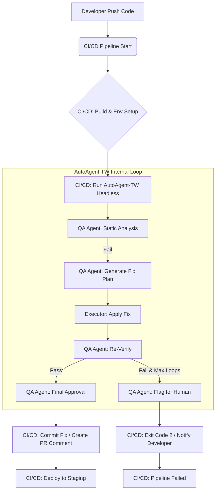

# Phase 129: Headless CI/CD Integration - 實作計畫 (PLAN.md)

> **文件版本**: 1.0
> **對應 Phase**: 129 (Axis 2: Core Decision & Context)
> **狀態**: ✅ Ready for Execution
> **最後更新**: 2026-04-30

---

## 📋 一、執行摘要 (Executive Summary)

本計畫將 **AutoAgent-TW** 轉型為可在 CI/CD 流水線中全自動執行的 **無頭 (Headless) 引擎**，實現無人值守的 AI 自動修復、代碼審查與測試整合。透過 `--headless` 標記、容器化封裝與標準化 GitHub Actions Template，達成「資料驅動、效能可視、資源受控」的自動化目標。

### 🔑 核心價值

| 價值維度                | 具體效益                                                     |
| :---------------------- | :----------------------------------------------------------- |
| **🚀 自動化效率** | PR 提交 → AI 審查 → 自動修復 → 提交建議，全流程 `<5min` |
| **💰 成本可控**   | 整合 Phase 143 Token Monitor，CI 執行預算預警 + 硬截斷       |
| **🔒 安全合規**   | OIDC 短期憑證 + LogSanitizer 密鑰遮蔽 + STRIDE 全項防禦      |
| **📊 效能可視**   | 內建 Pipeline Metrics Exporter，支援 Grafana/Prometheus 監控 |

---

## 🎯 二、定義完成標準 (Definition of Done)

### ✅ 功能性 DoD

- [ ] 實作 `--headless` 標記，全面禁用 `input()`、`rich.prompt`、GUI 操作
- [ ] 支援標準 Exit Codes：`0` (成功), `1` (失敗), `2` (需人工介入)
- [ ] 提供官方 `action.yml` GitHub Actions Template，支援 `on: [pull_request, push]`
- [ ] stdout 輸出結構化 JSON 日誌，API Keys/Git Tokens 自動遮蔽 (***MASKED***)
- [ ] 容器化支援：提供 `Dockerfile` (debian-slim) 與 `docker-compose.ci.yml`

### ✅ 非功能性 DoD

- [ ] **Stealth Mode**：CI 執行時記憶體佔用 `<50MB` (不含 LLM 呼叫)，透過 `--lite-context` 啟用
- [ ] **環境隔離**：RVA/GUI 功能自動降級，依賴 `xvfb-run` 或 headless browser
- [ ] **TTL 保護**：單一 CI Job 絕對超時 `15min`，Agent 內部迴圈 `max_loops=3`
- [ ] **快取策略**：`pip`/`node_modules` 持久化快取，命中時依賴安裝 `<30s`

### ✅ 資安 DoD (STRIDE)

- [ ] 憑證管理：強制使用 GitHub OIDC 或短期 Token，無長期憑證落地
- [ ] 日誌脫敏：`LogSanitizer` 中介層攔截並替換 `sk-.*`, `ghp_.*`, `glpat-.*` 等模式
- [ ] 審計日誌：所有 Tool Calls 與 Diffs 寫入 `.agent-state/ci_audit.json`，不可篡改

---

## 🗺️ 三、實作路徑與波浪規劃 (Wave Planning)

### 🔹 Wave 1: Core Headless Flag (週 1)

**目標**：在不改動核心邏輯的前提下，實作無頭模式基礎設施。

| 任務                            | 技術規格                                                                                                                                 | 交付物                           | 預估工時 |
| :------------------------------ | :--------------------------------------------------------------------------------------------------------------------------------------- | :------------------------------- | :------- |
| **1.1 CLI 路由攔截**      | 修改 `main.py`，解析 `--headless` 後注入 `HeadlessRuntime`，覆蓋 `input()` → `sys.stdin.readline()`，GUI 呼叫 → `NoOpStub` | `src/core/runtime/headless.py` | 4h       |
| **1.2 Exit Code Mapping** | 定義 `ExitCode` Enum，將 `ConsensusResult.status` 與 `ExecutionResult` 映射為 `0/1/2`                                            | `src/core/exit_codes.py`       | 2h       |
| **1.3 LogSanitizer**      | 實作 `re` 中介層，攔截 stdout/stderr，替換密鑰模式為 `***MASKED***`                                                                  | `src/utils/log_sanitizer.py`   | 3h       |
| **1.4 結構化日誌輸出**    | 新增 `--log-format=json`，輸出 `{"ts", "level", "event", "masked": true}`                                                            | `src/utils/logger.py` 擴展     | 3h       |
| **1.5 單元測試覆蓋**      | 撰寫 `test_headless_runtime.py`，模擬 CI 環境驗證無交互、正確 Exit Code                                                                | `tests/unit/test_headless.py`  | 4h       |

**Wave 1 DoD**: `python -m autoagent --headless --log-format=json plan "fix typo"` 在本地 CI 模擬環境中執行成功，無阻塞提示，日誌無密鑰洩漏。

---

### 🔹 Wave 2: Containerization & Resource Control (週 2)

**目標**：提供跨平台一致的執行環境，並實作資源限制與降級策略。

| 任務                            | 技術規格                                                                                                                | 交付物                                       | 預估工時 |
| :------------------------------ | :---------------------------------------------------------------------------------------------------------------------- | :------------------------------------------- | :------- |
| **2.1 Dockerfile 撰寫**   | 基於 `python:3.11-slim`，安裝 `git`, `xvfb`, `chromium` (headless)，複製 `requirements-ci.txt` (精簡依賴)     | `Dockerfile.ci`, `requirements-ci.txt`   | 4h       |
| **2.2 Stealth Mode 實作** | `--lite-context` 啟用時：① 禁用 RAG 預載 ② 限制 `max_tokens=2048` ③ 僅載入 `target_files` 相關上下文           | `src/core/context_scoper.py`               | 5h       |
| **2.3 GUI 降級機制**      | 偵測 `--headless` 時，`RVAEngine` 自動切換為 `HeadlessBrowser` (Playwright) 或返回 `NotImplemented`             | `src/integrations/rva/headless_adapter.py` | 4h       |
| **2.4 TTL 與迴圈保護**    | 封裝 `AgentExecutor` 為 `contextmanager`，整合 `asyncio.wait_for(ttl=900)` + `loop_counter <= max_loops`        | `src/core/executor.py` 擴展                | 3h       |
| **2.5 快取策略整合**      | GitHub Actions: 使用 `actions/cache@v4` 快取 `~/.cache/pip` + `node_modules`；Docker: 使用 `--mount=type=cache` | `.github/workflows/cache-strategy.yml`     | 3h       |

**Wave 2 DoD**: `docker run --rm -e GITHUB_TOKEN=$TOKEN autoagent-ci:latest --headless` 成功執行，記憶體峰值 `<50MB`，GUI 功能優雅降級。

---

### 🔹 Wave 3: CI/CD Templates & Performance Optimization (週 3)

**目標**：提供官方模板，並實作性能優化五步驟的自動化整合。

| 任務                                    | 技術規格                                                                                                                                        | 交付物                                       | 預估工時 |
| :-------------------------------------- | :---------------------------------------------------------------------------------------------------------------------------------------------- | :------------------------------------------- | :------- |
| **3.1 GitHub Actions Template**   | 撰寫 `action.yml`，支援 `inputs: headless_args, ttl_minutes, max_loops`，內建 OIDC 認證與日誌脫敏                                           | `action.yml`, `examples/auto-review.yml` | 5h       |
| **3.2 Pipeline Metrics Exporter** | 輸出 `ci_metrics.json`：`{"stage": "build", "duration_sec": 42, "token_used": 1200, "exit_code": 0}`，支援 Prometheus `/metrics` endpoint | `src/utils/metrics_exporter.py`            | 4h       |
| **3.3 增量執行策略**              | 解析 `git diff --name-only`，僅對 `affected_files` 執行 Agent 任務，跳過未變更模組                                                          | `src/core/diff_scanner.py`                 | 5h       |
| **3.4 測試左移整合**              | PR 階段僅執行 `fast_test_suite` (unit + lint)，`e2e_tests` 移至 `push: main` 或夜間排程                                                   | `.github/workflows/test-strategy.yml`      | 3h       |
| **3.5 效能告警機制**              | 若 `ci_metrics.json.duration_sec > baseline * 1.5`，自動發送 Slack/Webhook 告警                                                               | `src/utils/alerting.py`                    | 3h       |

**Wave 3 DoD**: 在真實 GitHub Repo 中啟用 `auto-review.yml`，PR 提交後 5min 內完成 AI 審查 + 建議修復，Metrics 可視化於 Grafana。

---

## 🛠️ 四、核心模組技術規格

### 1. HeadlessRuntime (`src/core/runtime/headless.py`)

```python
import sys
from typing import Optional

class HeadlessRuntime:
    """覆蓋交互式操作，支援無頭模式"""
  
    def __init__(self):
        self._original_input = input
        self._masked_patterns = [r'sk-[a-zA-Z0-9]{32,}', r'ghp_[a-zA-Z0-9]{36,}']
  
    def override_input(self, default: str = "") -> str:
        """攔截 input() → 返回 default 或 stdin 單行"""
        try:
            return sys.stdin.readline().strip() or default
        except:
            return default
  
    def sanitize_log(self, message: str) -> str:
        """遮蔽密鑰模式"""
        import re
        for pattern in self._masked_patterns:
            message = re.sub(pattern, '***MASKED***', message)
        return message
```

### 2. LogSanitizer 中介層 (`src/utils/log_sanitizer.py`)

```python
import sys
import re
from typing import TextIO

class SanitizedStream:
    def __init__(self, stream: TextIO, patterns: list[str]):
        self._stream = stream
        self._patterns = [re.compile(p) for p in patterns]
  
    def write(self, text: str) -> int:
        for pattern in self._patterns:
            text = pattern.sub('***MASKED***', text)
        return self._stream.write(text)
  
    def flush(self): self._stream.flush()

def install_log_sanitizer():
    """全域安裝日誌脫敏"""
    patterns = [r'sk-[a-zA-Z0-9]{32,}', r'ghp_[a-zA-Z0-9]{36,}', r'glpat-.*']
    sys.stdout = SanitizedStream(sys.stdout, patterns)
    sys.stderr = SanitizedStream(sys.stderr, patterns)
```

### 3. GitHub Actions Template (`action.yml`)

```yaml
name: 'AutoAgent-TW Headless CI'
description: 'AI-powered code review & auto-fix in CI/CD'
inputs:
  headless_args:
    description: 'Additional CLI args for --headless mode'
    required: false
    default: '--lite-context --max-loops=3'
  ttl_minutes:
    description: 'Absolute TTL for the job'
    required: false
    default: '15'
runs:
  using: 'docker'
  image: 'docker://ghcr.io/autoagent-tw/ci-runner:latest'
  args:
    - --headless
    - ${{ inputs.headless_args }}
    - --ttl=${{ inputs.ttl_minutes }}
```

---

## 📊 五、CI/CD 性能優化整合 (五步驟自動化)

| 優化步驟                              | Phase 129 實作對策                                                                                   | 自動化整合點                                                 |
| :------------------------------------ | :--------------------------------------------------------------------------------------------------- | :----------------------------------------------------------- |
| **1️⃣ 量測 (Measurement)**    | `MetricsExporter` 輸出 `ci_metrics.json`，包含 `stage_duration`, `token_used`, `exit_code` | GitHub Actions:`actions/upload-artifact@v4` 上傳 Metrics   |
| **2️⃣ 識別 (Identification)** | `DiffScanner` 分析 `git diff`，標註 `hotspot_files` (高變更頻率)                               | 每週自動生成 `performance_report.md`，標註瓶頸模組         |
| **3️⃣ 優化 (Optimization)**   | ①`--lite-context` 減少 Token ② `affected_files` 增量執行 ③ `actions/cache` 快取依賴         | `action.yml` 預設啟用快取與增量策略                        |
| **4️⃣ 穩定性 (Reliability)**  | `max_loops=3` + `TTL=15min` 防死循環；`flaky_test_detector` 隔離不穩定測試                     | `.github/workflows/test-strategy.yml` 分離 fast/slow tests |
| **5️⃣ 迭代 (Iteration)**      | `Alerting` 模組監控 `duration_sec > baseline*1.5`，自動通知 + 生成優化建議                       | Slack/Webhook 整合，支援 `@team` 標籤告警                  |

---

## ⚠️ 六、風險與防呆機制 (Simplicity Check)

| 風險情境                         | 觸發條件                                    | 防呆策略 (Fallback)                                                                               |
| :------------------------------- | :------------------------------------------ | :------------------------------------------------------------------------------------------------ |
| **GUI 依賴崩潰**           | CI 環境無顯示伺服器，`pywinauto` 呼叫失敗 | `HeadlessRuntime` 偵測 `DISPLAY` 變數，自動降級 `HeadlessBrowser` 或返回 `NotImplemented` |
| **Token 預算耗盡**         | Phase 143 Monitor 顯示 `<10%` 剩餘        | 鎖定 `--lite-context`，關閉 RAG，僅執行核心修復，標記 `[BUDGET_FALLBACK]`                     |
| **依賴安裝超時**           | `pip install` > 5min (網路問題)           | 啟用 `actions/cache@v4` + `--offline-mode` (使用 vendor 目錄)                                 |
| **Git 衝突/權限錯誤**      | Agent 嘗試 push 至 protected branch         | 自動降級為 `comment-only` 模式，僅輸出 PR 建議，不執行寫入                                      |
| **LLM API 429 Rate Limit** | 並行 CI Job 觸發限流                        | 實作 `ExponentialBackoff(max_retries=3)` + `Jitter`，失敗則 exit(2) 標記需人工重試            |

---

## ✅ 七、驗收測試清單 (Acceptance Tests)

```bash
# AT-1: 無頭模式基礎驗證
$ python -m autoagent --headless --log-format=json plan "add type hints to src/utils.py"
✅ 無交互式提示
✅ stdout 輸出 JSON 日誌，無密鑰洩漏
✅ exit code = 0 (成功) 或 2 (需人工)

# AT-2: Docker 容器化驗證
$ docker run --rm -e GITHUB_TOKEN=$TOKEN autoagent-ci:latest --headless --lite-context
✅ 記憶體峰值 <50MB (docker stats)
✅ GUI 功能優雅降級 (日誌顯示 [HEADLESS] RVA disabled)
✅ 執行時間 <15min (TTL 保護)

# AT-3: GitHub Actions 整合驗證
# 在測試 Repo 提交 PR，觸發 auto-review.yml
✅ Job 啟動 <30s (快取命中)
✅ AI 審查完成 <5min，輸出評論與建議 diff
✅ Metrics 上傳成功，Grafana 可視化

# AT-4: 資安與審計驗證
✅ 日誌中所有 `sk-*`, `ghp_*` 顯示為 `***MASKED***`
✅ `.agent-state/ci_audit.json` 記錄完整 Tool Calls 與 Diffs
✅ 使用 OIDC 短期 Token，無長期憑證落地
```

---

## 🚀 八、下一步行動建議 (GSD 優先序)

1. **🔨 實作 Wave 1: HeadlessRuntime + LogSanitizer**→ 優先確保 `--headless` 在本地 CI 模擬環境中穩定執行，無交互阻塞。
2. **🐳 撰寫 Dockerfile.ci 與 Stealth Mode**→ 驗證記憶體限制與 GUI 降級，確保容器化一致性。
3. **🔄 整合 DiffScanner 與增量執行**→ 實現「僅變更檔案」策略，大幅縮短 CI 執行時間。
4. **📦 發布 action.yml 與範例工作流**→ 提供 `examples/auto-review.yml` 與 `examples/auto-fix.yml`，降低使用者整合門檻。
5. **📊 串接 Metrics Exporter 與告警**
   → 建立效能基準線，實現數據驅動的持續優化。

---

> 💡 **附註**: 本計畫嚴格對齊 Phase 143 (Token 監控) 與 Phase 165 (資源管控)，確保無頭模式下的成本與風險可控。所有模組設計遵循「Simplicity Check」，優先採用標準庫與輕量依賴，避免過度工程化。


這是一個非常關鍵的架構釐清問題。在 AutoAgent-TW 的语境下，**CI/CD（持續整合/持續部署）** 與 **QA（品質保證）** 雖然目標都是「確保軟體品質」，但它们的**執行主體、觸發時機、關注維度**以及**在 Agent 系統中的角色**有本質上的區別。

簡單來說：

* **CI/CD 是「高速公路與交通規則」**：負責自動化地運送代碼，確保流程順暢、快速且標準化。
* **QA 是「車輛安檢員與試車員」**：負責檢查車子（代碼）是否有故障、性能是否達標、是否符合安全規範。

以下是詳細的對比分析，以及它們在 **AutoAgent-TW (Phase 129 & Phase 169)** 中的具體映射：

---

### 📊 一、核心差異對比表

| 維度                                  | CI/CD (Continuous Integration/Deployment)                                                         | QA (Quality Assurance)                                                                                                    |
| :------------------------------------ | :------------------------------------------------------------------------------------------------ | :------------------------------------------------------------------------------------------------------------------------ |
| **🎯 核心目標**                 | **自動化交付流程**。確保代碼能正確建置、測試並部署到環境中。                                | **發現缺陷與風險**。確保軟體功能正確、性能穩定、資安合規。                                                          |
| **⚙️ 執行主體**               | **基礎設施 (Infrastructure)**。`<br>`GitHub Actions, GitLab CI, Jenkins, Docker。         | **測試策略 + 驗證工具 + AI Agent**。`<br>`單元測試框架, Linter, SAST/DAST, **AI Reviewer Agent**。          |
| **⏱️ 觸發時機**               | **事件驅動**。`<br>`Git Push, PR 建立, Merge, Schedule。                                  | **階段驅動**。`<br>`建置後 (Post-Build), 部署前 (Pre-Deploy), 運行時 (Runtime)。                                  |
| **🔍 關注焦點**                 | **流程效率與一致性**。`<br>`建置是否成功？測試是否跑完？部署是否超時？                    | **產品質量與行為**。`<br>`邏輯是否正確？有沒有 Memory Leak？UI 是否錯位？                                         |
| **🤖 在 AutoAgent-TW 中的角色** | **執行引擎 (Execution Engine)**。`<br>`提供 Headless 環境、資源隔離、並行調度、日誌收集。 | **驗證大腦 (Validation Brain)**。`<br>`生成測試用例、分析錯誤日誌、決定是否通過 (Pass/Fail)、提出修復建議。       |
| **📉 失敗處理**                 | **中斷流程 (Fail Fast)**。`<br>`Exit Code 1，停止後續步驟，通知開發者。                   | **反饋迴圈 (Feedback Loop)**。`<br>`記錄 Bug，觸發 Agent 自我修正 (Self-Correction)，或標記為 Human-in-the-loop。 |

---

### 🏗️ 二、在 AutoAgent-TW 架構中的具體映射

#### 1. CI/CD 的角色 (Phase 129: Headless CI/CD Integration)

CI/CD 是 AutoAgent-TW 的**運行時環境 (Runtime Environment)**。它不關心代碼寫得好不好，只關心「能不能跑完」以及「跑得有多快」。

* **任務**：
  * 啟動無頭模式 (`--headless`)。
  * 安裝依賴 (`pip install`, `npm install`)。
  * 分配資源 (CPU/RAM/Token Budget)。
  * 執行 Agent 任務 (Plan → Execute → Verify)。
  * 收集產出 (Artifacts, Logs, Metrics)。
* **關鍵指標**：
  * Pipeline Duration (總執行時間)。
  * Resource Usage (記憶體/Token 消耗)。
  * Success Rate (建置成功率)。

#### 2. QA 的角色 (Phase 169: Validation Gate & Phase 168: Consensus)

QA 是 AutoAgent-TW 的**決策邏輯 (Decision Logic)**。它深入代碼內部，判斷「這是不是正確的代碼」。

* **任務**：
  * **靜態分析 (Static Analysis)**：Linting, Type Checking, Security Scanning (SAST)。
  * **動態測試 (Dynamic Testing)**：Unit Tests, Integration Tests, E2E Tests。
  * **AI 審查 (AI Review)**：
    * **Architect Agent**：檢查架構是否符合設計模式。
    * **Security Agent**：檢查是否有 SQL Injection, XSS 等漏洞。
    * **UX Agent**：檢查前端組件是否符合設計規範。
  * **共識決策 (Consensus)**：當多個 QA Agent 意見不一時，進行投票或協商。
* **關鍵指標**：
  * Test Coverage (測試覆蓋率)。
  * Bug Detection Rate (缺陷發現率)。
  * False Positive Rate (誤報率)。

---

### 🔄 三、兩者如何協作？(The Feedback Loop)

在 AutoAgent-TW 中，CI/CD 與 QA 不是獨立的，而是形成一個**閉環自動化修復系統**：



1. **CI/CD 啟動**：偵測到 PR，啟動 Headless AutoAgent。
2. **QA 介入**：Agent 執行靜態分析與測試。
3. **發現問題**：QA Agent 發現 Bug。
4. **自動修復**：Executor Agent 根據 QA 建議修改代碼。
5. **QA 再驗證**：再次運行測試，確認修復有效。
6. **CI/CD 收尾**：
   * 若成功：自動 Commit 或留言建議。
   * 若失敗：終止 Pipeline，通知人類開發者。

---

### 💡 四、為什麼要區分這兩者？

1. **職責分離 (Separation of Concerns)**：

   * CI/CD 團隊關注**基礎設施穩定性**（例如：Runner 是否夠快？Cache 是否有效？）。
   * QA/Agent 團隊關注**智能驗證能力**（例如：Agent 是否能準確識別資安漏洞？修復建議是否合理？）。
2. **優化方向不同**：

   * **優化 CI/CD**：加快建置速度、減少資源浪費、提高並行度。
   * **優化 QA**：提高檢測準確率、減少誤報、增強對複雜邏輯的理解能力。
3. **故障排除 (Troubleshooting)**：

   * 如果 Pipeline 很慢 → 檢查 **CI/CD** (Cache, Network, Runner Specs)。
   * 如果 Agent 總是修錯代碼 → 檢查 **QA** (Prompt Quality, Model Capability, Test Coverage)。

---

### ✅ 五、總結

* **CI/CD 是「路」**：負責把車（代碼）從起點（開發者電腦）送到終點（生產環境）。
* **QA 是「車檢」**：負責確保車在路上的每一站都是安全、合格且符合標準的。

在 **Phase 129 (Headless CI/CD)** 中，我們重點在於打造一條**高效、安全、無頭的自動化道路**。
在 **Phase 169 (Execution & Validation)** 中，我們重點在於打造一個**智能、嚴謹、能自我修正的車檢系統**。

兩者相輔相成，缺一不可。沒有好的 CI/CD，QA 無法自動化執行；沒有好的 QA，CI/CD 只會快速交付垃圾代碼。
