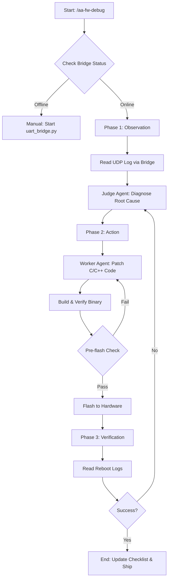
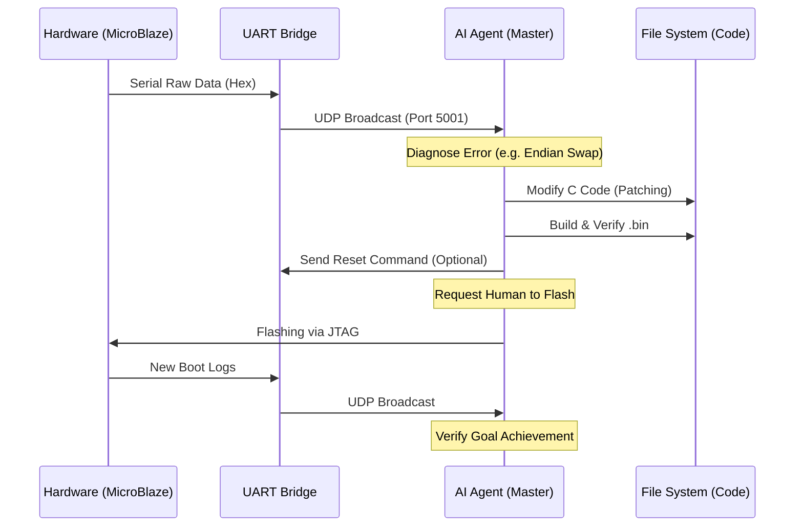

# UART-MCP Autonomous Debugging System Architecture

本文件詳述了 **AutoAgent-TW** 系統中用於「硬體閉環除錯」的架構設計。

## 1. 系統概覽 (System Overview)
本系統旨在消除韌體開發中「修改代碼 -> 編譯 -> 手動燒錄 -> 觀看串口 -> 診斷」的重複性勞動。透過 `uart_bridge` 與 AI Agent 的結合，實現了全自動的除錯循環。

## 2. 核心組件 (Core Components)

| 元件名稱 | 路徑 | 功能說明 |
| :--- | :--- | :--- |
| **UART Bridge** | `scripts/uart_bridge.py` | 負責 Serial 與 UDP 之間的雙向傳輸，將硬體 Log 廣播給 AI。 |
| **Master Orchestrator** | `_agents/workflows/aa-fw-debug.md` | 除錯任務的主控台，負責調度 Judge 與 Worker Agent。 |
| **Hex Parser** | `scripts/hex_parser.py` | 將 raw hex log 轉換為人類/AI 可讀的 ASCII 或特定的暫存器欄位。 |
| **Pre-flash Verifier** | `scripts/pre_flash_verify.py` | 燒錄前的最後一道防線，檢查 Magic Header 與 Endianness。 |
| **Central Config** | `_configs/flash_config.json` | 存放 COM Port、Baudrate、Magic Header 等所有硬體參數。 |

## 3. 邏輯流程圖 (Flowchart)

## 4. 系統時序圖 (Sequence Diagram)

## 5. 安全與防護 (Security & Safety)
- **Magic Header 驗證**：在 `pre_flash_verify.py` 中強制執行，防止錯誤的二進位檔損壞硬體。
- **手動掛起機制**：當除錯循環超過 5 次失敗時，系統會自動切換至手動模式，防止 AI 進入無限循環消耗 Token。
