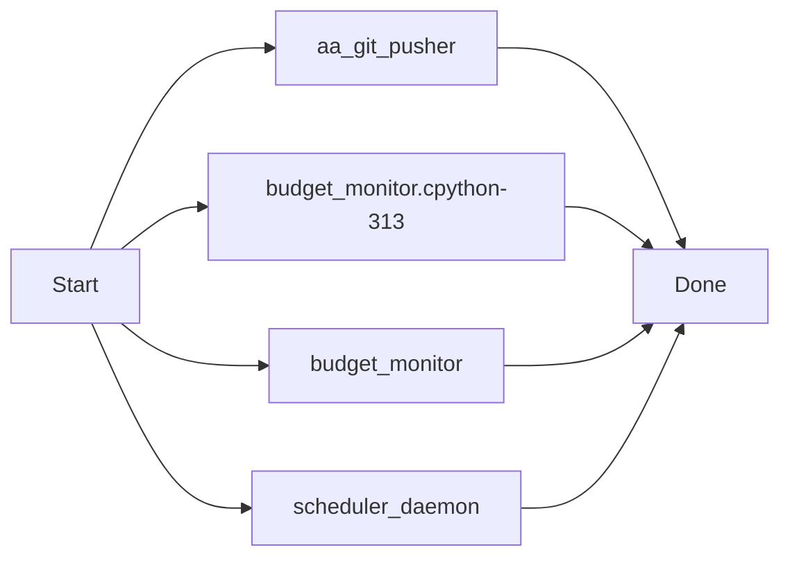

# Version List (Changelog) - AutoAgent-TW

## [v1.6.0] - 2026-03-31
### Added (Autonomous Scheduling & Event Loop)
- **自主排程守護行程 (Scheduler Daemon)**: 使用 APScheduler 支援時間觸發 (Cron/Interval) 自動執行任務。
- **事件驅動鉤子 (Event Hooks)**: 整合 Git `post-commit` 與 CI 失敗自動觸發修復流程。
- **智能修復終止邏輯 (Adaptive Repair)**: 引入趨勢分析與策略多樣性評分，動態決定修復輪次 (最高 6 輪)。
- **任務鏈組合 (Task Chaining)**: 新增 `/aa-chain` 指令，支援 `&&`, `||`, `|` 條件執行管線。
- **儀表板升級**: 儀表板新增排程任務與事件鉤子即時預覽標籤頁。

### 📁 新增/修改文件 (@file:)
- `scripts/scheduler_daemon.py`: 背景排程核心元件。
- `scripts/aa_schedule_cli.py`: 排程管理與 Hook 註冊工具。
- `scripts/event_handler.py`: 事件分發中心。
- `scripts/repair_loop_strategy.py`: 智能修復決策引擎。
- `scripts/aa_chain_orchestrator.py`: 任務鏈執行核心。
- `_agents/workflows/aa-schedule.md` & `aa-chain.md`: 新增排程與任務鏈工作流。

---

## [v1.5.0] - 2026-03-31
### Added (v0.3.0 Transparency Upgrade)
- **視覺化儀表板 (Status Dashboard)**: 提供即時執行進度、下一步標與狀態顯示。
- **動態執行樹 (Execution Tree)**: 整合 Mermaid.js 自動渲染 ROADMAP.md 的開發流程圖。
- **即時日誌流 (Live Logs)**: 瀏覽器即時日誌串流與動畫顯示。
- **停滯偵測與 LINE 警報**: 90 秒異常偵測與 LINE Notify 遠端推送邏輯。
- **系統工具指令**: 新增 `/aa-version` (查版本) 與 `/aa-versionupdate` (一鍵更新)。

### 📁 新增/修改文件 (@file:)
- `.agents/skills/status-notifier/SKILL.md`: 技能說明與集成指南。
- `.agents/skills/status-notifier/scripts/status_updater.py`: 狀態更新核心路徑。
- `.agents/skills/status-notifier/scripts/roadmap_parser.py`: ROADMAP Markdown 轉 Mermaid Parser。
- `.agents/skills/status-notifier/scripts/line_notifier.py`: LINE Notify API 接口。
- `.agents/skills/status-notifier/templates/status.html`: 視覺化 Dashboard 前端。
- `_agents/workflows/aa-progress.md`: 注入儀表板刷新與連結顯示。
- `README.md`: 更新開發版本資訊與功能介紹。
- `.planning/`: 項目研發流程文件 (PROJECT/ROADMAP/STATE/PHASES)。

---

## [v1.4.0] - 2026-03-30
### Fixed
- 修復 `aa-testclaw` 執行過程中可能導致的 HTTP 400 (Bad Request) 錯誤。
- 優化工作流步驟，減少 token 消耗與 IDE 負載。
- 自動修復完成後的結案邏輯優化。

---

## [v1.3.0] - 2026-03-30
### Added
- `aa-testclaw`: 自主代理模式 (TestClaw Agent Loop)。具備觀察、思考、決定、反思的動態循環。
- 引入 `Orchestrator` 與 `ToolRegistry` 架構理念。

### Improved
- `aa-helper`: 智慧助手優化。

---

## [v1.2.0] - 2026-03-30
### Added
- `aa-helper`: AI 智慧助手，問題診斷、方案比較、選項執行。

### Improved
- `aa-fixgit-issue` / `aa-fixgit-pr`: 修正後自動 Commit + Push + 回報 GitHub。
- 版本號納入 `config.json` 管理。

---

## [v1.1.0] - 2026-03-30
### Added
- Bilingual (English / Traditional Chinese) support for all 14 `aa-` commands.
- `aa-fixgit-pr`: Fetch and fix PRs using `aa-new-project`.
- `aa-fixgit-issue`: Fetch and fix Issues using `aa-new-project`.
- `.planning/config.json` with language and versioning.
- `version_list.md`: Official version tracking and change list.

### Improved
- Fixed encoding issues (garbled text) in all existing `aa-` workflows.
- Standardized command descriptions cross skills and workflows.
- Improved `aa-auto-build` initialization logic.

---
*Generated by AutoAgent-TW*

---
### [v1.7.x Update] 2026-04-01 08:33:57
v1.7.0 Resilience Upgrade & aa-gitpush Engine Deployment: Full system robustness implemented with automated context-aware delivery and visual documentation.

[Manifest]
 .agent-state/budget.json                           |   9 +
 .agent-state/scheduled_tasks.json                  |  51 +-
 .agent-state/scheduler.pid                         |   1 +
 .agent-state/status_state.js                       |  89 ++-
 .agent-state/status_state.json                     |  90 ++-
 .agents/logs/events.log                            |  39 +
 .agents/logs/scheduler.log                         | 834 +++++++++++++++++++++
 .../skills/status-notifier/templates/status.html   | 105 ++-
 _agents/workflows/aa-discuss.md                    |  34 +-
 _agents/workflows/aa-gitpush.md                    |  33 +
 scripts/aa_git_pusher.py                           | 101 +++
 .../__pycache__/budget_monitor.cpython-313.pyc     | Bin 0 -> 7283 bytes
 scripts/resilience/budget_monitor.py               | 114 ++-
 scripts/scheduler_daemon.py                        |  28 +-
 14 files changed, 1455 insertions(+), 73 deletions(-)

[Test Result]: Verified via aa-gitpush-core
[Visual Doc]: Mermaid logic appended to docs

#### Sequence & Logic Flow

